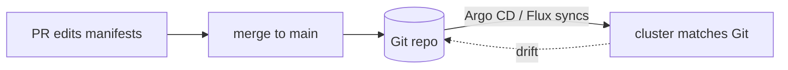
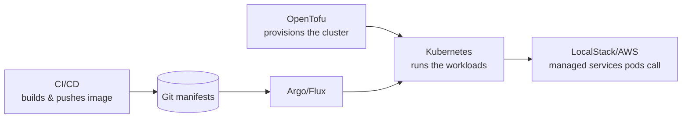

# 04-3 · GitOps, RBAC & best practices

> **Level:** Intermediate · **Prerequisites:** [04-2 Observability & troubleshooting](02_observability_and_troubleshooting.md)
> **Time:** 20 min · **Verified:** 2026-07-16

How teams actually operate clusters: Git as the source of truth, least-privilege
access, and the guardrails that stop a cluster from becoming a mess. This closes
the course and connects it back to the CI/CD and IaC courses.

---

## GitOps: the cluster mirrors a Git repo

You've been running `kubectl apply` by hand. **GitOps** flips it: manifests live in
Git, and an in-cluster agent (**Argo CD** or **Flux**) continuously applies them and
**corrects drift** — if someone hand-edits the cluster, the agent reverts it to match
Git.



Why teams love it:
- **Git is the single source of truth** — the repo *is* the cluster state; `git log`
  is your deploy history and audit trail.
- **Reviewable + revertible** — a deploy is a merged PR; a rollback is `git revert`.
- **No cluster credentials in CI** — the pull-based agent applies from inside, so
  your pipeline never holds cluster admin.

It's the same "declarative, reconcile-to-desired" idea as the [OpenTofu course](../../opentofu_iac/)
and K8s controllers themselves — now for the *whole cluster*, driven by Git.

---

## RBAC: least privilege

**Role-Based Access Control** decides who (users, and pod **ServiceAccounts**) can do
what. A Role grants verbs on resources; a RoleBinding assigns it:

```yaml
kind: Role
metadata: { namespace: linkstash, name: pod-reader }
rules:
  - apiGroups: [""]
    resources: ["pods", "pods/log"]
    verbs: ["get", "list"]          # read-only, this namespace only
```

Principles: **default deny, grant the minimum, prefer namespaced Roles** over
cluster-wide, and give each workload its **own ServiceAccount** (don't run pods as
the powerful `default`). Same least-privilege thinking as the CI/CD course's
`permissions:` and OIDC — a pod's identity should do only its job.

---

## The best-practices checklist

Everything the course built, as a shipping checklist:

- ✅ **Namespaces** per app/env — isolation + a place to scope RBAC and quotas.
- ✅ **requests + limits** on every container ([02-2](../02_config_health_scaling/02_probes_and_resources.md)) — protect the node.
- ✅ **readiness + liveness** probes — zero-downtime rollouts and self-healing.
- ✅ **≥2 replicas** for anything user-facing — survive a pod/node loss.
- ✅ **Config/secrets out of the image** ([02-1](../02_config_health_scaling/01_configmaps_and_secrets.md)); real secrets via a manager + RBAC.
- ✅ **Pin image tags** (a digest or version, never `:latest`) — reproducible, rollback-able.
- ✅ **Non-root containers**, read-only root FS where possible, drop capabilities.
- ✅ **Resource quotas / LimitRanges** per namespace so one team can't starve others.
- ✅ **GitOps** for deploys; **RBAC** for access.

---

## Where this sits in your stack



OpenTofu makes the cluster; CI/CD builds the image and updates manifests in Git;
GitOps rolls it out; your pods talk to cloud services. That's the whole modern
delivery stack — and you've now built every box.

---

## Recap & next

- ✅ **GitOps** (Argo CD/Flux) makes the cluster continuously match a Git repo —
  reviewable deploys, `git revert` rollbacks, no cluster creds in CI.
- ✅ **RBAC** = least privilege for users and pod ServiceAccounts; default deny,
  namespaced Roles, per-workload ServiceAccounts.
- ✅ Ship with the **checklist**: namespaces, requests/limits, probes, ≥2 replicas,
  external config/secrets, pinned images, non-root, quotas, GitOps + RBAC.

**Self-check:** With GitOps running, someone runs `kubectl edit` to bump replicas
to 5 directly on the cluster. What happens, and what's the right way to make that
change?

<details>
<summary>Answer</summary>

The GitOps agent (Argo/Flux) detects the cluster no longer matches Git and
**reverts it** to the committed value — the hand-edit is undone (that's drift
correction working as intended). The right way is to **change `replicas` in the Git
manifest and merge a PR**; the agent then syncs it. Git is the source of truth, not
the live cluster.

</details>

**Course complete.** → Assemble it all in the
**[99 · Capstone: linkstash on Kubernetes](../99_project_linkstash_k8s/README.md)**.
You've built the full delivery stack: **Docker → CI/CD → OpenTofu → Kubernetes → cloud services.**
