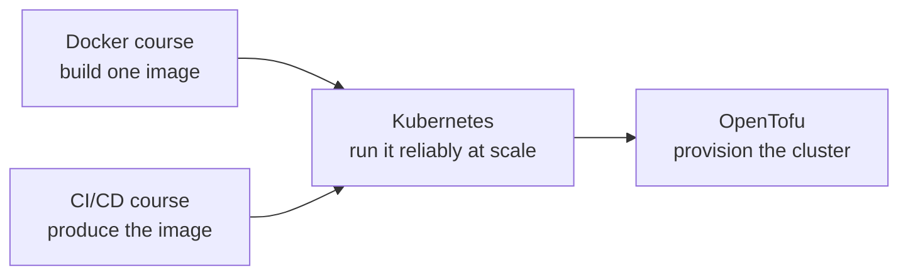
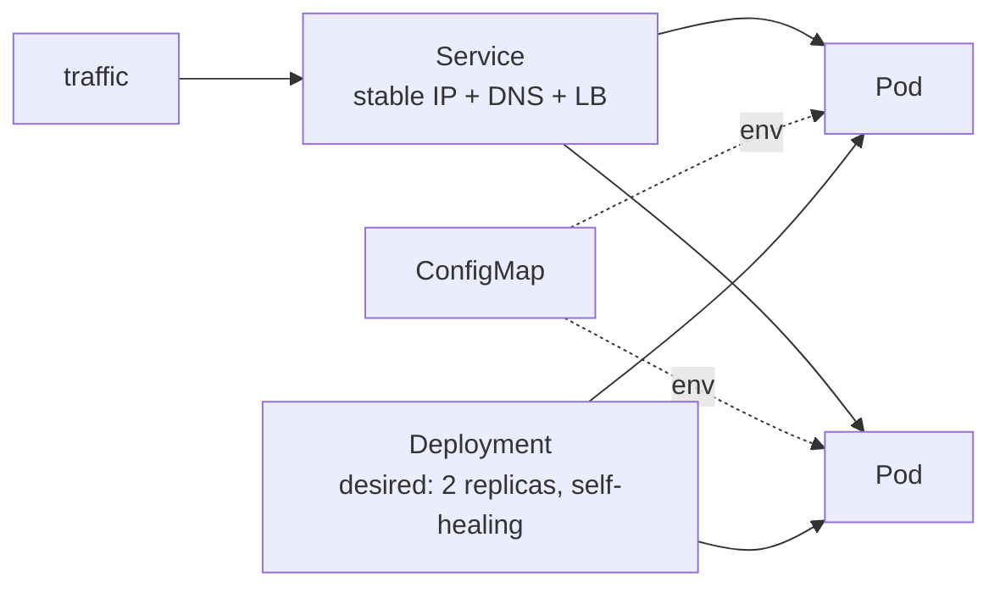

# Kubernetes — from containers to a self-healing cluster

> **What you build:** deploy the `linkstash` app (from the [CI/CD](../cicd_github_actions/)
> course) to a **real Kubernetes cluster** running locally — Deployment, Service,
> ConfigMap, health probes, resource limits — then scale it, roll it out with zero
> downtime, and package it as a **Helm** chart. All on a throwaway **kind** cluster,
> no cloud.

> **Verified:** 2026-07-16 with **kind v0.27.0**, **kubectl v1.36.2**, **Helm
> v3.16.4**, **Docker 29.6.1**. Every step was run: a kind cluster was created, the
> image built + loaded, the manifests applied (**2/2 pods**), `/health` returned
> `{"status":"ok","version":"1.2.0"}` and `POST /shorten` returned a slug through
> the Service, a **rolling restart** and **scale to 3** succeeded, and the Helm
> chart **linted + installed** cleanly. Real output throughout.

---

## Why Kubernetes (and why after Docker)

Docker runs *a* container. Kubernetes runs *many* containers across *many*
machines and keeps them running — restarting crashed ones, scaling under load,
rolling out new versions without downtime, and load-balancing traffic. It's the
industry-standard way to operate containerized apps at scale, and — per the skills
analysis — the single biggest "platform engineer" pay unlock once you already know
Docker + CI/CD + IaC.



---

## What you'll deploy



The Deployment keeps 2 pods alive; the Service gives them one stable address and
load-balances; the ConfigMap injects config. Kill a pod and Kubernetes makes
another — you'll watch it happen.

---

## Course map

| # | Module | Time |
|---|---|---|
| 00 | [Introduction](00_introduction.md) | 15 min |
| **01** | **Foundations** | |
| 01-1 | [What is Kubernetes?](01_foundations/01_what_is_kubernetes.md) | 20 min |
| 01-2 | [Setup: kind & kubectl](01_foundations/02_setup_kind_kubectl.md) | 25 min |
| 01-3 | [Pods & Deployments](01_foundations/03_pods_and_deployments.md) | 25 min |
| 01-4 | [Services & networking](01_foundations/04_services_and_networking.md) | 25 min |
| **02** | **Config, health & scaling** | |
| 02-1 | [ConfigMaps & Secrets](02_config_health_scaling/01_configmaps_and_secrets.md) | 20 min |
| 02-2 | [Health probes & resources](02_config_health_scaling/02_probes_and_resources.md) | 25 min |
| 02-3 | [Scaling & rollouts](02_config_health_scaling/03_scaling_and_rollouts.md) | 25 min |
| **03** | **Deploying linkstash** | |
| 03-1 | [The manifests](03_deploying_linkstash/01_the_manifests.md) | 20 min |
| 03-2 | [Apply & verify](03_deploying_linkstash/02_apply_and_verify.md) | 25 min |
| **04** | **Production** | |
| 04-1 | [Packaging with Helm](04_production/01_helm.md) | 25 min |
| 04-2 | [Observability & troubleshooting](04_production/02_observability_and_troubleshooting.md) | 20 min |
| 04-3 | [GitOps, RBAC & best practices](04_production/03_gitops_and_best_practices.md) | 20 min |
| **99** | [Capstone: linkstash on Kubernetes](99_project_linkstash_k8s/README.md) | — |

**Total: ~5 hours** | Prerequisites: the [Docker course](../docker/) (containers,
images) and comfort in a terminal.

---

## Quick start (local, no cloud)

```bash
cd 99_project_linkstash_k8s
make cluster      # create a kind cluster
make image load   # build the app image and load it into the cluster
make deploy       # kubectl apply the manifests, wait for rollout
make verify       # port-forward + curl /health
make status       # pods / deployment / service
make cluster-down # tear it all down
```

Verified:

```
$ kubectl -n linkstash get deploy
NAME        READY   UP-TO-DATE   AVAILABLE
linkstash   2/2     2            2
$ curl .../health   → {"status":"ok","version":"1.2.0"}
```

---

## Related guides

- [Docker](../docker/) — the images Kubernetes runs (prerequisite)
- [CI/CD with GitHub Actions](../cicd_github_actions/) — produces & pushes the image; deploy step targets K8s
- [OpenTofu / IaC](../opentofu_iac/) — provision the cluster itself as code
- [AWS on LocalStack](../aws_localstack/) — the managed services your pods talk to

→ Start here: **[00 · Introduction](00_introduction.md)**
