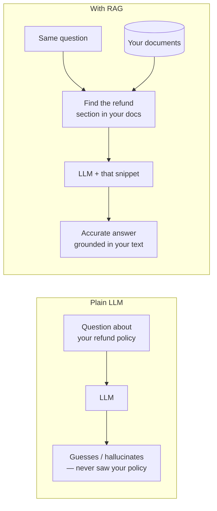
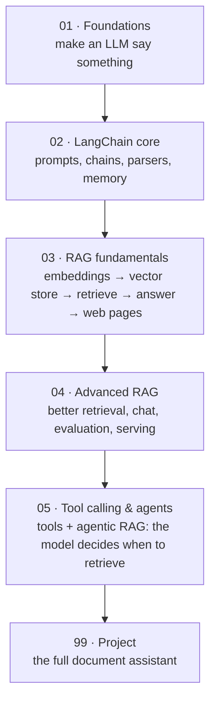

# 00: Introduction

> **Level:** Beginner · **Prerequisites:** Python 3.10+, basic terminal use
> **Time:** ~30 min · **Verified:** 2026-06-15

## Welcome 👋

By the end of this course you'll have built a **document assistant**: you point it at a folder of documents (a refund policy, a product manual, your notes), ask a question in plain English, and it answers *from those documents* — and honestly says "I don't know" when the answer isn't there.

That last part is the whole point. Here's the real, verified output of the assistant you'll build, answering from three small company docs:

```text
Q: How long do I have to return something?
A: You have 30 days from the purchase date to return most items for a full refund,
   provided you have the original receipt, the item is unused, and in its original packaging.

Q: Where is the company based?
A: The company is based in Berlin, Germany.

Q: What is the CEO's salary?
A: I don't know.
```

The first two answers came straight from the documents. The third — not in the documents — got an honest "I don't know" instead of a made-up number. Teaching an LLM to do that is what **RAG** is, and it's what this course builds, step by step.

## The problem RAG solves

An LLM (Large Language Model) like the one behind ChatGPT is trained once on a huge pile of public text, and then it's frozen. That creates three gaps:

- **It doesn't know your private data.** Your company wiki, your PDFs, last week's notes — never seen them.
- **It doesn't know recent events.** Anything after its training cut-off is invisible.
- **It makes things up (hallucinates).** Asked about something it doesn't know, it often produces a confident, wrong answer rather than admitting ignorance.



**RAG (Retrieval-Augmented Generation)** bolts a search step onto the LLM: *retrieve* the most relevant pieces of your documents, then let the model *generate* an answer using them. The model's language skills, your facts.

## Why LangChain?

You *could* wire all of this together by hand. **LangChain** is a Python library that gives you ready-made, swappable pieces for each step — loading documents, splitting them, embedding them, searching, prompting the LLM, parsing the output — and a clean way to connect them into a pipeline. It means you write *what* you want, not the plumbing.

> **Analogy:** LangChain is like a set of standard plumbing fittings. Each component (a vector store, an LLM, a splitter) has the same connectors, so you can snap them together — and swap one brand of LLM for another without re-doing the pipes.

## What you'll build, section by section



Each section adds one layer to the same mental model, until the picture from the [README](README.md) is something you've built yourself.

## Key terms (skim now, refer back later)

- **LLM (Large Language Model):** the AI text model that generates answers (e.g. Llama, Qwen, GPT, Gemini).
- **Chat model:** an LLM you talk to with a list of messages (system / human / AI). The modern default.
- **Token:** the small chunk of text an LLM reads and emits (roughly a word-piece).
- **Embedding:** a list of numbers representing a piece of text's *meaning*, so a computer can measure how similar two texts are. The heart of retrieval (Section 03).
- **Vector store:** a database of embeddings you can search by meaning ("find chunks similar to this question").
- **Retrieval:** finding the most relevant document chunks for a query.
- **RAG:** retrieve relevant chunks, then have the LLM generate an answer from them.
- **LCEL (LangChain Expression Language):** LangChain's modern way to connect steps with the `|` pipe operator (Section 02).
- **Chunk:** a small slice of a document (a paragraph or two), the unit you retrieve.
- **Grounding:** making the model answer *from provided context* rather than its own memory — what stops hallucination.
- **Tool calling:** letting the model *request* that a function be run (a search, a calculation, a web fetch) and use the result — your code runs it, not the model (Section 05).
- **Agent:** an LLM that runs the tool-calling loop on its own, choosing which tools to call and when — the basis of **agentic RAG**, where retrieval is a tool the model decides to use.

> **Don't worry** if several of these are fuzzy. Each gets its own module with runnable examples.

## The tools we'll use (and why)

- **LangChain 1.x** — the current major version. We use the modern **LCEL** style; older `LLMChain`/`RetrievalQA` tutorials won't run on 1.x.
- **A local embedding model** (`all-MiniLM-L6-v2` via `langchain-huggingface`) — turns text into meaning-vectors **on your machine, no API key**, so retrieval is real and free.
- **`InMemoryVectorStore`** — a vector store built into `langchain-core`; zero setup, perfect for learning. (We'll note how to swap in FAISS or Chroma later.)
- **An LLM you choose:** a **local model via [Ollama](https://ollama.com)** (no key), a **hosted endpoint** (an OpenAI-compatible/NVIDIA endpoint, or **Anthropic Claude**), or a **built-in fake model** for running things with literally no setup. All are wired up in Section 01, along with how to *choose* between them.

## A note on how this course verifies code

Every code sample that doesn't need a live LLM was **actually run** in the verified environment, and you'll see its real output. Examples that call a live LLM are clearly labelled, and because LLM output varies between models and runs, we show a representative real answer (captured from the local model) — never a fabricated one. You can reproduce everything offline.

## Recap & next

- ✅ A plain LLM doesn't know your data, doesn't know recent events, and hallucinates. **RAG** fixes this by retrieving your documents and grounding the answer in them.
- ✅ **LangChain** gives you swappable, snap-together pieces for each step; **LCEL** (the `|` pipe) connects them.
- ✅ You'll build a real "chat with your documents" assistant, entirely runnable offline.
- ✅ Self-check: in one sentence each, what problem does RAG solve, and what does "grounding" mean?

→ Next: **[01 · Foundations](01_foundations/README.md)** — what LangChain and RAG are, setting up, and your first LLM call.
