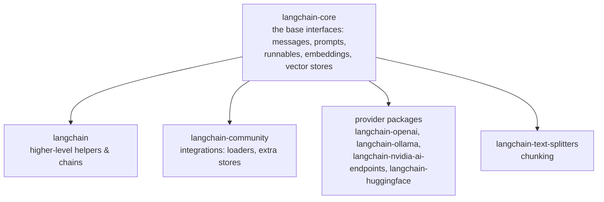
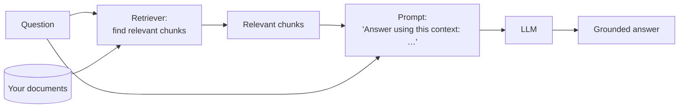
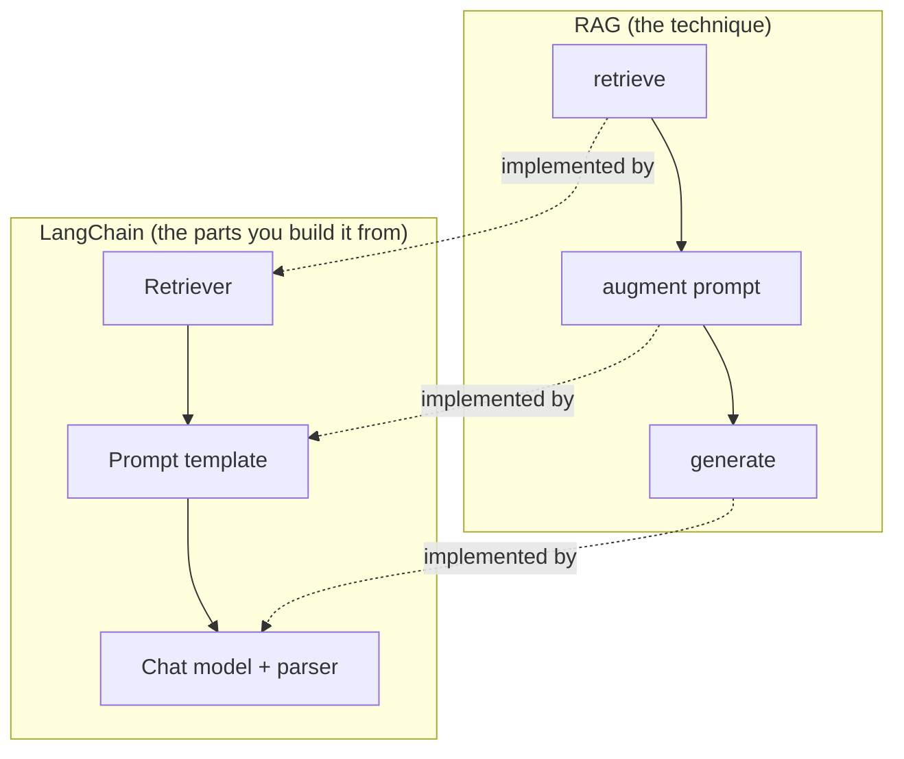

# 01: What LangChain & RAG are

> **Level:** Beginner · **Prerequisites:** [00 · Introduction](../00_introduction.md)
> **Time:** ~45 min · **Verified:** 2026-06-15

## Why this matters

You'll build faster if you hold the right mental model from the start. This module pins down two ideas that beginners often blur together: **LangChain** (a toolkit for building LLM apps) and **RAG** (a *technique* for grounding LLMs in your data). They're different things — you can use LangChain without RAG, and the RAG idea exists outside LangChain — but together they're how most "chat with your data" apps are built.

## What an LLM is (the 30-second version)

A **Large Language Model** is a program that, given some text, predicts the most plausible continuation. Train that on enough text and it becomes startlingly good at answering questions, summarising, and writing — *about things it saw during training*.

Two consequences matter for us:

- It has **no memory of your private documents** and **no knowledge past its training cut-off**.
- When it doesn't know, it tends to **guess fluently** (hallucinate) rather than say "I don't know."

> **Analogy:** an LLM is a brilliant new hire who has read most of the public internet but started today — they've never seen your company's files, and they're a little too eager to sound confident.

## What LangChain is

**LangChain** is a Python library of **standard, swappable components** for LLM apps, plus a way to **connect them into a pipeline**. The components you'll meet:

| Component | Job | Section |
|-----------|-----|---------|
| **Chat model** | talk to an LLM | 01 |
| **Prompt template** | build the text you send the LLM | 02 |
| **Output parser** | turn the LLM's reply into usable data | 02 |
| **Document loader** | read files (PDF, txt, web…) into a standard form | 03 |
| **Text splitter** | chop documents into chunks | 03 |
| **Embeddings** | turn text into meaning-vectors | 03 |
| **Vector store** | store & search those vectors | 03 |
| **Retriever** | fetch the most relevant chunks | 03 |

The big win is **swappability**: each component has a standard interface, so you can switch a local LLM for a hosted one, or `InMemoryVectorStore` for Chroma, *without rewriting the rest of your app*.

> **Analogy (revisited):** standard plumbing fittings. Every pipe has the same connector, so you assemble a system from parts and replace any one part without redoing the whole thing.

### LangChain is a family of packages

In 1.x, LangChain is split into focused packages — you'll import from several:

Most of the *primitives* live in `langchain-core` (that's why you'll see lots of `from langchain_core...`). Providers (OpenAI, Ollama, HuggingFace) each have their own package so you install only what you use.

> ⚠️ **Version note:** older tutorials import from `langchain.chains`, `langchain.memory`, `langchain.vectorstores`, etc. Those modules were **removed** in LangChain 1.0. If you paste an old snippet and get `ModuleNotFoundError: No module named 'langchain.chains'`, that's why — this course uses the current imports.

## What RAG is

**RAG (Retrieval-Augmented Generation)** is a *technique*, not a library: before the LLM answers, you **retrieve** relevant snippets from your own data and put them in the prompt as context. The model then **generates** an answer grounded in those snippets.

Why RAG instead of alternatives?

- **vs. just asking the LLM:** the LLM can't see your data and may hallucinate. RAG supplies the facts.
- **vs. fine-tuning the LLM on your data:** fine-tuning is expensive, slow to update, and still leaks/forgets. RAG just searches your current documents at question time — change a document, and the next answer reflects it instantly.
- **vs. pasting everything into the prompt:** documents are far too big to fit. RAG sends only the few most relevant chunks.

## How they fit together

RAG is the *blueprint*; LangChain provides the *parts* to build it.

You'll build each LangChain part in Sections 01–03, then snap them into the RAG shape in Section 03's "Build a RAG chain."

## Recap & next

- ✅ An **LLM** predicts text well but doesn't know your data, can't see recent events, and hallucinates when unsure.
- ✅ **LangChain** is a family of packages (`langchain-core` + providers) giving **swappable components** you connect into pipelines. Old `langchain.chains`/`.vectorstores` imports are gone in 1.x.
- ✅ **RAG** is a technique: **retrieve** your relevant snippets, **augment** the prompt, **generate** a grounded answer — cheaper and fresher than fine-tuning.
- ✅ RAG is the blueprint; LangChain supplies the parts.
- ✅ Self-check: name three components LangChain provides, and explain why RAG beats fine-tuning for "answer from my latest documents."

→ Next: **[02 · Environment setup](02_environment_setup.md)** — install everything and pick your LLM.

## Exercises

1. **Spot the gap.** For each question, say whether a plain LLM could answer reliably, or whether you'd need RAG: (a) "What's the capital of France?" (b) "What's our company's parental-leave policy?" (c) "Summarise the PDF I uploaded this morning."

Solution

(a) Plain LLM — it's common public knowledge from training. (b) RAG — the policy is private data the LLM never saw. (c) RAG — the PDF didn't exist at training time and is yours. The rule of thumb: **public + stable → plain LLM; private or fresh → RAG.**

2. **Why not fine-tune?** Your support docs change weekly. A teammate suggests fine-tuning the LLM on them every week. Give two reasons RAG is a better fit.

Solution

(1) **Freshness/cost:** fine-tuning is a slow, costly training job; RAG just indexes the new docs (seconds) and searches them at query time, so weekly changes are trivial. (2) **Grounding & traceability:** RAG can show *which* document a fact came from (sources), and is less prone to confidently misremembering than a model that baked the facts into its weights. Fine-tuning also risks the model "forgetting" or blending old and new policies.

3. **Map the parts.** Without looking, match each RAG step (retrieve / augment / generate) to the LangChain component that implements it.

Solution

Retrieve → **Retriever** (backed by a vector store + embeddings). Augment → **Prompt template** (inserts the retrieved context and the question). Generate → **Chat model** (+ an output parser to get clean text). You'll build all three in this course and connect them with LCEL in Section 03.

