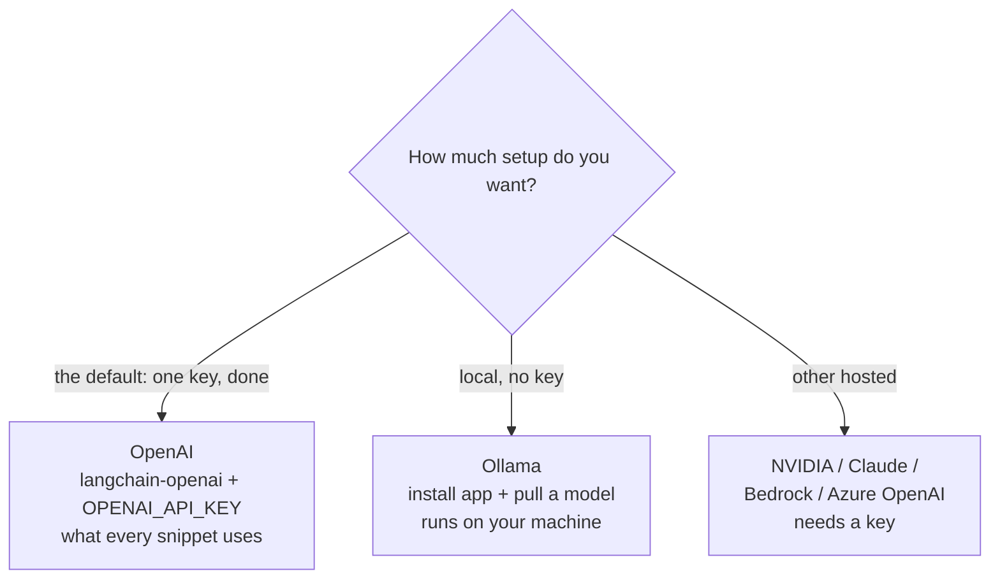

# 02: Environment setup

> **Level:** Beginner · **Prerequisites:** [01 · What LangChain & RAG are](01_what_is_langchain_and_rag.md)
> **Time:** ~45 min · **Verified:** 2026-06-15 (versions below)

## Why this matters

RAG has a few moving parts (an embedding model, a vector store, an LLM), and beginners often get stuck at "what do I even install, and do I need a paid API key?" The answer: one install plus an **OpenAI API key** (`gpt-4o-mini` costs cents for the whole course) — or a free local model if you'd rather not. This module sets up a clean environment and wires up OpenAI as the course default, with five alternatives you can swap in at any time.

## Step 1 — A virtual environment

Keep this project's packages isolated from your system Python. We use [uv](../../UV_GUIDE.md) — a drop-in, much faster `venv` + `pip` (`curl -LsSf https://astral.sh/uv/install.sh | sh` if you don't have it):

```bash
uv venv
source .venv/bin/activate        # Windows: .venv\Scripts\activate
python --version                 # should be 3.10+
```

Activate this `.venv` in any terminal where you run course code.

## Step 2 — Install the core packages

```bash
uv pip install \
  langchain langchain-core langchain-community langchain-text-splitters \
  langchain-huggingface sentence-transformers
```

What each is for:

| Package | Role |
|---------|------|
| `langchain-core` | the base interfaces (messages, prompts, runnables, vector stores) |
| `langchain` | higher-level helpers used later |
| `langchain-community` | document loaders and extra integrations (Section 03) |
| `langchain-text-splitters` | chunking documents (Section 03) |
| `langchain-huggingface` + `sentence-transformers` | a **local** embedding model — turns text into meaning-vectors on your machine, **no API key** |

> **Verified versions** (what this course was tested against): `langchain 1.2.16`, `langchain-core 1.3.2`, `langchain-community 0.4.1`, `langchain-text-splitters 1.1.2`, `langchain-huggingface 1.2.2`, `sentence-transformers 5.5.1`. Newer 1.x versions should behave the same; if an import ever fails, check you're on 1.x (`uv pip show langchain`).

The first time you use the embedding model it downloads ~80MB (`all-MiniLM-L6-v2`) and caches it; after that it's offline.

## Step 3 — Choose an LLM

You need *something* to generate answers. Pick whichever fits — you can change later, and the code stays the same thanks to LangChain's swappable interface.



### Option A — OpenAI (the course default, needs a key)

Every snippet in this course uses `ChatOpenAI`. Create a key at [platform.openai.com](https://platform.openai.com/api-keys), then:

```bash
uv pip install langchain-openai
export OPENAI_API_KEY=sk-...        # Windows (PowerShell): $env:OPENAI_API_KEY="sk-..."
```

```python
from langchain_openai import ChatOpenAI
llm = ChatOpenAI(model="gpt-4o-mini", temperature=0)   # reads OPENAI_API_KEY from the environment
print(llm.invoke("Say hi in five words.").content)
```

`gpt-4o-mini` is cheap and fast — the whole course costs cents. `temperature=0` makes answers as deterministic as possible, which is what you want for factual RAG.

### Option B — Ollama (local, no API key)

[Ollama](https://ollama.com) runs open models on your own machine. Install the app, then pull a model:

```bash
ollama pull qwen2:7b        # ~4.4GB; or a smaller model like llama3.2:3b
uv pip install langchain-ollama
```

```python
from langchain_ollama import ChatOllama
llm = ChatOllama(model="qwen2:7b", temperature=0)
```

The RAG answers shown in Section 03 were captured from this model. Swap it into any snippet in place of `ChatOpenAI` — nothing else changes.

### Option C — NVIDIA hosted models (real answers, free tier, needs a key)

NVIDIA hosts open models (Llama, Mistral, Qwen, …) behind a **free API key** at [build.nvidia.com](https://build.nvidia.com). LangChain ships a first-party package for it:

```bash
uv pip install langchain-nvidia-ai-endpoints
export NVIDIA_API_KEY=nvapi-...      # from build.nvidia.com
```

```python
from langchain_nvidia_ai_endpoints import ChatNVIDIA
llm = ChatNVIDIA(model="meta/llama-3.1-8b-instruct", temperature=0)   # reads NVIDIA_API_KEY

reply = llm.invoke("In one sentence, what is RAG?")
print(reply.content)
```

`ChatNVIDIA.get_available_models()` lists what you can call. The same package also has `NVIDIAEmbeddings` if you'd rather embed on their side than locally.

**Alternative — any OpenAI-compatible endpoint.** NVIDIA (and many other providers) also speak the OpenAI API format, so `langchain-openai` pointed at a `base_url` works too. Useful when you want one class for several providers:

```bash
uv pip install langchain-openai
```

```python
import os
from langchain_openai import ChatOpenAI
llm = ChatOpenAI(
    model="meta/llama-3.1-8b-instruct",
    base_url="https://integrate.api.nvidia.com/v1",   # swap for your provider's URL
    api_key=os.environ["NVIDIA_API_KEY"],
    temperature=0,
)
print(llm.invoke("In one sentence, what is RAG?").content)
```

> **Keep keys out of code.** Read them from environment variables (`os.environ[...]`), never hard-code them. Set with `export NVIDIA_API_KEY=...` (or a `.env` file you don't commit).

### Option D — Anthropic Claude (real answers, needs a key)

A hosted frontier model. Reach for it when you want the highest answer quality, a very large context window (so more retrieved chunks fit), or reliable **tool calling** (Section 05). It has its own package:

```bash
uv pip install langchain-anthropic
```

```python
import os
from langchain_anthropic import ChatAnthropic
llm = ChatAnthropic(
    model="claude-haiku-4-5-20251001",   # small + cheap; or a larger Claude for harder tasks
    api_key=os.environ["ANTHROPIC_API_KEY"],
    temperature=0,
)
```

The call site is still `llm.invoke(...)` — identical to every other option. That's the swappability payoff again.

### Option E — Amazon Bedrock (real answers, needs an AWS account)

If your team runs on AWS, Bedrock calls Claude/Llama/Nova through your AWS
account instead of a third-party API — IAM-authenticated, billed like any AWS
service. Same interface, different package:

```bash
uv pip install langchain-aws
```

```python
from langchain_aws import ChatBedrockConverse
llm = ChatBedrockConverse(model="anthropic.claude-haiku-4-5", region_name="us-east-1", temperature=0)
```

The IAM permissions, model-access setup, and the "build your own RAG vs. Bedrock
Knowledge Bases" decision are covered properly in the
[AWS-locally course's Bedrock module](../../aws_localstack/08_bedrock_and_genai/01_bedrock_for_rag_agents.md) —
worth reading before you use this in anything real.

### Option F — Azure OpenAI Service (real answers, needs an Azure account)

The Azure-shop equivalent of Bedrock: OpenAI's models (GPT-4o, GPT-4o-mini, …),
hosted inside your Azure subscription instead of OpenAI's own API. No separate
package — it's the same `langchain-openai` you already installed for Option A,
just a different class:

```python
from langchain_openai import AzureChatOpenAI
llm = AzureChatOpenAI(
    azure_endpoint="https://<your-resource>.openai.azure.com/",
    deployment_name="<your-deployment-name>",   # you name this when you deploy the model in Azure
    api_version="2024-10-21",                    # check the current version in Azure's docs
    temperature=0,
    # reads AZURE_OPENAI_API_KEY from the environment
)
```

Two things that trip people up coming from plain OpenAI: you call a
**deployment name** you chose, not a raw model name (you deploy a model to a
named endpoint in Azure AI Foundry/Azure OpenAI Studio first), and auth is
either an API key (`AZURE_OPENAI_API_KEY`) or **Azure AD** (`azure_ad_token_provider`,
the Azure equivalent of an IAM role) for keyless auth in production. Same
`.invoke()` afterward — identical to every other option here.

> **Why this shows up in job posts even for GenAI roles:** "Azure" on a GenAI
> job description overwhelmingly means **Azure OpenAI Service**, not general
> Azure infrastructure — this one class is usually the actual skill being asked
> for.

## Which model should you choose?

For *this course* the answer is easy — see the box below. But "which LLM?" is a real question once you build something for others, and the honest answer is **it's a trade-off, not a winner**. Here's how the options compare:

| Option | API key? | Runs offline? | Cost | Answer quality | Tool calling (§05) | Best for |
|--------|----------|---------------|------|----------------|--------------------|----------|
| **OpenAI** (`ChatOpenAI`) — course default | yes | no | pay per token (cents for this course) | high | yes, reliable | the simplest path through the course |
| **Ollama** (local) | no | yes (after pull) | free (your hardware) | good; depends on model size | some models (e.g. `qwen2`) | private data, offline dev, no bills |
| **NVIDIA** (`ChatNVIDIA` or OpenAI-compatible) | yes | no | free tier, then pay per token | high | yes | quick hosted quality without local hardware |
| **Anthropic Claude** | yes | no | pay per token | highest, large context | yes, reliable | production quality, long contexts, agents |
| **Amazon Bedrock** (`ChatBedrockConverse`) | AWS account | no | pay per token | model-dependent | yes | AWS-native shops, IAM-authenticated calls |
| **Azure OpenAI Service** (`AzureChatOpenAI`) | Azure account | no | pay per token | high (same models as OpenAI) | yes, reliable | Azure-native shops, Azure AD-authenticated calls |

Three questions decide it in practice:

1. **Is the data private / must it stay on your machine?** → **Ollama** (local, nothing leaves your computer).
2. **Do you have a GPU or patience for CPU inference?** No → a **hosted** option; the provider runs the hardware.
3. **Will the model need to call tools or juggle a big context (Section 05)?** → a capable model: **Claude**, a hosted OpenAI-compatible model, or a tool-capable Ollama model like `qwen2`. Small local models can't do this reliably.

> **You don't have to pick perfectly now.** Because every option shares the same `.invoke()` interface, you can develop against cheap `gpt-4o-mini` or free local **Ollama** and switch to **Claude** or a larger model for a final, higher-quality version — without rewriting your RAG code. That swappability is *why* the course teaches through LangChain's abstractions.

## Step 4 — Verify your setup

With `OPENAI_API_KEY` set, run:

```python
from langchain_openai import ChatOpenAI

llm = ChatOpenAI(model="gpt-4o-mini", temperature=0)
print(llm.invoke("Reply with exactly: LangChain is working!").content)
```

**Output (representative):**

```text
LangChain is working!
```

An `AuthenticationError` means the key isn't in your environment (check `echo $OPENAI_API_KEY`). If you installed Ollama, swap in `ChatOllama(model="qwen2:7b")` to confirm that path too.

## Which should *you* use for the course?

- Default: **OpenAI** (`gpt-4o-mini`) — every snippet is written against it; one env var and you're done.
- No key, or want everything on your machine? **Ollama** — free, runs offline after the model is pulled; a one-line swap in any snippet.
- Already have an NVIDIA, Anthropic, AWS, or Azure account? **Option C / D / E / F** all work identically.

LLM output varies between runs and models, so the course labels LLM answers as *representative*; the Section 03 RAG answers were captured from the local Ollama model.

## Recap & next

- ✅ Use a **virtualenv**; install `langchain-core`, `langchain`, `langchain-community`, `langchain-text-splitters`, plus `langchain-huggingface` + `sentence-transformers` for **local, key-free embeddings**.
- ✅ Choose an LLM: **OpenAI** (the default, needs a key), **Ollama** (local, no key), **NVIDIA** (free tier), or **Anthropic Claude**. The code is the same shape for all of them — swap freely.
- ✅ Choosing a model is a **trade-off** (privacy vs. hardware vs. cost vs. quality vs. tool-calling), not a single winner — see the comparison table above.
- ✅ Keep API keys in **environment variables**, never in code.
- ✅ Self-check: which package provides local embeddings, and which LLM option needs no installation and no key?

→ Next: **[03 · Your first chat model](03_your_first_chat_model.md)** — actually calling an LLM from Python.

## Exercises

1. **Verify your install.** Run the Step 4 snippet. Then print the installed LangChain version with `python -c "import langchain; print(langchain.__version__)"`. Is it 1.x?

<details><summary>Solution</summary>

The snippet prints `LangChain is working!`. The version command prints something like `1.2.16`. If it prints `0.1.x` or `0.2.x`, you're on the *old* LangChain and the course's imports (e.g. `langchain_core.runnables`) may differ — upgrade with `uv pip install -U langchain langchain-core`.
</details>

2. **Pick your LLM, justify it.** Decide which of the three options you'll use for the course and write one sentence on why. What would make you switch later?

<details><summary>Solution</summary>

No single right answer. Common pick: **OpenAI `gpt-4o-mini`** — cheap, fast, reliable tool calling, and every snippet is written against it. **Ollama** wins when data must stay local or you want zero bills; you might switch to a **larger model** (a bigger GPT or Claude) for higher quality on a final project.
</details>

3. **Why temperature=0?** Both Ollama and the hosted example set `temperature=0`. Why is that a sensible default for a *RAG* app specifically?

<details><summary>Solution</summary>

`temperature` controls randomness/creativity. For RAG you want the model to faithfully report what's in the retrieved context, not invent or vary — so a low temperature (0) gives the most consistent, grounded, repeatable answers. Higher temperatures suit creative writing, not factual document Q&A.
</details>
