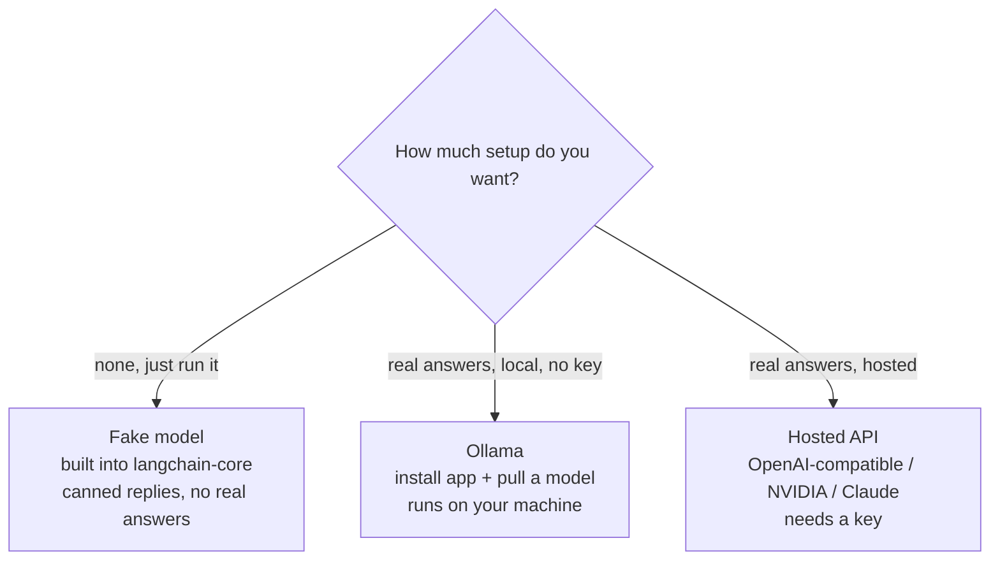

# 02: Environment setup

> **Level:** Beginner · **Prerequisites:** [01 · What LangChain & RAG are](01_what_is_langchain_and_rag.md)
> **Time:** ~45 min · **Verified:** 2026-06-15 (versions below)

## Why this matters

RAG has a few moving parts (an embedding model, a vector store, an LLM), and beginners often get stuck at "what do I even install, and do I need a paid API key?" The answer: **no key required.** This module sets up a clean environment and gives you three LLM options, from zero-setup to real, so the rest of the course just runs.

## Step 1 — A virtual environment

Keep this project's packages isolated from your system Python:

```bash
python -m venv .venv
source .venv/bin/activate        # Windows: .venv\Scripts\activate
python --version                 # should be 3.10+
```

Activate this `.venv` in any terminal where you run course code.

## Step 2 — Install the core packages

```bash
pip install \
  langchain langchain-core langchain-community langchain-text-splitters \
  langchain-huggingface sentence-transformers
```

What each is for:

| Package | Role |
|---------|------|
| `langchain-core` | the base interfaces (messages, prompts, runnables, vector stores) |
| `langchain` | higher-level helpers used later |
| `langchain-community` | document loaders and extra integrations (Section 03) |
| `langchain-text-splitters` | chunking documents (Section 03) |
| `langchain-huggingface` + `sentence-transformers` | a **local** embedding model — turns text into meaning-vectors on your machine, **no API key** |

> **Verified versions** (what this course was tested against): `langchain 1.2.16`, `langchain-core 1.3.2`, `langchain-community 0.4.1`, `langchain-text-splitters 1.1.2`, `langchain-huggingface 1.2.2`, `sentence-transformers 5.5.1`. Newer 1.x versions should behave the same; if an import ever fails, check you're on 1.x (`pip show langchain`).

The first time you use the embedding model it downloads ~80MB (`all-MiniLM-L6-v2`) and caches it; after that it's offline.

## Step 3 — Choose an LLM

You need *something* to generate answers. Pick whichever fits — you can change later, and the code stays the same thanks to LangChain's swappable interface.



### Option A — Fake model (zero setup, for learning the plumbing)

Nothing to install — it's in `langchain-core`. It returns canned text, so you can run every *pipeline* in this course and see its shape without any LLM. We use it for examples that teach structure (and for the test suite).

```python
from langchain_core.language_models import GenericFakeChatModel
llm = GenericFakeChatModel(messages=iter(["This is a canned reply."]))
```

### Option B — Ollama (real answers, local, no API key) — recommended

[Ollama](https://ollama.com) runs open models on your own machine. Install the app, then pull a model:

```bash
ollama pull qwen2:7b        # ~4.4GB; or a smaller model like llama3.2:3b
pip install langchain-ollama
```

```python
from langchain_ollama import ChatOllama
llm = ChatOllama(model="qwen2:7b", temperature=0)
```

This is what produced the real answers shown throughout the course. `temperature=0` makes answers as deterministic as possible — good for factual RAG.

### Option C — Hosted OpenAI-compatible endpoint (real answers, needs a key)

Many providers speak the OpenAI API format, including a **free NVIDIA endpoint**. Use `langchain-openai` and point it at the provider's `base_url`:

```bash
pip install langchain-openai
```

```python
import os
from langchain_openai import ChatOpenAI
llm = ChatOpenAI(
    model="meta/llama-3.1-8b-instruct",
    base_url="https://integrate.api.nvidia.com/v1",   # example; check your provider
    api_key=os.environ["NVIDIA_API_KEY"],             # set this in your shell
    temperature=0,
)
```

> **Keep keys out of code.** Read them from environment variables (`os.environ[...]`), never hard-code them. Set with `export NVIDIA_API_KEY=...` (or a `.env` file you don't commit).

### Option D — Anthropic Claude (real answers, needs a key)

A hosted frontier model. Reach for it when you want the highest answer quality, a very large context window (so more retrieved chunks fit), or reliable **tool calling** (Section 05). It has its own package:

```bash
pip install langchain-anthropic
```

```python
import os
from langchain_anthropic import ChatAnthropic
llm = ChatAnthropic(
    model="claude-haiku-4-5-20251001",   # small + cheap; or a larger Claude for harder tasks
    api_key=os.environ["ANTHROPIC_API_KEY"],
    temperature=0,
)
```

The call site is still `llm.invoke(...)` — identical to every other option. That's the swappability payoff again.

## Which model should you choose?

For *this course* the answer is easy — see the box below. But "which LLM?" is a real question once you build something for others, and the honest answer is **it's a trade-off, not a winner**. Here's how the options compare:

| Option | API key? | Runs offline? | Cost | Answer quality | Tool calling (§05) | Best for |
|--------|----------|---------------|------|----------------|--------------------|----------|
| **Fake model** | no | yes | free | none (canned) | no | learning pipeline shape, tests |
| **Ollama** (local) | no | yes (after pull) | free (your hardware) | good; depends on model size | some models (e.g. `qwen2`) | private data, offline dev, no bills |
| **OpenAI-compatible / NVIDIA** | yes | no | pay per token (NVIDIA has a free tier) | high | yes | quick hosted quality without local hardware |
| **Anthropic Claude** | yes | no | pay per token | highest, large context | yes, reliable | production quality, long contexts, agents |

Three questions decide it in practice:

1. **Is the data private / must it stay on your machine?** → **Ollama** (local, nothing leaves your computer).
2. **Do you have a GPU or patience for CPU inference?** No → a **hosted** option; the provider runs the hardware.
3. **Will the model need to call tools or juggle a big context (Section 05)?** → a capable model: **Claude**, a hosted OpenAI-compatible model, or a tool-capable Ollama model like `qwen2`. Small local models and the fake model can't do this reliably.

> **You don't have to pick perfectly now.** Because every option shares the same `.invoke()` interface, you can develop against the free **fake** or **Ollama** model and switch to **Claude** or a hosted model for a final, higher-quality version — without rewriting your RAG code. That swappability is *why* the course teaches through LangChain's abstractions.

## Step 4 — Verify your setup

Run this — it uses the fake model, so it works no matter which LLM you chose:

```python
from langchain_core.language_models import GenericFakeChatModel

llm = GenericFakeChatModel(messages=iter(["LangChain is working!"]))
print(llm.invoke("hello").content)
```

**Output (real run):**

```text
LangChain is working!
```

If you installed Ollama, swap in `ChatOllama(model="qwen2:7b")` and ask a real question to confirm that path too.

## Which should *you* use for the course?

- Just want to learn the concepts and see pipelines run? **Fake model** is fine for most of Sections 01–03.
- Want to see *real* grounded answers (recommended, and needed to feel RAG working)? **Ollama** — no key, runs offline after the model is pulled.
- Already have a hosted key? **Option C** works identically.

The course text shows real answers captured from the local Ollama model, and clearly labels anything that needs a live LLM.

## Recap & next

- ✅ Use a **virtualenv**; install `langchain-core`, `langchain`, `langchain-community`, `langchain-text-splitters`, plus `langchain-huggingface` + `sentence-transformers` for **local, key-free embeddings**.
- ✅ Choose an LLM: **fake** (zero setup), **Ollama** (real, local, no key — recommended), a **hosted OpenAI-compatible** endpoint, or **Anthropic Claude** (both need a key). The code is the same shape for all of them — swap freely.
- ✅ Choosing a model is a **trade-off** (privacy vs. hardware vs. cost vs. quality vs. tool-calling), not a single winner — see the comparison table above.
- ✅ Keep API keys in **environment variables**, never in code.
- ✅ Self-check: which package provides local embeddings, and which LLM option needs no installation and no key?

→ Next: **[03 · Your first chat model](03_your_first_chat_model.md)** — actually calling an LLM from Python.

## Exercises

1. **Verify your install.** Run the Step 4 snippet. Then print the installed LangChain version with `python -c "import langchain; print(langchain.__version__)"`. Is it 1.x?

<details><summary>Solution</summary>

The snippet prints `LangChain is working!`. The version command prints something like `1.2.16`. If it prints `0.1.x` or `0.2.x`, you're on the *old* LangChain and the course's imports (e.g. `langchain_core.runnables`) may differ — upgrade with `pip install -U langchain langchain-core`.
</details>

2. **Pick your LLM, justify it.** Decide which of the three options you'll use for the course and write one sentence on why. What would make you switch later?

<details><summary>Solution</summary>

No single right answer. Common pick: **Ollama**, because it gives real answers with no API key and runs offline — ideal for experimenting freely. You might switch to a **hosted** model for higher quality on a final project, or drop to the **fake** model when you only want to test pipeline wiring quickly (it's instant and deterministic).
</details>

3. **Why temperature=0?** Both Ollama and the hosted example set `temperature=0`. Why is that a sensible default for a *RAG* app specifically?

<details><summary>Solution</summary>

`temperature` controls randomness/creativity. For RAG you want the model to faithfully report what's in the retrieved context, not invent or vary — so a low temperature (0) gives the most consistent, grounded, repeatable answers. Higher temperatures suit creative writing, not factual document Q&A.
</details>
