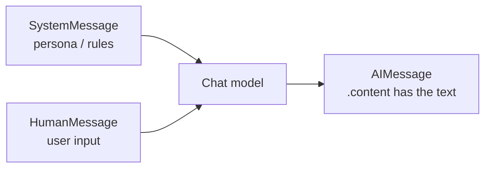

# 03: Your first chat model

> **Level:** Beginner · **Prerequisites:** [02 · Environment setup](02_environment_setup.md)
> **Time:** ~1 hour · **Verified:** 2026-06-15 (langchain-core 1.3.2)

## Why this matters

Everything in LangChain — every chain, every RAG pipeline — eventually calls a **chat model**. Learn its small, consistent interface now (`.invoke`, messages, `.stream`) and the rest of the course is just composing around it. We'll use `ChatOpenAI` throughout (set `OPENAI_API_KEY` as in the last module); swap in `ChatOllama` or `ChatNVIDIA` anywhere and nothing else changes.

## The chat model interface

A modern LLM is a **chat model**: you give it messages, it returns an `AIMessage`. The one method you'll use most is `.invoke()`:

```python
from langchain_openai import ChatOpenAI

llm = ChatOpenAI(model="gpt-4o-mini", temperature=0)   # reads OPENAI_API_KEY

response = llm.invoke("What is a function?")
print("type:", type(response).__name__)
print("content:", response.content)
```

**Output (representative — your wording will differ):**

```text
type: AIMessage
content: A function is a reusable block of code that performs a specific task.
```

Two things to notice:

- You can pass a **plain string** and LangChain wraps it as a human message.
- You get back an **`AIMessage` object**, not a string. The text is in `.content`. (Section 02's output parsers extract `.content` for you automatically.)

> Swap in `ChatOllama(model="qwen2:7b")` or `ChatNVIDIA(...)` and the rest of the snippet is unchanged. The *interface is identical* — that's the swappability payoff.

## Messages: system, human, AI

Chat models think in **messages**, each with a role:

| Message | Role | Use |
|---------|------|-----|
| `SystemMessage` | instructions/persona | "You are a friendly Python tutor." |
| `HumanMessage` | the user's input | "What is a variable?" |
| `AIMessage` | the model's reply | (what you get back) |

Passing a message list gives you control over the system instruction:

```python
from langchain_core.messages import SystemMessage, HumanMessage
from langchain_openai import ChatOpenAI

llm = ChatOpenAI(model="gpt-4o-mini", temperature=0)

messages = [
    SystemMessage("You are a friendly Python tutor."),
    HumanMessage("What is a variable?"),
]
print(llm.invoke(messages).content)
```

**Output (representative — your wording will differ):**

```text
Sure! A variable is a name that stores a value so you can use it later.
```

The **system message** is how you set behaviour ("answer only from the context, say 'I don't know' otherwise") — which is exactly how we'll keep RAG answers grounded later.



## Streaming: tokens as they arrive

For a responsive UI you often want tokens *as they're generated* rather than waiting for the whole answer. Use `.stream()`, which yields chunks:

```python
from langchain_openai import ChatOpenAI

llm = ChatOpenAI(model="gpt-4o-mini", temperature=0)
print("stream chunks:", [chunk.content for chunk in llm.stream("Say hello in three words.")])
```

**Output (representative — your wording will differ):**

```text
stream chunks: ['', 'Hello', ' there', ',', ' friend', '!', '']
```

Chunks are the model's actual tokens (often sub-word pieces). The empty first and last chunks carry metadata — the role and the finish reason — not text. In an app you'd print each chunk as it arrives (`print(chunk.content, end="", flush=True)`) to get the familiar "typing" effect.

## The methods you'll actually use

Every chat model (OpenAI, Ollama, NVIDIA, Claude) shares these — learn them once:

| Method | Returns | Use |
|--------|---------|-----|
| `.invoke(input)` | one `AIMessage` | the normal "ask and get an answer" call |
| `.stream(input)` | an iterator of chunks | show output as it's generated |
| `.batch([a, b, …])` | a list of `AIMessage`s | answer many inputs efficiently |

`input` can be a string, a list of messages, or (Section 02) the output of a prompt template. Because the interface is identical across providers, switching LLMs never changes these calls.

## Try it with a local model (optional)

If you installed Ollama in the last module, the same code runs against a local model:

```python
from langchain_ollama import ChatOllama          # needs: ollama + a pulled model
llm = ChatOllama(model="qwen2:7b", temperature=0)
print(llm.invoke("In one sentence, what is Python?").content)
```

This needs a running Ollama and a pulled model — but it's the same `.invoke()` you just used; everything above transfers verbatim.

## Recap & next

- ✅ A **chat model** takes messages and returns an **`AIMessage`** (text in `.content`). `.invoke()` is the everyday call.
- ✅ **Messages** have roles: `SystemMessage` (rules/persona), `HumanMessage` (input), `AIMessage` (reply). The system message is how you'll keep RAG grounded.
- ✅ `.stream()` yields chunks for a live "typing" effect; `.batch()` handles many inputs.
- ✅ The interface is **identical** across OpenAI/Ollama/NVIDIA/Claude — swap providers without changing call sites.
- ✅ Self-check: what type does `.invoke()` return, and where's the text? What's the system message for?

→ Next: **[Section 02 · LangChain core](../02_langchain_core/README.md)** — prompts, the LCEL `|` pipe, output parsers, and memory.

## Exercises

1. **Change the persona.** Give a `SystemMessage` that says "You always answer in exactly five words," then ask "What is LangChain?" Did the system message change the style?

<details><summary>Solution</summary>

```python
from langchain_openai import ChatOpenAI
from langchain_core.messages import SystemMessage, HumanMessage
llm = ChatOpenAI(model="gpt-4o-mini", temperature=0)
msgs = [SystemMessage("You always answer in exactly five words."),
        HumanMessage("What is LangChain?")]
print(llm.invoke(msgs).content)
```

The system message steers the format (you'll get a terse ~5-word reply). This demonstrates why the system message is your main control knob — we'll use it to enforce "answer only from the context" in RAG.
</details>

2. **Stream the typing effect.** Adapt the streaming snippet to print chunks on one line as they arrive, with no list brackets, like a chatbot typing.

<details><summary>Solution</summary>

```python
from langchain_openai import ChatOpenAI
llm = ChatOpenAI(model="gpt-4o-mini", temperature=0)
for chunk in llm.stream("Say hello in three words."):
    print(chunk.content, end="", flush=True)
print()   # newline at the end
# prints the reply as it streams, e.g.: Hello there, friend!
```

`end=""` keeps it on one line and `flush=True` shows each chunk immediately. This is the live "typing" effect users expect.
</details>

3. **Predict the type.** Before running, what type is `llm.invoke("hi")`, and what's the difference between `llm.invoke("hi")` and `llm.invoke("hi").content`?

<details><summary>Solution</summary>

`llm.invoke("hi")` returns an **`AIMessage`** object (it has `.content`, plus metadata like token usage). `.content` is the **string** of the actual reply text. You usually want `.content` — and in Section 02, a `StrOutputParser` will pull it out automatically at the end of a chain so you don't write `.content` everywhere.
</details>
