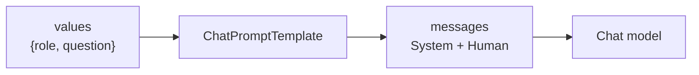

# 01: Prompts & messages

> **Level:** Beginner · **Prerequisites:** [Section 01](../01_foundations/README.md)
> **Time:** ~1 hour · **Verified:** 2026-06-15 (langchain-core 1.3.2)

## Why this matters

You rarely send a fixed string to an LLM — you send a *template* with holes you fill in: the user's question, retrieved context, a persona. **Prompt templates** make that reusable and safe. They're the first link in every chain, and in RAG they're where retrieved document chunks get slotted in next to the question.

## A prompt template with variables

`ChatPromptTemplate.from_messages` builds a multi-message prompt with `{placeholders}`:

```python
from langchain_core.prompts import ChatPromptTemplate

template = ChatPromptTemplate.from_messages([
    ("system", "You are a helpful {role}."),
    ("human", "{question}"),
])

messages = template.invoke({"role": "Python tutor", "question": "What is a list?"})
for m in messages.to_messages():
    print(f"{type(m).__name__}: {m.content}")
```

**Output (real run):**

```text
SystemMessage: You are a helpful Python tutor.
HumanMessage: What is a list?
```

The `{role}` and `{question}` were filled from the dict. The template produced the same `SystemMessage`/`HumanMessage` objects you met in Section 01 — so a prompt template is just "a recipe for building messages."



## Why templates beat f-strings

You *could* build the string with an f-string. Templates are better because they:

- **Separate the prompt from the code** — you can edit wording without touching logic.
- **Declare their inputs** — the template knows it needs `role` and `question`; miss one and you get a clear error.
- **Plug into chains** — a template is a *runnable* you can pipe into the LLM with `|` (next module). An f-string isn't.

## The roles, again

Templates use the same roles as raw messages:

| Tuple form | Becomes |
|------------|---------|
| `("system", "...")` | `SystemMessage` — rules/persona |
| `("human", "...")` | `HumanMessage` — user input |
| `("ai", "...")` | `AIMessage` — a prior model reply (for examples/few-shot) |

For RAG, the **system** message is where you'll write the crucial instruction — *"Answer using only the context below; if it's not there, say you don't know"* — and a `{context}` placeholder is where retrieved chunks land.

## A peek at the RAG prompt you'll use

Here's the actual shape from the capstone (don't worry about where `context` comes from yet — that's Section 03):

```python
from langchain_core.prompts import ChatPromptTemplate

rag_prompt = ChatPromptTemplate.from_template(
    "Answer the question using ONLY the context below. "
    "If the answer is not in the context, say you don't know.\n\n"
    "Context:\n{context}\n\n"
    "Question: {question}\n"
    "Answer:"
)
```

`from_template` is a shortcut for a single human-message prompt with placeholders — handy when you don't need separate system/human messages. Two holes: `{context}` (retrieved chunks) and `{question}` (the user's query). This one template is what turns a generic LLM into a grounded document assistant.

## Recap & next

- ✅ A **prompt template** is a reusable recipe with `{placeholders}` you fill via `.invoke({...})`, producing messages.
- ✅ Templates beat f-strings: they separate wording from code, declare their inputs, and pipe into chains.
- ✅ Roles (`system`/`human`/`ai`) carry over; the **system** message holds your RAG grounding rule, and a `{context}` placeholder receives retrieved chunks.
- ✅ Self-check: what two placeholders does the RAG prompt have, and which message would hold "answer only from context"?

→ Next: **[02 · LCEL chains](02_lcel_chains.md)** — connecting the template to the model with `|`.

## Exercises

1. **Build a translator prompt.** Make a `ChatPromptTemplate` with a system message "You translate English to {language}." and a human message "{text}". Invoke it with `language="French"`, `text="Good morning"` and print the messages.

<details><summary>Solution</summary>

```python
from langchain_core.prompts import ChatPromptTemplate
t = ChatPromptTemplate.from_messages([
    ("system", "You translate English to {language}."),
    ("human", "{text}"),
])
for m in t.invoke({"language": "French", "text": "Good morning"}).to_messages():
    print(type(m).__name__, "->", m.content)
# SystemMessage -> You translate English to French.
# HumanMessage -> Good morning
```
</details>

2. **Missing variable.** Take the translator template and call `.invoke({"language": "French"})` (forget `text`). What happens, and why is that better than an f-string silently producing wrong text?

<details><summary>Solution</summary>

It raises a `KeyError`/missing-variable error naming `text`. That's *better* than an f-string because the template **declares** its required inputs and fails loudly when one is missing, instead of producing a malformed prompt you only notice from a weird LLM answer. Declared inputs = earlier, clearer errors.
</details>

3. **Design a grounded prompt.** Write a `from_template` prompt for a cooking-recipe assistant that must answer only from provided recipe text and refuse otherwise. Which instruction prevents hallucination?

<details><summary>Solution</summary>

```python
ChatPromptTemplate.from_template(
    "You are a recipe assistant. Use ONLY the recipe context to answer. "
    "If the context doesn't contain the answer, say 'That's not in the recipe.'\n\n"
    "Recipe:\n{context}\n\nQuestion: {question}\nAnswer:"
)
```

The instruction **"Use ONLY the context … if not present, say …"** is what prevents hallucination — it tells the model to ground itself in `{context}` and to admit ignorance rather than invent. This is the single most important line in a RAG prompt.
</details>
