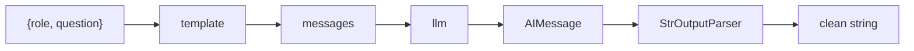
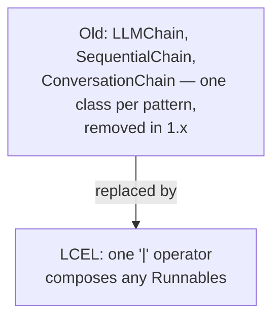

# 02: LCEL chains

> **Level:** Beginner → Intermediate · **Prerequisites:** [01 · Prompts & messages](01_prompts_and_messages.md)
> **Time:** ~1.5 hours · **Verified:** 2026-06-15 (langchain-core 1.3.2)

## Why this matters

This is *the* core skill of modern LangChain. **LCEL — LangChain Expression Language** — lets you connect steps with the `|` pipe operator, exactly like a Unix pipeline. Your RAG system, conversational chains, and parsers are all built this way. Old LangChain used special classes (`LLMChain`, `SequentialChain`) for this; LCEL replaced them with one uniform, composable idea.

## The `|` pipe: output of one step → input of the next

Take the template from the last module, a model, and a parser, and pipe them:

```python
from langchain_core.prompts import ChatPromptTemplate
from langchain_core.output_parsers import StrOutputParser
from langchain_core.language_models import GenericFakeChatModel

template = ChatPromptTemplate.from_messages([
    ("system", "You are a helpful {role}."),
    ("human", "{question}"),
])
llm = GenericFakeChatModel(messages=iter(["A list is an ordered collection."]))

chain = template | llm | StrOutputParser()      # ← the LCEL chain

print(chain.invoke({"role": "tutor", "question": "What is a list?"}))
print("chain type:", type(chain).__name__)
```

**Output (real run):**

```text
A list is an ordered collection.
```
```text
chain type: RunnableSequence
```

Read `template | llm | StrOutputParser()` left to right:



Each `|` feeds one step's output into the next. The whole thing becomes a single **`RunnableSequence`** you call with `.invoke()` — and it has the same interface as a single model (`.invoke`, `.stream`, `.batch`), so chains compose into bigger chains.

## What is a "Runnable"?

Everything in an LCEL chain is a **Runnable** — a thing with `.invoke()`, `.stream()`, `.batch()`. Prompt templates, models, parsers, retrievers: all Runnables. Because they share that interface, the `|` operator can wire any of them together, and the result is itself a Runnable. That uniformity is the whole trick.

| You get, for free, on every chain | Because… |
|-----------------------------------|----------|
| `.invoke(x)` — run once | every step is a Runnable |
| `.stream(x)` — stream the final output | streaming flows through the pipe |
| `.batch([x, y])` — run many inputs | batching flows through too |

## Passing data through: dicts and `RunnablePassthrough`

Often a step needs *multiple* inputs assembled from earlier values. You express that with a **dict of Runnables** — each key is computed, then the dict is passed on. This is exactly how RAG feeds both `context` and `question` into the prompt:

```python
from langchain_core.runnables import RunnablePassthrough

# Sketch of the RAG shape (full version in Section 03):
# chain = (
#     {"context": retriever | format_docs, "question": RunnablePassthrough()}
#     | rag_prompt
#     | llm
#     | StrOutputParser()
# )
```

- The **dict** builds the prompt's inputs: `context` comes from running the retriever and formatting it; `question` is the original input, passed straight through.
- **`RunnablePassthrough()`** means "take the chain's input and pass it along unchanged" — here, the user's question goes both into the retriever *and* into the prompt's `question` slot.

You'll build this exact chain in Section 03; seeing its shape now means it won't look like magic then.

## Why LCEL instead of the old chains



- **Uniform:** one mechanism (`|`) instead of a different class for every composition pattern.
- **Composable:** any chain is a Runnable, so chains nest into bigger chains.
- **Free streaming/batching/async:** implemented once on Runnables, available everywhere.
- **It's the supported path:** `LLMChain` etc. are gone in 1.x; LCEL is what the library and docs use now.

## Recap & next

- ✅ **LCEL** connects steps with `|`: `prompt | llm | parser`, read left to right, output→input.
- ✅ Every piece is a **Runnable** (shares `.invoke`/`.stream`/`.batch`), and a chain *is* a Runnable, so chains compose.
- ✅ A **dict of Runnables** assembles multiple named inputs; **`RunnablePassthrough()`** forwards the original input — the pattern RAG uses to supply `context` + `question`.
- ✅ LCEL replaced the old per-pattern chain classes (`LLMChain`, `SequentialChain`) removed in 1.x.
- ✅ Self-check: what does `|` do, and what does `RunnablePassthrough()` pass through?

→ Next: **[03 · Output parsers & structured output](03_output_parsers_and_structured.md)** — getting clean text and data out.

## Exercises

1. **Build and run a chain.** Make `prompt | llm | StrOutputParser()` where the prompt asks for a one-line definition of a `{term}`, using the fake model. Invoke it for `term="recursion"`. What type comes out — `AIMessage` or `str`?

<details><summary>Solution</summary>

```python
from langchain_core.prompts import ChatPromptTemplate
from langchain_core.output_parsers import StrOutputParser
from langchain_core.language_models import GenericFakeChatModel
prompt = ChatPromptTemplate.from_template("Define {term} in one line.")
llm = GenericFakeChatModel(messages=iter(["Recursion is when a function calls itself."]))
chain = prompt | llm | StrOutputParser()
out = chain.invoke({"term": "recursion"})
print(type(out).__name__, out)   # str  Recursion is when a function calls itself.
```

A **`str`** — the `StrOutputParser` at the end of the pipe pulled `.content` out of the `AIMessage` for you. Without it you'd get an `AIMessage`.
</details>

2. **Drop the parser.** Remove `| StrOutputParser()` from the chain above and invoke again. What's the output type now, and what would you write to get the text?

<details><summary>Solution</summary>

Now `chain = prompt | llm`, so `.invoke(...)` returns an **`AIMessage`**, and you'd read `.content` to get the string. The parser is just a convenience that does that final `.content` extraction inside the pipe — handy so downstream steps receive a plain string.
</details>

3. **Why is a chain itself a Runnable?** You have `chain_a = prompt | llm`. Can you write `chain_a | StrOutputParser()`? Why does that work?

<details><summary>Solution</summary>

Yes. `chain_a` is a `RunnableSequence`, which is a Runnable, so it has the same interface (`.invoke`, etc.) the `|` operator needs on both sides. Piping it into another Runnable just produces a longer `RunnableSequence`. This composability — chains nesting into bigger chains — is the core reason LCEL scales from a 2-step demo to a full RAG pipeline.
</details>
