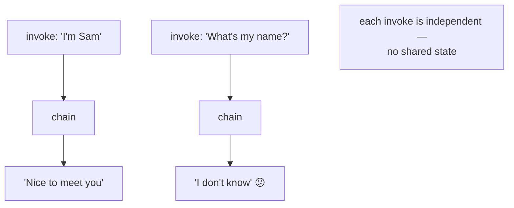
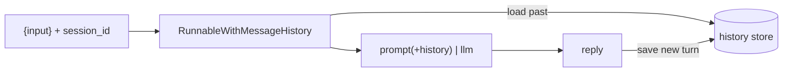

# 04: Memory & message history

> **Level:** Intermediate · **Prerequisites:** [02 · LCEL chains](02_lcel_chains.md)
> **Time:** ~1.5 hours · **Verified:** 2026-06-15 (langchain-core 1.3.2)

## Why this matters

Chains are **stateless** — each `.invoke()` knows nothing about the last one. But a chatbot must remember: "What's my name?" only works if it recalls you said "I'm Sam" earlier. This module adds **conversation memory** the modern way, with `RunnableWithMessageHistory`. (Old tutorials use `ConversationChain` + `ConversationBufferMemory` — both **removed** in LangChain 1.x.) You'll reuse this in Section 04 to build *conversational* RAG.

## The problem: chains forget



The fix is to **store the messages** of a conversation and **replay them** into the prompt on each new turn.

## Step 1 — a prompt with a history slot

`MessagesPlaceholder` reserves a spot where past messages get injected:

```python
from langchain_core.prompts import ChatPromptTemplate, MessagesPlaceholder

prompt = ChatPromptTemplate.from_messages([
    ("system", "You are a helpful assistant."),
    MessagesPlaceholder("history"),     # ← past turns go here
    ("human", "{input}"),               # ← the new message
])
```

## Step 2 — wrap the chain with history

`RunnableWithMessageHistory` wraps any chain and automatically (a) loads stored history into the `history` placeholder before each call and (b) saves the new human+AI messages after. You give it a function that returns a *store* per `session_id`:

```python
from langchain_core.chat_history import InMemoryChatMessageHistory
from langchain_core.runnables.history import RunnableWithMessageHistory
from langchain_openai import ChatOpenAI

llm = ChatOpenAI(model="gpt-4o-mini", temperature=0)
chain = prompt | llm

store = {}
def get_history(session_id: str):
    return store.setdefault(session_id, InMemoryChatMessageHistory())

with_history = RunnableWithMessageHistory(
    chain, get_history,
    input_messages_key="input",       # which input key is the new human message
    history_messages_key="history",   # which placeholder receives past messages
)
```

## Step 3 — talk, and watch it remember

Each call passes a `session_id` so the right conversation is loaded:

```python
config = {"configurable": {"session_id": "demo"}}
print("turn 1:", with_history.invoke({"input": "Hi, I'm Sam."}, config=config).content)
print("turn 2:", with_history.invoke({"input": "What's my name?"}, config=config).content)
print("stored messages:", len(store["demo"].messages))
```

**Output (representative — your wording will differ):**

```text
turn 1: Nice to meet you, Sam! How can I help you today?
turn 2: Your name is Sam.
stored messages: 4
```

Turn 2 "knew" the name because turn 1's messages were replayed into the `history` placeholder. The store now holds **4 messages** — two human, two AI — the full conversation.



## Sessions keep conversations separate

The `session_id` is why two users (or two chats) don't bleed together: each id maps to its own history. `InMemoryChatMessageHistory` keeps them in a dict for the program's lifetime — fine for learning. For a real app you'd swap in a persistent backend (file, Redis, a database) by returning a different history object from `get_history` — the chain code doesn't change.

> **Memory grows.** Every turn adds messages, and prompts have a size limit. Real apps trim or summarise old turns (keep the last N, or summarise the rest). Start simple; add trimming when conversations get long.

## Recap & next

- ✅ Chains are **stateless**; conversation memory means **storing messages and replaying them** into the prompt.
- ✅ Use a **`MessagesPlaceholder("history")`** in the prompt and wrap the chain in **`RunnableWithMessageHistory`** with a per-`session_id` store. (Replaces the removed `ConversationChain`/`ConversationBufferMemory`.)
- ✅ The wrapper auto-loads past messages before each call and saves the new turn after; `session_id` isolates conversations.
- ✅ Swap `InMemoryChatMessageHistory` for a persistent store without changing the chain; trim/summarise long histories.
- ✅ Self-check: what two things does `RunnableWithMessageHistory` do automatically, and what does `session_id` control?

→ Next: **[Section 03 · RAG fundamentals](../03_rag_fundamentals/README.md)** — embeddings, vector stores, and building the retrieval pipeline.

## Exercises

1. **Two sessions don't mix.** Using the setup above, run a turn under `session_id="a"` and another under `session_id="b"`, then check that `store["a"]` and `store["b"]` have separate messages.

<details><summary>Solution</summary>

```python
cfg_a = {"configurable": {"session_id": "a"}}
cfg_b = {"configurable": {"session_id": "b"}}
with_history.invoke({"input": "I'm Alice."}, config=cfg_a)
with_history.invoke({"input": "I'm Bob."}, config=cfg_b)
print(len(store["a"].messages), len(store["b"].messages))   # 2 2 — independent
```

Each `session_id` gets its own `InMemoryChatMessageHistory` from `get_history`, so conversations stay isolated — exactly what multi-user apps need.
</details>

2. **Why MessagesPlaceholder, not a {history} string?** Why inject past turns as *messages* via `MessagesPlaceholder` rather than formatting them into one big string variable?

<details><summary>Solution</summary>

Chat models work best with real message *objects* carrying roles (human/AI), so the model clearly sees who said what across turns. `MessagesPlaceholder` injects the stored `HumanMessage`/`AIMessage` objects directly, preserving roles. Flattening history into a single string loses that structure and tends to confuse multi-turn reasoning. Keep history as messages.
</details>

3. **Persistence swap.** Your chatbot loses memory on restart because history is in a dict. Conceptually, what's the single change to persist it, and what stays the same?

<details><summary>Solution</summary>

Change only `get_history` to return a **persistent** chat-history object (e.g. file-backed, Redis, or SQL) keyed by `session_id`, instead of `InMemoryChatMessageHistory`. The prompt, the chain, and `RunnableWithMessageHistory` are unchanged — they just call `get_history` and use whatever store it returns. That clean seam is why memory is injected via a function rather than hard-coded.
</details>
