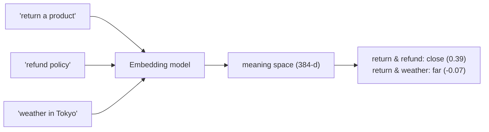

# 01: Embeddings

> **Level:** Intermediate · **Prerequisites:** [Section 02](../02_langchain_core/README.md)
> **Time:** ~1.5 hours · **Verified:** 2026-06-15 (langchain-huggingface 1.2.2, MiniLM)

## Why this matters

Retrieval — the "R" in RAG — works by **meaning**, not keywords. "How do I return a product?" should match a doc titled "Refund Policy" even though they share no words. **Embeddings** make that possible: they turn text into a list of numbers (a vector) positioned so that *similar meanings sit close together*. Everything downstream (vector stores, retrievers) is built on this one idea.

## What an embedding is

An **embedding** is a fixed-length list of numbers representing a piece of text's meaning. Our local model (`all-MiniLM-L6-v2`) produces **384 numbers** per text:

```python
from langchain_huggingface import HuggingFaceEmbeddings

embeddings = HuggingFaceEmbeddings(model_name="sentence-transformers/all-MiniLM-L6-v2")
vector = embeddings.embed_query("How do I return a product?")
print("dimensions:", len(vector))
print("first 5 numbers:", [round(x, 3) for x in vector[:5]])
```

**Output (real run):**

```text
dimensions: 384
first 5 numbers: [-0.001, 0.005, 0.018, -0.041, 0.007]
```

Those 384 numbers are coordinates in a 384-dimensional "meaning space." You'll never read them — what matters is *distance between vectors*.

> **Analogy:** think of a map. Cities close in meaning ("Paris", "Lyon") sit near each other; unrelated ones ("Paris", "banana") sit far apart. Embeddings are map coordinates for *meaning* instead of geography — just with 384 axes instead of 2.

## Measuring similarity

Closeness is usually measured with **cosine similarity**: ~1.0 = very similar, ~0 = unrelated, negative = opposite-ish. Watch meaning, not words:

```python
import numpy as np
def cosine(a, b):
    a, b = np.array(a), np.array(b)
    return float(a @ b / (np.linalg.norm(a) * np.linalg.norm(b)))

v_return  = embeddings.embed_query("How do I return a product?")
v_refund  = embeddings.embed_query("What is your refund policy?")
v_weather = embeddings.embed_query("The weather in Tokyo is rainy.")

print("sim(return, refund) :", round(cosine(v_return, v_refund), 3))
print("sim(return, weather):", round(cosine(v_return, v_weather), 3))
```

**Output (real run):**

```text
sim(return, refund) : 0.393
sim(return, weather): -0.065
```

"Return a product" and "refund policy" share **no words** yet score clearly positive (0.393), while the unrelated weather sentence scores near zero/negative. *That* is semantic search — and why RAG finds the right doc even when the user's words differ from the document's.



## Two methods: query vs documents

Embedding models expose two methods, because questions and documents are embedded slightly differently by some models:

| Method | Use |
|--------|-----|
| `embed_query(text)` | embed **one** search query → a single vector |
| `embed_documents([t1, t2, …])` | embed **many** documents → a list of vectors (batched, efficient) |

```python
vectors = embeddings.embed_documents([
    "Refunds within 30 days.",
    "Shipping is free over $50.",
])
print(len(vectors), "vectors of dim", len(vectors[0]))   # 2 vectors of dim 384
```

In practice the vector store calls these for you (next module) — you rarely call them by hand outside of learning/debugging.

## Why a *local* model here

We use a local HuggingFace model because it's **free, private, and offline** (after a one-time ~80MB download) — ideal for learning and for documents you don't want to send to a third party. Hosted embedding models (OpenAI, Cohere, Google) are often higher quality and a one-line swap (`OpenAIEmbeddings()` etc.) thanks to the standard interface — but they cost money and send your text to an API. Same code shape either way.

> **Consistency rule:** you must embed your documents *and* your queries with the **same model**. Their vectors only live in the same "meaning space" if produced by the same embedder — mixing models makes distances meaningless.

## Recap & next

- ✅ An **embedding** turns text into a fixed-length vector (here 384 numbers) positioned by **meaning**.
- ✅ **Cosine similarity** scores closeness; related texts score high even with no shared words — that's semantic search.
- ✅ `embed_query` (one query) vs `embed_documents` (many docs); the vector store calls these for you.
- ✅ A **local** model is free/private/offline; hosted models are a one-line swap. Always embed docs and queries with the **same** model.
- ✅ Self-check: why does "return a product" match "refund policy"? Why must docs and queries share one embedder?

→ Next: **[02 · Vector stores](02_vector_stores.md)** — storing and searching these vectors at scale.

## Exercises

1. **Rank by similarity.** Embed the query "Where are you located?" and these three docs: "Our HQ is in Berlin.", "We offer free shipping.", "Refunds take a week." Compute cosine similarity to each and rank them. Which wins, and does it share words with the query?

<details><summary>Solution</summary>

```python
q = embeddings.embed_query("Where are you located?")
for text in ["Our HQ is in Berlin.", "We offer free shipping.", "Refunds take a week."]:
    print(round(cosine(q, embeddings.embed_query(text)), 3), text)
```

"Our HQ is in Berlin." scores highest despite sharing **no words** with "Where are you located?" — the model maps "located" and "HQ … in Berlin" to nearby points in meaning space. That word-independent matching is exactly why embeddings beat keyword search for Q&A.
</details>

2. **Same vs different embedder.** Why would embedding your documents with MiniLM but your queries with a different model break retrieval?

<details><summary>Solution</summary>

Each model lays out meaning space differently — its axes and distances are its own. Vectors from two different models aren't comparable, so cosine similarity between a MiniLM doc vector and an other-model query vector is noise. Retrieval would return effectively random chunks. Always use one embedder for both sides.
</details>

3. **Dimensions intuition.** MiniLM gives 384 numbers; some models give 1536. What does a higher dimension buy, and what's the cost?

<details><summary>Solution</summary>

More dimensions give the model more "room" to capture fine-grained meaning, often improving retrieval quality. Costs: each vector uses more memory and storage, similarity math is a bit slower, and the embedding model is usually larger/slower or pricier (if hosted). For learning and many real apps, 384-d MiniLM is plenty; you scale up only if retrieval quality demands it.
</details>
