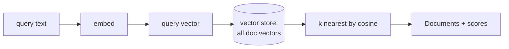

# 02: Vector stores

> **Level:** Intermediate · **Prerequisites:** [01 · Embeddings](01_embeddings.md)
> **Time:** ~1.5 hours · **Verified:** 2026-06-15 (langchain-core 1.3.2, MiniLM)

## Why this matters

Embeddings are only useful if you can **store many of them and find the closest ones fast**. That's a **vector store**: a database specialised for "given this query vector, return the most similar stored vectors." It's the engine room of retrieval. We'll use `InMemoryVectorStore` — built into `langchain-core`, zero setup — and you'll see it find the right document by meaning, with similarity scores.

## Create a store and add documents

A vector store needs an embedding model (to vectorise what you add and what you search for). Adding documents embeds and indexes them in one call:

```python
from langchain_huggingface import HuggingFaceEmbeddings
from langchain_core.vectorstores import InMemoryVectorStore
from langchain_core.documents import Document

embeddings = HuggingFaceEmbeddings(model_name="sentence-transformers/all-MiniLM-L6-v2")
store = InMemoryVectorStore(embeddings)

store.add_documents([
    Document(page_content="Refunds are allowed within 30 days with a receipt.", metadata={"source": "refunds"}),
    Document(page_content="Standard shipping is free over $50.", metadata={"source": "shipping"}),
    Document(page_content="Our office is in Berlin.", metadata={"source": "about"}),
])
```

A `Document` has `page_content` (the text) and `metadata` (anything you want — source, page, date). Metadata rides along through retrieval, so your answers can cite *where* a fact came from.

## Search by meaning

`similarity_search` embeds your query and returns the `k` closest documents:

```python
results = store.similarity_search("how long do I have to return something?", k=1)
print(results[0].page_content)
```

**Output (real run):**

```text
Refunds are allowed within 30 days with a receipt.
```

The query shares almost no words with the stored text, yet the refund doc came back — semantic search at work (Module 01's similarity, now over a whole collection).

## See the scores

`similarity_search_with_score` returns each hit with its similarity, so you can see *how* confident the match is:

```python
for doc, score in store.similarity_search_with_score("how long do I have to return?", k=2):
    print(f"{round(score, 3)}  {doc.metadata['source']}: {doc.page_content}")
```

**Output (real run):**

```text
0.579  refunds: Refunds are allowed within 30 days with a receipt.
0.032  about: Our office is in Berlin.
```

The refund doc scores **0.579**; the unrelated "Berlin" doc scores **0.032**. That gap is the signal retrieval relies on — and you can use scores to filter out weak matches (Module 05).



## The retriever interface

For chains, you don't call `similarity_search` directly — you turn the store into a **retriever**, which is a Runnable (Section 02) you can pipe with `|`:

```python
retriever = store.as_retriever(search_kwargs={"k": 2})
docs = retriever.invoke("how long do I have to return?")
print([d.metadata["source"] for d in docs])     # ['refunds', ...]
```

`as_retriever()` is the bridge from "a database I query" to "a step in an LCEL chain." The RAG chain in Module 04 pipes this retriever straight into the prompt.

## InMemory now, others later — same interface

`InMemoryVectorStore` keeps everything in RAM and vanishes when your program exits — perfect for learning and small/ephemeral data. Production stores persist to disk or a server, but expose the **same** `add_documents` / `similarity_search` / `as_retriever` interface, so swapping is a near one-liner:

| Store | Category | Good for | Install |
|-------|----------|----------|---------|
| `InMemoryVectorStore` | embedded | learning, tests, small data | built into `langchain-core` |
| **FAISS** | embedded library | fast local, save/load to disk | `uv add langchain-community faiss-cpu` |
| **Chroma** / LanceDB | embedded DB | local persistence, prototypes | `uv add langchain-chroma` |
| **pgvector** | "the DB you already run" | **the 2026 production default** (≤ ~50M vectors) | `uv add langchain-postgres` → [07](07_pgvector_postgres.md) |
| **Qdrant** | self-hosted engine | pure-vector scale, strong filtering | `uv add langchain-qdrant` → [08](08_production_vector_dbs.md) |
| **Weaviate** | self-hosted / cloud | hybrid search built in | provider package |
| **Pinecone** | managed SaaS | zero-ops, enterprise SLAs | provider package |
| **Milvus** / Zilliz | self-hosted / managed | massive scale, on-prem | provider package |
| **Neo4j** (`Neo4jVector`) | graph + vector | when *relationships* are the query | [04-5 · GraphRAG](../04_advanced_rag/05_graph_rag.md) |

> **Which one do I actually use?** Learn on `InMemoryVectorStore`/FAISS (zero setup), ship on **pgvector** unless you can name the bottleneck that forces a dedicated engine. Lessons [07](07_pgvector_postgres.md) and [08](08_production_vector_dbs.md) cover both, plus the **HNSW/IVF indexing** vocabulary job specs ask for by name.

> **One caveat we hit:** `InMemoryVectorStore` doesn't implement *relevance-score-threshold* retrieval (it raises `NotImplementedError`). Use `similarity_search_with_score` to filter by score manually (Module 05), or switch to FAISS/Chroma for the built-in threshold retriever. The basic `similarity` and `mmr` retrievers work fine on InMemory.

## Persisting to disk with FAISS

`InMemoryVectorStore` forgets everything when your program exits, so you **re-embed every run** — fine for 10 chunks, painful for 10,000. **FAISS** is a local store you can **save to disk once and load instantly** afterward (`uv pip install faiss-cpu`):

```python
from langchain_community.vectorstores import FAISS

# Build once and save to disk
store = FAISS.from_documents(docs, embeddings)
store.save_local("refunds_index")

# Later (or another run): load from disk — no re-embedding of the documents
loaded = FAISS.load_local("refunds_index", embeddings, allow_dangerous_deserialization=True)
print(loaded.similarity_search("how long to return?", k=1)[0].page_content)
```

**Output (real run):**

```text
Refunds are allowed within 30 days with a receipt.
```

The save writes two files — `index.faiss` (the vectors) and `index.pkl` (the documents/metadata). Note `allow_dangerous_deserialization=True`: FAISS restores that `.pkl` with `pickle`, so **only load index files you created yourself**. Everything else is unchanged — `loaded.as_retriever(...)` behaves exactly like the in-memory store, which is why the capstone can offer persistence as a one-env-var switch ([99 · project](../99_project_doc_assistant/README.md)).

## Recap & next

- ✅ A **vector store** stores embeddings and finds the nearest ones to a query. `InMemoryVectorStore` needs zero setup.
- ✅ `add_documents` embeds + indexes; `Document` carries `page_content` + `metadata` (for citing sources).
- ✅ `similarity_search` returns the top-`k`; `similarity_search_with_score` adds the similarity so you can judge/filter matches.
- ✅ `as_retriever()` turns the store into a Runnable you pipe into a chain.
- ✅ FAISS/Chroma/hosted stores share the same interface — swapping is nearly one line.
- ✅ **FAISS** (`save_local`/`load_local`) persists the index to disk so you **embed once, then load** — the fix for re-embedding on every run.
- ✅ Self-check: what does `add_documents` do under the hood? Why turn a store into a retriever? What two files does FAISS save?

→ Next: **[03 · Loaders & splitters](03_loaders_and_splitters.md)** — getting your real files *into* the store.

## Exercises

1. **Index and search your own facts.** Create an `InMemoryVectorStore`, add 4 short `Document`s about a topic you know, and run `similarity_search` for a question whose wording differs from the docs. Did meaning win over keywords?

<details><summary>Solution</summary>

```python
store = InMemoryVectorStore(embeddings)
store.add_documents([Document(page_content=t) for t in [
    "The library opens at 9am on weekdays.",
    "Parking is free for the first hour.",
    "Coffee is available on the second floor.",
    "Wi-Fi password is printed on your receipt."]])
print(store.similarity_search("When can I get in?", k=1)[0].page_content)
# -> "The library opens at 9am on weekdays."  (no shared words with the query)
```

The opening-hours doc wins despite no shared words — confirming the store searches by meaning.
</details>

2. **Read the scores.** Use `similarity_search_with_score` for a query that's only *loosely* related to your docs. Are the top scores high or low, and what would that tell a RAG system?

<details><summary>Solution</summary>

For a loosely-related query, even the top score will be modest (e.g. < 0.2). That low score is a signal the store has **nothing truly relevant** — a RAG system can use a score threshold to detect this and respond "I don't know" instead of forcing an answer from weak matches. Scores turn "here are k docs" into "here are k docs *and how good they are*."
</details>

3. **Pick a store.** You're building (a) a quick demo, (b) a desktop note-search app that must remember across restarts, (c) a service indexing millions of docs. Which vector store for each?

<details><summary>Solution</summary>

(a) `InMemoryVectorStore` — zero setup, data is throwaway. (b) **Chroma** or **FAISS** — local and *persistent*, so the index survives restarts without a server. (c) a **hosted/server store** (Pinecone, Weaviate, pgvector) — built for scale and concurrent access. Because all share the LangChain vector-store interface, you can prototype on InMemory and switch later with minimal code change.
</details>
