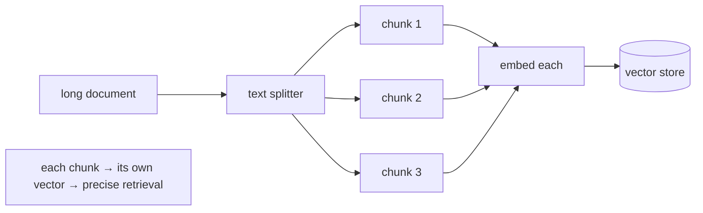
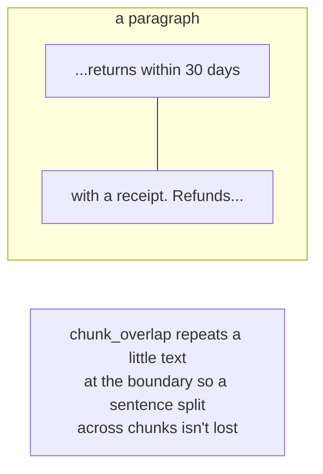

# 03: Loaders & splitters

> **Level:** Intermediate · **Prerequisites:** [02 · Vector stores](02_vector_stores.md)
> **Time:** ~1.5 hours · **Verified:** 2026-06-15 (langchain-community 0.4.1, langchain-text-splitters 1.1.2)

## Why this matters

Real documents are PDFs, web pages, and long text files — not the tidy two-line strings we've been hand-typing. Two tools bridge that gap: **document loaders** read files into LangChain's standard `Document` form, and **text splitters** chop long documents into bite-sized **chunks**. Chunking is one of the highest-leverage decisions in RAG — get it wrong and retrieval returns half-thoughts or giant blobs. This module covers both, on the real capstone documents.

## Document loaders: files → `Document`s

A loader knows how to read one kind of source and return `Document`s with the text in `page_content` and useful `metadata` (like the file path):

```python
from langchain_community.document_loaders import TextLoader, DirectoryLoader

# Load every .md file in the capstone's data/ folder
loader = DirectoryLoader("data", glob="*.md", loader_cls=TextLoader)
docs = loader.load()

print("loaded docs:", len(docs))
print("sources:", sorted(d.metadata["source"].split("/")[-1] for d in docs))
```

**Output (real run, against the capstone `data/`):**

```text
loaded docs: 3
sources: ['company.md', 'refunds.md', 'shipping.md']
```

There's a loader for almost any source — same `.load()` interface, different file type:

| Loader | Reads | Package |
|--------|-------|---------|
| `TextLoader` | `.txt`, `.md` | `langchain-community` |
| `PyPDFLoader` | PDFs (one Document per page) | `langchain-community` + `pypdf` |
| `WebBaseLoader` | web pages | `langchain-community` + `beautifulsoup4` |
| `DirectoryLoader` | a whole folder (wraps another loader) | `langchain-community` |
| `CSVLoader` | CSV rows | `langchain-community` |

Because they all return `Document`s, the *rest of your pipeline doesn't care* where the text came from — swap a `TextLoader` for a `PyPDFLoader` and everything downstream is unchanged.

## Why split? The chunking problem

A loaded document can be many pages. Two reasons you can't just embed it whole:

1. **Retrieval precision:** one embedding for a 10-page doc blurs all its topics into a single vague vector. Chunked, each paragraph gets its own focused vector, so the query matches the *exact* relevant passage.
2. **Prompt size:** you stuff retrieved text into the prompt, which has a token limit. Whole documents won't fit; chunks will.



## The recommended splitter

`RecursiveCharacterTextSplitter` is the sensible default. It tries to split on natural boundaries first — paragraphs (`\n\n`), then lines, then sentences, then words — so chunks stay coherent rather than cut mid-word:

```python
from langchain_text_splitters import RecursiveCharacterTextSplitter

splitter = RecursiveCharacterTextSplitter(chunk_size=200, chunk_overlap=30)
chunks = splitter.split_documents(docs)

print("chunks:", len(chunks))
print("first chunk length:", len(chunks[0].page_content))
print("sample:", repr(chunks[0].page_content[:80]))
```

**Output (real run):**

```text
chunks: 10
first chunk length: 171
sample: '# About Acme\n\nAcme is a small e-commerce company founded in 2019 and headquarter'
```

Three docs became **10 chunks**. Each chunk keeps its parent's `metadata` (so you still know the source). `split_documents` takes and returns `Document`s, ready for `add_documents`.

## The two knobs: `chunk_size` and `chunk_overlap`



- **`chunk_size`** — max characters per chunk. Smaller = more precise retrieval but more chunks and less context per chunk; larger = more context but fuzzier matches. ~500–1000 is a common starting range (we used 200 here for a small demo).
- **`chunk_overlap`** — characters repeated between consecutive chunks (e.g. 30–100). Overlap prevents a fact that straddles a boundary ("refunds within 30 days **| with a receipt**") from being torn apart so neither chunk fully captures it.

> **There's no universal best size.** It depends on your documents and questions. Start at `chunk_size=500, chunk_overlap=50`, test retrieval on real questions, and adjust. This is the single most impactful knob to tune in a RAG system (Section 04 revisits it).

## Putting it together: files → searchable store

This is the whole ingestion pipeline, exactly as the capstone's `ingest.py` does it:

```python
from langchain_huggingface import HuggingFaceEmbeddings
from langchain_core.vectorstores import InMemoryVectorStore

embeddings = HuggingFaceEmbeddings(model_name="sentence-transformers/all-MiniLM-L6-v2")
store = InMemoryVectorStore(embeddings)
store.add_documents(chunks)            # the chunks we just split

print(store.similarity_search("how long are returns?", k=1)[0].page_content[:60])
# -> the refund chunk
```

Load → split → embed → store. Run once, then it's ready for retrieval.

## Recap & next

- ✅ **Loaders** read sources (txt, PDF, web, CSV…) into standard `Document`s; the rest of the pipeline is source-agnostic.
- ✅ **Splitting** is required: per-chunk vectors give precise retrieval, and chunks fit the prompt's token limit.
- ✅ Use **`RecursiveCharacterTextSplitter`** (splits on natural boundaries); tune **`chunk_size`** (precision vs context) and **`chunk_overlap`** (don't tear facts at boundaries).
- ✅ The ingestion pipeline is **load → split → embed → store**, run once.
- ✅ Self-check: give two reasons not to embed a whole document; what does `chunk_overlap` prevent?

→ Next: **[04 · Build a RAG chain](04_build_a_rag_chain.md)** — connect this store to an LLM and answer questions.

## Exercises

1. **Resize the chunks.** Re-split the capstone docs with `chunk_size=500, chunk_overlap=50` and compare the chunk count to the 200/30 run. Why does a bigger `chunk_size` yield fewer chunks?

<details><summary>Solution</summary>

```python
big = RecursiveCharacterTextSplitter(chunk_size=500, chunk_overlap=50).split_documents(docs)
print(len(big))   # fewer than 10 — each chunk holds more text
```

Bigger chunks pack more characters each, so the same total text needs fewer of them. Trade-off: fewer, larger chunks give more context per hit but less precise matching (a chunk may mix two topics). It's the core chunk-size tension.
</details>

2. **Overlap matters.** Split a sentence-spanning text with `chunk_overlap=0` vs `chunk_overlap=50` and inspect the boundary chunks. What can go wrong with zero overlap?

<details><summary>Solution</summary>

With `chunk_overlap=0`, a fact split across the boundary (e.g. "...returns within 30 days" | "with a receipt...") lands half in each chunk, so *neither* chunk fully states the rule — retrieval might surface one half and the LLM misses the condition. With overlap, the boundary text is repeated in both chunks, preserving the complete fact. Overlap is cheap insurance against boundary loss.
</details>

3. **Pick a loader.** You need to ingest: (a) a folder of `.md` notes, (b) a 50-page PDF manual, (c) a documentation website. Which loader for each, and what extra package might each need?

<details><summary>Solution</summary>

(a) `DirectoryLoader` wrapping `TextLoader` — no extra deps. (b) `PyPDFLoader` — needs `pypdf` (`pip install pypdf`); it returns one `Document` per page, which you then split further. (c) `WebBaseLoader` — needs `beautifulsoup4` to parse HTML. All return `Document`s, so your split→embed→store steps are identical regardless of source.
</details>
