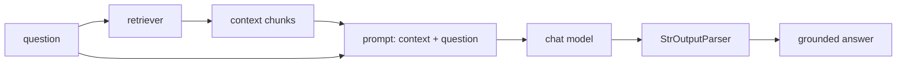

# 04: Build a RAG chain

> **Level:** Intermediate · **Prerequisites:** [03 · Loaders & splitters](03_loaders_and_splitters.md)
> **Time:** ~1.5 hours · **Verified:** 2026-06-15 (LCEL; answers from local qwen2:7b)

## Why this matters

This is the payoff: you connect retrieval to the LLM and get **grounded answers**. Everything so far — chat models, prompts, LCEL, embeddings, vector stores, splitters — snaps together here into the RAG pipeline from the [course README](../README.md). And it's just an LCEL chain: once you see it, you'll recognise it as `prompt | llm | parser` with a retrieval step bolted on the front.

## The four ingredients



You already built each piece:

1. a **retriever** (from a vector store, Module 02),
2. a **prompt** with `{context}` and `{question}` holes (Section 02.01),
3. a **chat model** (Section 01),
4. a **`StrOutputParser`** (Section 02.03).

## Step 1 — set up the retriever

```python
from langchain_huggingface import HuggingFaceEmbeddings
from langchain_core.vectorstores import InMemoryVectorStore
from langchain_core.documents import Document

embeddings = HuggingFaceEmbeddings(model_name="sentence-transformers/all-MiniLM-L6-v2")
store = InMemoryVectorStore(embeddings)
store.add_documents([
    Document(page_content="Refunds are allowed within 30 days of purchase with a receipt."),
    Document(page_content="Standard shipping is free on orders over $50."),
    Document(page_content="Our headquarters is in Berlin, Germany."),
])
retriever = store.as_retriever(search_kwargs={"k": 2})
```

Sanity-check what the retriever feeds the LLM:

```python
for d in retriever.invoke("how long are returns?"):
    print("-", d.page_content)
```

**Output (real run):**

```text
- Refunds are allowed within 30 days of purchase with a receipt.
- Standard shipping is free on orders over $50.
```

The refund chunk is there (plus one less-relevant chunk — `k=2`). The LLM will answer from these.

## Step 2 — the grounded prompt and a formatter

The retriever returns a *list of `Document`s*, but the prompt wants a *string*. A tiny helper joins them:

```python
from langchain_core.prompts import ChatPromptTemplate

prompt = ChatPromptTemplate.from_template(
    "Answer using ONLY the context.\n\n"
    "Context:\n{context}\n\n"
    "Question: {question}\nAnswer:"
)

def format_docs(docs):
    return "\n\n".join(d.page_content for d in docs)
```

The "ONLY the context" instruction is what keeps answers grounded — recall Section 02.01.

## Step 3 — assemble the LCEL chain

Now the key line. The dict (Section 02.02) builds the prompt's two inputs: `context` by running the retriever and formatting it, `question` passed straight through:

```python
from langchain_core.runnables import RunnablePassthrough
from langchain_core.output_parsers import StrOutputParser
from langchain_ollama import ChatOllama        # or any chat model

llm = ChatOllama(model="qwen2:7b", temperature=0)

rag_chain = (
    {"context": retriever | format_docs, "question": RunnablePassthrough()}
    | prompt
    | llm
    | StrOutputParser()
)
```

Trace one question through it:

```mermaid
flowchart TD
    IN["'how long are returns?'"] --> DICT
    subgraph DICT["dict step"]
      C["context: retriever | format_docs<br/>→ 'Refunds are allowed within 30 days…'"]
      QN["question: RunnablePassthrough()<br/>→ 'how long are returns?'"]
    end
    DICT --> P[prompt fills {context}+{question}] --> M[llm] --> SP[StrOutputParser] --> OUT[answer string]
```

## Step 4 — ask it

```python
print(rag_chain.invoke("how long are returns?"))
```

**Output (real run, local qwen2:7b):**

```text
Returns are allowed within 30 days of purchase with a receipt.
```

A grounded answer, drawn straight from the retrieved chunk. And the crucial RAG property — refusing to invent — when the answer isn't in the docs:

```python
print(rag_chain.invoke("who is the CEO?"))
```

**Output (real run):**

```text
The information provided does not include details about the CEO.
```

No hallucinated name. The retrieval supplied no CEO info, and the "ONLY the context" instruction made the model admit it. *That* is the difference between RAG and a bare LLM.

## Running it offline (no LLM)

To see the *plumbing* without any LLM, swap in the fake model — the chain is identical:

```python
from langchain_core.language_models import GenericFakeChatModel

fake = GenericFakeChatModel(messages=iter(["Returns are allowed within 30 days."]))
offline_chain = (
    {"context": retriever | format_docs, "question": RunnablePassthrough()}
    | prompt | fake | StrOutputParser()
)
print(offline_chain.invoke("how long are returns?"))
```

**Output (real run):**

```text
Returns are allowed within 30 days.
```

Same chain, fake model — proof the *structure* works with zero setup. Swap `fake` for `ChatOllama(...)` to get real answers. This is exactly the swap the capstone's `llm.py` automates.

## Returning sources

Because chunks carry `metadata`, you can also return *where* an answer came from — build a chain that outputs both the answer and the source docs (you'll do this in the capstone). Citing sources is a major reason teams choose RAG: answers are auditable.

## Recap & next

- ✅ A RAG chain is **`{context: retriever | format_docs, question: passthrough} | prompt | llm | parser`** — LCEL you already know, with retrieval on the front.
- ✅ A small `format_docs` joins retrieved `Document`s into the prompt's `{context}` string.
- ✅ The **"answer using ONLY the context"** instruction grounds the model — verified it answered from docs *and* refused to invent a CEO.
- ✅ Swap the real LLM for `GenericFakeChatModel` to run the whole pipeline offline; metadata lets you return sources.
- ✅ Self-check: what are the two keys in the dict step, and what does each produce? What makes the model say "I don't know"?

→ Next: **[05 · Retrieval strategies](05_retrieval_strategies.md)** — getting the *right* chunks into that context.

## Exercises

1. **Build your own RAG chain.** Index 4–5 facts about a topic, build the LCEL RAG chain (use the fake model if you have no LLM), and ask a question whose answer is in your facts. Confirm the answer reflects your data.

<details><summary>Solution</summary>

Reuse the Step 1–3 code with your own `Document`s. With the fake model the chain returns whatever you scripted (proving wiring); with a real model it answers from your facts. The structure never changes — that's the LCEL win. The key check: the retrieved `context` (print `retriever.invoke(question)`) actually contains the answer, so the LLM has what it needs.
</details>

2. **Force a hallucination, then prevent it.** Ask your chain something *not* in the docs. With the "ONLY the context" instruction, what should it say? Remove that instruction from the prompt — what changes (with a real model)?

<details><summary>Solution</summary>

With "ONLY the context," the model should say it doesn't know (as the CEO example did). Remove that line and the model, lacking grounding rules, is more likely to *guess* from its training knowledge — possibly inventing a plausible but wrong answer. This demonstrates that grounding lives in the **prompt instruction**, not magic: RAG retrieves the context, but the prompt must tell the model to stick to it.
</details>

3. **Why the dict, not two calls?** Why express the inputs as `{"context": retriever | format_docs, "question": RunnablePassthrough()}` instead of calling the retriever separately and then `prompt.invoke(...)`?

<details><summary>Solution</summary>

The dict keeps everything as **one composable Runnable**, so the whole RAG flow is a single object with `.invoke`/`.stream`/`.batch`, can be reused, and runs the retriever and passthrough as part of the pipeline (even concurrently). Calling the retriever separately would split the logic into imperative glue code, losing streaming/batching and composability. The dict is how LCEL expresses "build these named inputs in parallel, then continue the pipe."
</details>
