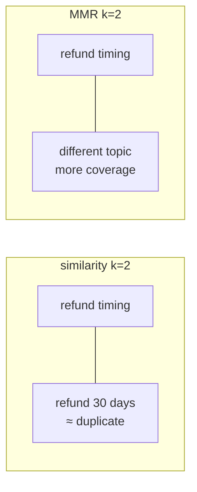
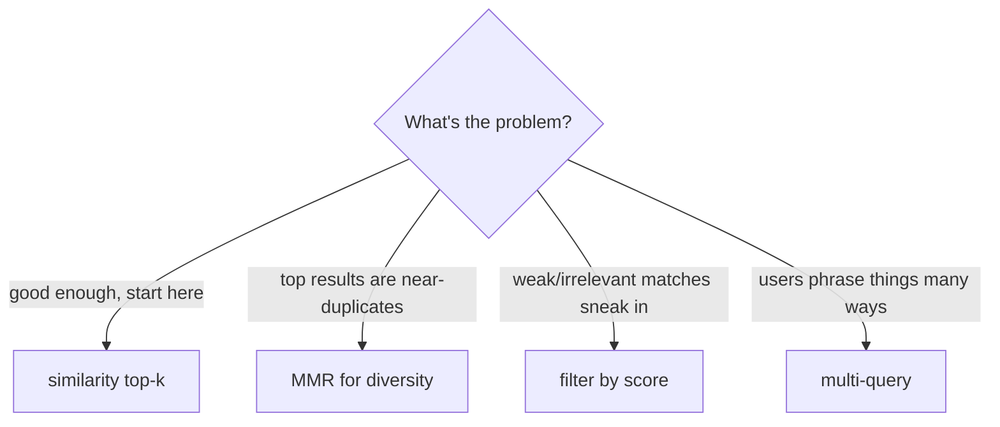

# 05: Retrieval strategies

> **Level:** Intermediate · **Prerequisites:** [04 · Build a RAG chain](04_build_a_rag_chain.md)
> **Time:** ~1.5 hours · **Verified:** 2026-06-15 (langchain-core 1.3.2, MiniLM)

## Why this matters

RAG is only as good as what it retrieves — garbage chunks in, garbage answer out. Plain top-`k` similarity is a fine default, but it has failure modes: it can return near-duplicate chunks (wasting your context budget) or weak matches when nothing is truly relevant. This module covers the handful of retrieval strategies that fix those, and *when* to reach for each. All are a small change to `as_retriever(...)`.

## 1. Similarity (the default)

Return the `k` chunks closest to the query. Simple, fast, the right starting point:

```python
retriever = store.as_retriever(search_kwargs={"k": 2})
print([d.page_content[:30] for d in retriever.invoke("refund timing")])
```

**Output (real run):**

```text
['Refunds take 5-7 business days', 'Refunds are allowed within 30 ']
```

Both hits are about refunds — but notice they're *similar to each other*. If your top results are near-duplicates, you're spending context on redundant text. That's what MMR fixes.

## 2. MMR — Maximal Marginal Relevance (diversity)

MMR balances **relevance** with **diversity**: it picks chunks that are relevant *and* different from the ones already chosen, so you cover more ground. It fetches a larger pool (`fetch_k`) then selects a diverse `k`:

```python
retriever = store.as_retriever(
    search_type="mmr",
    search_kwargs={"k": 2, "fetch_k": 4},
)
print([d.page_content[:30] for d in retriever.invoke("refund timing")])
```

**Output (real run):**

```text
['Refunds take 5-7 business days', 'Our office is in Berlin, Germa']
```

Compared to plain similarity, MMR kept the top refund chunk but swapped the redundant second refund chunk for a *different* one. Use MMR when your documents have lots of near-duplicate passages and you want broader coverage in the context.



## 3. Filtering by score (drop weak matches)

Sometimes *nothing* relevant exists, and you'd rather return nothing than a weak match. Use the scores from Module 02 to filter:

```python
def retrieve_strong(query, k=3, min_score=0.2):
    hits = store.similarity_search_with_score(query, k=k)
    return [doc for doc, score in hits if score >= min_score]

print("relevant :", [d.page_content[:25] for d in retrieve_strong("refund timing")])
print("nonsense :", [d.page_content[:25] for d in retrieve_strong("quantum astrophysics")])
```

For a relevant query you get chunks; for "quantum astrophysics" (nothing in the docs is close) you get an **empty list** — and your RAG prompt can then answer "I don't know" instead of being fed junk.

> **Version note:** LangChain also has a `search_type="similarity_score_threshold"` retriever, but `InMemoryVectorStore` doesn't implement the relevance-score function it needs (it raises `NotImplementedError`). The manual filter above works on any store; the built-in threshold retriever works on stores like FAISS/Chroma. Same idea, just pick the form your store supports.

## 4. Multi-query (catch different phrasings)

A single query might miss chunks phrased differently. **MultiQueryRetriever** uses an LLM to rewrite your question several ways, retrieves for each, and merges the results — improving recall:

```python
# Lives in the langchain-classic package in LangChain 1.x:
from langchain_classic.retrievers.multi_query import MultiQueryRetriever

multi = MultiQueryRetriever.from_llm(
    retriever=store.as_retriever(search_kwargs={"k": 2}),
    llm=llm,                                   # needs a real LLM to generate variations
)
docs = multi.invoke("How do I get my money back?")
```

This needs a live LLM (to generate the query variations), so it's **not run here** — but the idea: "How do I get my money back?", "What's the refund process?", "Can I return an item?" all retrieve, and the union surfaces the refund chunk even if one phrasing would have missed it. Use it when users ask the same thing in many ways.

## Choosing a strategy



| Strategy | Fixes | Cost |
|----------|-------|------|
| **Similarity** | — (baseline) | cheapest |
| **MMR** | redundant chunks | a bit more compute (`fetch_k` pool) |
| **Score filter** | weak matches when nothing fits | trivial |
| **Multi-query** | missed phrasings (recall) | extra LLM calls |

Start with similarity. Add a strategy only when you observe its specific failure in *your* retrieval — don't pre-optimise. Section 04 goes further with **hybrid (keyword + semantic)** search and reranking.

## Recap & next

- ✅ **Similarity top-`k`** is the default; tune `k` first.
- ✅ **MMR** (`search_type="mmr"`, `fetch_k`) trades a little relevance for **diversity**, avoiding near-duplicate chunks.
- ✅ **Filter by score** (`similarity_search_with_score` + a threshold) to drop weak matches and let RAG say "I don't know."
- ✅ **Multi-query** rewrites the question with an LLM to catch different phrasings (better recall, extra LLM calls); it's in `langchain-classic` on 1.x.
- ✅ Pick a strategy to fix an *observed* failure, not preemptively.
- ✅ Self-check: what does MMR optimise for besides relevance? When is score-filtering worth it?

→ Next: **[06 · RAG over web pages](06_web_sources.md)** — scrape web content into the same pipeline. (Then Section 04 for hybrid retrieval, conversational RAG, evaluation, and serving.)

## Exercises

1. **See MMR change the result.** Index several near-duplicate chunks on one topic plus a couple of others. Retrieve with `similarity` (`k=3`) and with `mmr` (`k=3, fetch_k=6`). How do the result sets differ?

<details><summary>Solution</summary>

Similarity tends to return the 3 most-similar chunks, which on a duplicate-heavy topic are near-copies of each other. MMR returns the best match plus chunks that are *different*, so the set covers more distinct information. If your answers feel like they're missing context that's clearly in the docs, redundant retrieval is a likely cause — MMR helps.
</details>

2. **Add a relevance gate.** Wrap the score filter so your RAG chain returns "I don't have information on that." when retrieval comes back empty. Why is this better than always feeding the top-`k`?

<details><summary>Solution</summary>

```python
def answer(query):
    docs = retrieve_strong(query, min_score=0.2)
    if not docs:
        return "I don't have information on that."
    # ... otherwise run the normal RAG chain with these docs
```

Always feeding top-`k` forces *some* chunks into the prompt even when none are relevant, tempting the LLM to answer from junk (or hallucinate). A score gate detects "nothing relevant" and short-circuits to an honest refusal — improving trustworthiness, which is the whole point of RAG.
</details>

3. **When multi-query earns its cost.** Multi-query makes extra LLM calls per question. For which kind of app is that worth it, and for which is it overkill?

<details><summary>Solution</summary>

Worth it when **users phrase the same need in wildly different ways** and missing a relevant chunk is costly — e.g. a customer-support bot where "money back", "refund", "return for cash" all mean the same thing and a missed doc means a wrong answer. Overkill for a small, well-curated corpus with consistent terminology, or a latency/cost-sensitive app, where plain similarity (maybe with MMR) already retrieves the right chunks without the extra LLM round-trips.
</details>
