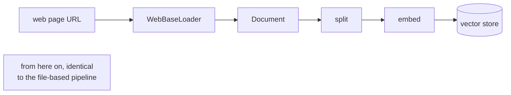

# 06: RAG over web pages (scraping)

> **Level:** Intermediate · **Prerequisites:** [03 · Loaders & splitters](03_loaders_and_splitters.md), [04 · Build a RAG chain](04_build_a_rag_chain.md)
> **Time:** ~1 hour · **Verified:** 2026-07-05 (langchain-community 0.4.1, beautifulsoup4 4.14.3, MiniLM; live LLM answer with local qwen2:7b)

## Why this matters

So far your documents have been local files. But a huge amount of the knowledge you'd want to ground an LLM on lives **on the web** — a product's documentation site, a company's FAQ page, a changelog, a wiki. The great news: because loaders all return `Document`s (Module 03), **scraping a web page is just a different loader** — everything downstream (split → embed → store → retrieve → answer) is *exactly the same code you already wrote*. This module shows the web loader, the one gotcha (web pages are messy), and a full RAG answer grounded in a scraped page.



## Setup

`WebBaseLoader` uses **BeautifulSoup** to parse HTML. You already installed it if you followed Section 03; if not:

```bash
uv pip install beautifulsoup4
```

> **Set a User-Agent.** Polite scrapers identify themselves. Set the `USER_AGENT` environment variable (e.g. `export USER_AGENT="my-rag-app/1.0"`) — otherwise the loader prints a warning. Some sites also block requests that don't send one.

## Scraping a single page

We'll use **`example.com`** throughout — it's the internet's official, permanently-stable page for documentation examples, so these outputs are reproducible.

```python
from langchain_community.document_loaders import WebBaseLoader

loader = WebBaseLoader("https://example.com")
docs = loader.load()

print("docs:", len(docs))
print("source:", docs[0].metadata["source"])
print("title:", docs[0].metadata["title"])
print("content:", repr(docs[0].page_content.strip()))
```

**Output (real run):**

```text
docs: 1
source: https://example.com
title: Example Domain
content: 'Example DomainExample DomainThis domain is for use in documentation examples without needing permission. Avoid use in operations.Learn more'
```

One page → one `Document`, with the URL and page title captured in `metadata`. Same `.load()` you used for text files.

## The gotcha: web pages are messy

Look closely at that output: **"Example Domain" appears twice** (once from the `<title>`-ish heading, once from the `<h1>`), plus a trailing "Learn more" link. Real pages are far worse — navigation bars, cookie banners, footers, ads, "related articles" — all scraped into `page_content` as noise. Feed that to retrieval and you embed junk alongside the real content.

**Fix: tell BeautifulSoup which part of the page to keep.** Pass a `SoupStrainer` so the loader parses *only* the tags you care about (here, paragraph `<p>` tags):

```python
import bs4
from langchain_community.document_loaders import WebBaseLoader

loader = WebBaseLoader(
    "https://example.com",
    bs_kwargs={"parse_only": bs4.SoupStrainer("p")},   # keep only <p> tags
)
print(repr(loader.load()[0].page_content.strip()))
```

**Output (real run):**

```text
'This domain is for use in documentation examples without needing permission. Avoid use in operations.Learn more'
```

The duplicated heading is gone — we kept only the paragraph text. On a real site you'd target the main content container, e.g. `SoupStrainer("div", class_="article-body")` or `SoupStrainer(["h1", "p"])`. **Inspect the page's HTML** (right-click → Inspect in your browser) to find the right tag/class. This cleanup step is the web equivalent of choosing a good `chunk_size` — a little effort here pays off in retrieval quality.

## Scraping several pages at once

Pass a list of URLs and you get one `Document` per page:

```python
loader = WebBaseLoader(["https://example.com", "https://example.org"])
docs = loader.load()

print("docs:", len(docs))
print("sources:", [d.metadata["source"] for d in docs])
```

**Output (real run):**

```text
docs: 2
sources: ['https://example.com', 'https://example.org']
```

## Web content → a working RAG, end to end

Here's the payoff: the retrieved-web-content pipeline is **the module-03 pipeline, unchanged**. Load from the web instead of disk, then split → embed → store → retrieve → answer exactly as before:

```python
from langchain_community.document_loaders import WebBaseLoader
from langchain_text_splitters import RecursiveCharacterTextSplitter
from langchain_huggingface import HuggingFaceEmbeddings
from langchain_core.vectorstores import InMemoryVectorStore
from langchain_core.prompts import ChatPromptTemplate
from langchain_core.output_parsers import StrOutputParser
from langchain_core.runnables import RunnablePassthrough
from langchain_ollama import ChatOllama          # any chat model works

# 1. Load from the web  ← the only new part
docs = WebBaseLoader("https://example.com").load()

# 2. …everything below is identical to Module 04
chunks = RecursiveCharacterTextSplitter(chunk_size=120, chunk_overlap=20).split_documents(docs)
store = InMemoryVectorStore(HuggingFaceEmbeddings(
    model_name="sentence-transformers/all-MiniLM-L6-v2"))
store.add_documents(chunks)
retriever = store.as_retriever(search_kwargs={"k": 2})

prompt = ChatPromptTemplate.from_template(
    "Answer using ONLY the context. If not in the context, say you don't know.\n\n"
    "Context:\n{context}\n\nQuestion: {question}\nAnswer:")
fmt = lambda ds: "\n\n".join(d.page_content for d in ds)
llm = ChatOllama(model="qwen2:7b", temperature=0)

chain = ({"context": retriever | fmt, "question": RunnablePassthrough()}
         | prompt | llm | StrOutputParser())

print("A:", chain.invoke("What is this domain for?"))
```

**Output (real run, local qwen2:7b):**

```text
A: This domain is for use in documentation examples without needing permission
   and should be avoided in actual operations.
```

A grounded answer built from a page we scraped seconds earlier. Swap the URL for your product's docs and you have "chat with a website."

## Scaling up: the loader you need for the job

`WebBaseLoader` is the free, no-key default, but it's one of **many** web loaders LangChain integrates — you pick based on the source. All return `Document`s, so your downstream pipeline never changes.

**Free / local (in `langchain-community`):**

| Loader | Use it for | Extra install |
|--------|-----------|---------------|
| `WebBaseLoader` | a known URL (or list), static HTML | `beautifulsoup4` |
| `RecursiveUrlLoader` | **crawl a whole site** — follows links from a start URL to a set depth | `beautifulsoup4` |
| `SitemapLoader` | every page in a site's `sitemap.xml` | `beautifulsoup4` |
| `UnstructuredURLLoader` | messy pages with tables/lists/complex layout | `unstructured` |
| `SeleniumURLLoader` | **JavaScript-rendered** pages (drives a real browser) | `selenium` + a browser driver |

**Hosted scraping services (higher quality / anti-bot handling — need an API key):**

| Loader | Import | What it adds |
|--------|--------|--------------|
| **FireCrawl** | `from langchain_community.document_loaders import FireCrawlLoader` | crawls a whole site → clean markdown; `scrape`/`crawl` modes; needs `FIRECRAWL_API_KEY` (`uv pip install firecrawl-py`) |
| **Docling** | `from langchain_docling.loader import DoclingLoader` | strong document/HTML structure parsing (`uv pip install langchain-docling`) |
| **Hyperbrowser / Browserbase** | provider packages | managed headless browsers with stealth mode for tough anti-scraping sites |

> **Where to look:** LangChain's integration list at **[docs.langchain.com → integrations → document loaders](https://docs.langchain.com/oss/python/integrations/document_loaders)** is the authoritative, up-to-date catalog — new web loaders get added there. Start with `WebBaseLoader`; reach for a hosted service only when free loaders can't get clean content.

> **When does plain `WebBaseLoader` fail?** If a page looks empty or missing its main text after scraping, it's probably a **JavaScript app** that renders content in the browser after load. `WebBaseLoader` grabs the raw HTML *before* that JS runs, so it sees an empty shell — reach for `SeleniumURLLoader`, a Playwright loader, or a hosted service like FireCrawl instead.

## Scrape responsibly

Scraping hits someone else's server. Be a good citizen:

- **Respect `robots.txt`** and a site's terms of service — not everything is fair game.
- **Don't hammer** — for many pages, add delays; don't fire hundreds of requests in a burst.
- **Cache what you scrape** so you don't re-fetch the same page on every run (embed once, reuse the store — Module 02).
- **Set a `USER_AGENT`** that identifies you.

## Recap & next

- ✅ Scraping a web page is **just another loader** (`WebBaseLoader`) returning standard `Document`s — the whole split→embed→retrieve→answer pipeline is unchanged.
- ✅ Web pages are **noisy** (nav, footers, duplicated headings); use a `SoupStrainer` via `bs_kwargs` to keep only the content tags that matter.
- ✅ Pass a **list of URLs** for several pages; use `RecursiveUrlLoader`/`SitemapLoader` for whole sites and a **Selenium/Playwright** loader for JavaScript-rendered pages.
- ✅ Scrape **politely**: honour `robots.txt`, set a `USER_AGENT`, don't hammer servers, and cache results.
- ✅ Self-check: why did "Example Domain" appear twice, and what fixes it? Which loader do you need for a JavaScript-heavy page?

→ Next: **[07 · pgvector on Postgres](07_pgvector_postgres.md)** — move off the toy store onto the production default.

## Exercises

1. **Clean a real page.** Pick a documentation page you like, scrape it with plain `WebBaseLoader`, and print `len(page_content)`. Then open the page's HTML in your browser's inspector, find the main content container, and re-scrape with a `SoupStrainer` targeting it. How much did the length drop, and what noise disappeared?

<details><summary>Solution</summary>

```python
import bs4
from langchain_community.document_loaders import WebBaseLoader

raw = WebBaseLoader(URL).load()[0]
clean = WebBaseLoader(URL, bs_kwargs={"parse_only": bs4.SoupStrainer("main")}).load()[0]
print("raw:", len(raw.page_content), "clean:", len(clean.page_content))
```

The cleaned length is usually far smaller — the removed characters were navigation menus, footers, sidebars, and cookie banners. Those would otherwise be embedded as chunks and could be retrieved instead of real content, so targeting the main container directly improves retrieval precision.
</details>

2. **Web vs. file — spot the difference.** Take your RAG chain from Module 04 (file-based) and point it at a scraped page instead. How many lines did you actually change?

<details><summary>Solution</summary>

Exactly **one**: the loader line (`WebBaseLoader(url)` instead of `TextLoader(path)` / `DirectoryLoader(...)`). Because both return `Document`s, splitting, embedding, the vector store, the retriever, and the chain are all identical. This is the loader abstraction paying off — your RAG logic doesn't know or care where the text came from.
</details>

3. **Diagnose an empty scrape.** You scrape a modern web app and `page_content` comes back nearly empty, even though the page is full of text in your browser. What's happening, and what do you switch to?

<details><summary>Solution</summary>

The page is a **JavaScript-rendered app**: the server sends a near-empty HTML shell, and the browser runs JS to fetch and render the real content afterward. `WebBaseLoader` only sees that initial shell (it doesn't run JavaScript), so it captures almost nothing. Switch to a loader that drives a real browser — `SeleniumURLLoader` or a Playwright-based loader — which waits for the JS to render before reading the page.
</details>
</content>
</invoke>
