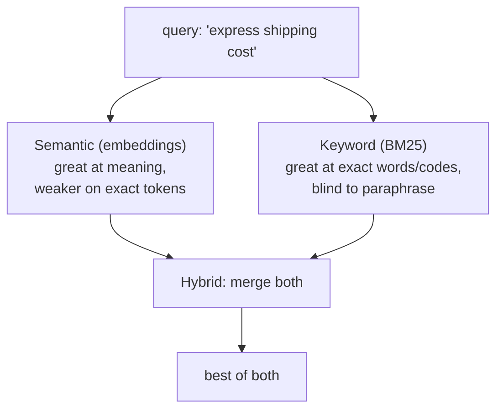

# 01: Better retrieval

> **Level:** Intermediate · **Prerequisites:** [Section 03](../03_rag_fundamentals/README.md)
> **Time:** ~1.5 hours · **Verified:** 2026-06-15 (langchain-community 0.4.1, rank-bm25 0.2.2)

## Why this matters

Semantic search is great at *meaning* but can miss exact terms — product codes, names, acronyms ("Error E-501", "the K2 plan"). Keyword search is the opposite: great at exact terms, blind to paraphrase. **Hybrid search** combines both, and it's one of the most reliable quality upgrades for a real RAG system. This module builds it with an `EnsembleRetriever`.

## The blind spots of each method



- **Semantic** matches "how do I get my money back" to a "Refund Policy" doc — but might rank a doc containing the literal SKU "AC-90" below a paraphrase.
- **Keyword (BM25)** nails "AC-90" or "Error E-501" exactly — but returns nothing for a paraphrase with no shared words.

## Build a hybrid retriever

`BM25Retriever` (keyword) lives in `langchain-community`; `EnsembleRetriever` (the merger) is in `langchain-classic` on 1.x. You give the ensemble both retrievers and weights:

```python
from langchain_core.documents import Document
from langchain_huggingface import HuggingFaceEmbeddings
from langchain_core.vectorstores import InMemoryVectorStore
from langchain_community.retrievers import BM25Retriever
from langchain_classic.retrievers import EnsembleRetriever

docs = [
    Document(page_content="Refunds are allowed within 30 days with a receipt."),
    Document(page_content="Standard shipping is free over $50."),
    Document(page_content="Our office is in Berlin, Germany."),
    Document(page_content="Express shipping costs $14.99 and takes 1-2 days."),
]

embeddings = HuggingFaceEmbeddings(model_name="sentence-transformers/all-MiniLM-L6-v2")
store = InMemoryVectorStore(embeddings); store.add_documents(docs)

semantic = store.as_retriever(search_kwargs={"k": 2})
keyword = BM25Retriever.from_documents(docs); keyword.k = 2

hybrid = EnsembleRetriever(retrievers=[keyword, semantic], weights=[0.5, 0.5])
```

Compare all three on the same query:

```python
q = "shipping cost"
print("semantic:", [d.page_content[:30] for d in semantic.invoke(q)])
print("bm25    :", [d.page_content[:30] for d in keyword.invoke(q)])
print("hybrid  :", [d.page_content[:30] for d in hybrid.invoke(q)])
```

**Output (real run):**

```text
semantic: ['Standard shipping is free over', 'Express shipping costs $14.99 ']
bm25    : ['Express shipping costs $14.99 ', 'Our office is in Berlin, Germa']
hybrid  : ['Express shipping costs $14.99 ', 'Standard shipping is free over', 'Our office is in Berlin, Germa']
```

Each method ranks differently; the **hybrid** merges them, surfacing both shipping chunks at the top while still including others. The `weights=[0.5, 0.5]` balance keyword vs semantic — raise the semantic weight for paraphrase-heavy queries, the keyword weight for jargon/code-heavy ones.

## Drop it into your RAG chain

An ensemble retriever is just a retriever, so it slots into the LCEL RAG chain from Section 03 with **no other change**:

```python
rag_chain = (
    {"context": hybrid | format_docs, "question": RunnablePassthrough()}
    | prompt | llm | StrOutputParser()
)
```

That's the payoff of the uniform retriever interface — you upgrade retrieval quality by swapping one component.

## Reranking (the next step up)

Hybrid retrieval improves *recall* (getting the right chunk into the candidate set). **Reranking** improves *precision*: fetch more candidates (say 20), then use a smarter, slower model (a cross-encoder, or a hosted reranker like Cohere) to re-score and keep the best 3–4. It's a common production pattern when the top hits are *almost* right but not well-ordered.

```python
# Sketch — needs an extra model/package, so not run here:
# from langchain.retrievers import ContextualCompressionRetriever
# reranked = ContextualCompressionRetriever(base_retriever=hybrid, base_compressor=<reranker>)
```

Reach for reranking only after hybrid + chunk-size tuning, and when you can measure that ordering is the problem (next module). It adds latency and often a dependency or API.

## A retrieval-quality checklist

When answers are weak, work *down* this list — most gains are near the top and cheap:

1. **Chunk size/overlap** (Section 03.03) — usually the biggest lever.
2. **`k`** — too low misses context, too high adds noise.
3. **MMR** — if results are redundant.
4. **Hybrid** — if exact terms/codes matter.
5. **Reranking** — if recall is fine but ordering is off.

## Recap & next

- ✅ **Semantic** search nails meaning, **keyword (BM25)** nails exact terms/codes; each is blind where the other is strong.
- ✅ **Hybrid** = `EnsembleRetriever([BM25, semantic], weights=[…])` merges both; tune weights to your query mix.
- ✅ It's just a retriever — drop it into the LCEL RAG chain unchanged.
- ✅ **Reranking** improves ordering (precision) after recall is good; add it later, it costs latency/deps.
- ✅ Tune in order: chunk size → `k` → MMR → hybrid → rerank.
- ✅ Self-check: give a query where BM25 beats semantic, and one where semantic beats BM25. What do the ensemble weights control?

→ Next: **[02 · Conversational RAG](02_conversational_rag.md)** — handling follow-up questions.

## Exercises

1. **Find a keyword-only win.** Add a doc containing an exact code like "Promo code SAVE20 gives 20% off." Query "SAVE20" with semantic vs BM25 vs hybrid. Which retrieves it most reliably, and why?

<details><summary>Solution</summary>

BM25 (and hybrid) reliably surface it because "SAVE20" is an exact token match — BM25's strength. Pure semantic search may rank it lower, since a random code string has weak *meaning* for the embedding model to latch onto. This is the canonical case for hybrid: codes, SKUs, error IDs, and names where the literal characters matter more than meaning.
</details>

2. **Tune the weights.** Set `weights=[0.2, 0.8]` (favor semantic) then `[0.8, 0.2]` (favor keyword) and observe ranking changes on a paraphrased query. Which weighting suits a support bot where users paraphrase a lot?

<details><summary>Solution</summary>

For a paraphrase-heavy support bot, favor **semantic** (`[0.2, 0.8]` keyword/semantic) so "get my money back" still finds the refund doc. Lean keyword when your corpus is full of exact identifiers users type verbatim. There's no universal setting — pick based on how your users actually phrase queries, and (next module) measure it.
</details>

3. **Order the fixes.** Your RAG answers are missing info that you can see is in the docs. Using the checklist, what do you try first and why — reranking or chunk size?

<details><summary>Solution</summary>

**Chunk size first.** If relevant info exists but isn't retrieved, the chunk is often too big (topic diluted into one vague vector) or too small (the fact is split). Reranking only reorders what's *already retrieved* — it can't surface a chunk that never made the candidate set. Fix recall (chunking, `k`, hybrid) before precision (reranking). Cheapest, highest-impact levers first.
</details>
