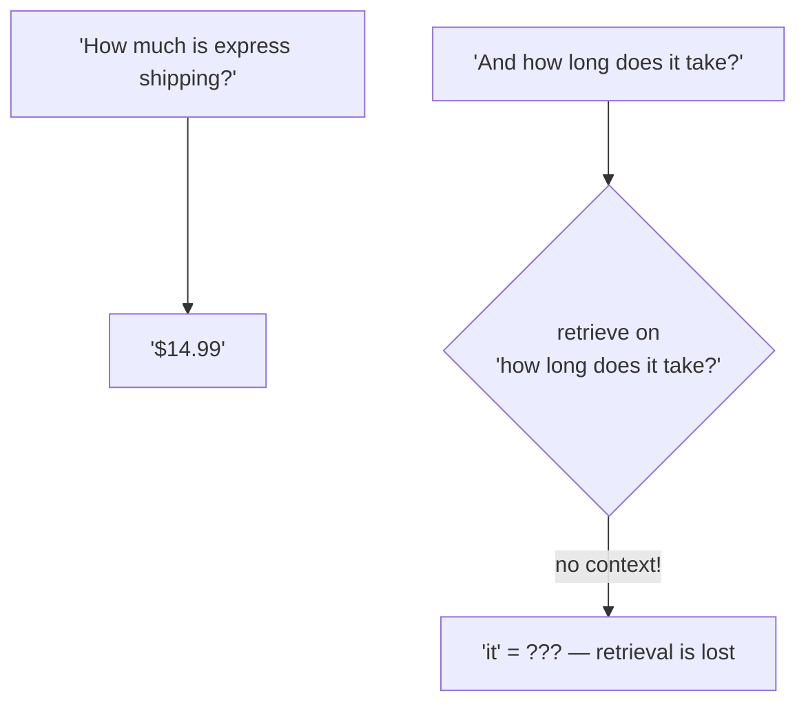
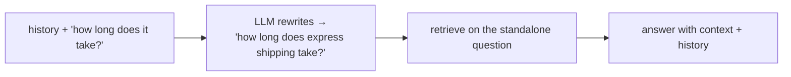

# 02: Conversational RAG

> **Level:** Intermediate · **Prerequisites:** [Section 03](../03_rag_fundamentals/README.md), [Section 02.04 · Memory](../02_langchain_core/04_memory_message_history.md)
> **Time:** ~1.5 hours · **Verified:** 2026-06-15 (LCEL + RunnableWithMessageHistory)

## Why this matters

Real users don't ask one isolated question — they have a *conversation*: "How much is express shipping?" … "And how long does it take?" That second question is meaningless without the first. This module combines RAG (Section 03) with conversation memory (Section 02.04) so your assistant handles follow-ups naturally.

## The challenge: follow-ups depend on history



"And how long does it take?" has no nouns to retrieve on. Two ways to handle this, simplest first.

## Approach A — pass history to the LLM (simple, often enough)

Keep the retrieval on the raw question, but give the LLM the **chat history** so it understands "it." Reuse `RunnableWithMessageHistory` from Section 02.04, with a prompt that has both a `{context}` and a history placeholder:

```python
from langchain_core.prompts import ChatPromptTemplate, MessagesPlaceholder
from langchain_core.runnables import RunnablePassthrough
from langchain_core.output_parsers import StrOutputParser
from langchain_core.chat_history import InMemoryChatMessageHistory
from langchain_core.runnables.history import RunnableWithMessageHistory

prompt = ChatPromptTemplate.from_messages([
    ("system", "Answer using ONLY this context:\n{context}"),
    MessagesPlaceholder("history"),
    ("human", "{input}"),
])

# build the {context} from the current question, keep the rest flowing through
chain = (
    RunnablePassthrough.assign(
        context=(lambda x: x["input"]) | retriever | format_docs
    )
    | prompt | llm | StrOutputParser()
)

histories = {}
conversational = RunnableWithMessageHistory(
    chain,
    lambda sid: histories.setdefault(sid, InMemoryChatMessageHistory()),
    input_messages_key="input",
    history_messages_key="history",
)
```

`RunnablePassthrough.assign(context=...)` adds a `context` key (computed by running the retriever on `input`) while keeping `input` available for the prompt. Then talk to it with a `session_id`:

```python
cfg = {"configurable": {"session_id": "user-1"}}
print("turn1:", conversational.invoke({"input": "How much is express shipping?"}, config=cfg))
print("turn2:", conversational.invoke({"input": "And how long does it take?"}, config=cfg))
print("history msgs:", len(histories["user-1"].messages))
```

**Output (representative — wording varies by model):**

```text
turn1: Express shipping costs $14.99.
turn2: It takes 1–2 business days.
history msgs: 4
```

Turn 2 worked because the LLM saw turn 1 in the `history` placeholder, so it understood "it" = express shipping.

## Approach B — reformulate the question first (history-aware retrieval)

Approach A retrieves on the raw follow-up ("how long does it take?"), which can retrieve poorly. The more robust pattern adds a step that **rewrites the follow-up into a standalone question** using history, *then* retrieves:



LangChain ships a helper for this, `create_history_aware_retriever`, now in the `langchain-classic` package:

```python
# In LangChain 1.x these helpers live in langchain-classic:
from langchain_classic.chains import create_history_aware_retriever, create_retrieval_chain
from langchain_classic.chains.combine_documents import create_stuff_documents_chain
```

It needs a live LLM (for the rewrite step), so it's **not run here**. Use Approach B when follow-ups are common and Approach A's raw-question retrieval starts missing context; Approach A is often enough for short conversations.

> **Note on the helpers:** `create_retrieval_chain` and friends are convenience wrappers. They're handy, but everything they do can be expressed in plain LCEL (as you've been doing) — which is why this course teaches the LCEL form first. Knowing both, you can read any tutorial.

## Memory grows — manage it

Every turn adds messages, and prompts have a token limit (Section 02.04). For long chats, trim to the last N turns or summarise older ones. Start simple; add trimming when conversations get long enough to matter.

## Recap & next

- ✅ Follow-up questions ("how long does *it* take?") need **conversation history** to make sense.
- ✅ **Approach A:** wrap the RAG chain in `RunnableWithMessageHistory` and add a history placeholder — the LLM resolves references; retrieval stays on the raw question. Often enough.
- ✅ **Approach B:** *reformulate* the follow-up into a standalone question (history-aware retriever) before retrieving — more robust; helper is in `langchain-classic`.
- ✅ Use `RunnablePassthrough.assign(context=...)` to add retrieved context while keeping the question flowing.
- ✅ Manage growing history (trim/summarise) to stay within the token limit.
- ✅ Self-check: why does retrieving on a raw follow-up sometimes fail, and how does Approach B fix it?

→ Next: **[03 · Evaluating RAG](03_evaluating_rag.md)** — measuring whether the answers are actually good.

## Exercises

1. **Build a 2-turn conversation.** Index a few facts, build the Approach-A conversational chain, and run a question + a follow-up that uses "it"/"that". Confirm the history grows and the follow-up makes sense.

<details><summary>Solution</summary>

Use the Approach-A code with your own docs. After two turns, `histories[sid].messages` has 4 entries (2 human, 2 AI). The follow-up referencing "it" resolves correctly because the prior turn is in the `history` placeholder — that's the whole point of wrapping the chain in `RunnableWithMessageHistory`.
</details>

2. **Where A breaks.** Give an example follow-up where retrieving on the raw text would fetch the *wrong* chunks, motivating Approach B.

<details><summary>Solution</summary>

After "Tell me about the K2 plan," a follow-up "Is **it** cheaper than the others?" retrieved on the raw text ("is it cheaper than the others") has no mention of "K2 plan" — so semantic search may pull pricing chunks for unrelated plans, or nothing specific. Approach B rewrites it to "Is the K2 plan cheaper than the other plans?" *before* retrieving, so the right chunks come back. The rewrite restores the nouns the retriever needs.
</details>

3. **Trim strategy.** A support chat runs 50 turns and starts hitting the token limit. Name two ways to keep it working and a trade-off of each.

<details><summary>Solution</summary>

(1) **Keep last N turns:** simple and cheap, but the bot forgets anything older (may lose early context like the user's name/issue). (2) **Summarise older turns** into a short running summary kept in the prompt: preserves the gist of the whole conversation, but costs extra LLM calls to produce summaries and can lose specific details. Many production bots combine them: a summary of old turns + the verbatim last few.
</details>
