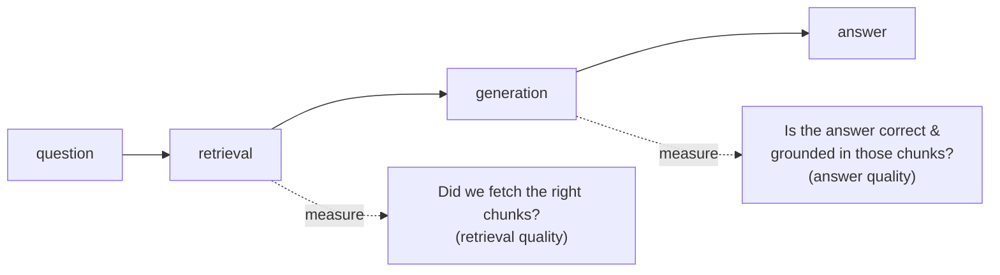
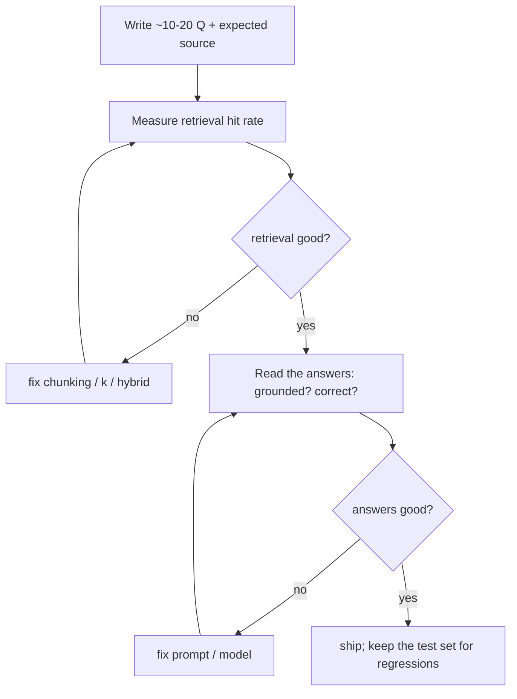

# 03: Evaluating RAG

> **Level:** Intermediate · **Prerequisites:** [Section 03](../03_rag_fundamentals/README.md)
> **Time:** ~1.5 hours · **Verified:** 2026-06-15 (manual eval, MiniLM)

## Why this matters

"It seems to work" is not a quality bar. RAG can fail in two distinct places — **retrieval** (wrong chunks fetched) or **generation** (right chunks, bad answer) — and you can't fix what you can't measure. This module shows how to evaluate both, starting with a simple, runnable manual approach, then what automated tools like RAGAS add.

## Two failure points, two things to measure



Always check retrieval first: if the right chunk wasn't fetched, no LLM can answer correctly. A bad answer on top of good retrieval is a *generation* problem (prompt, model). Diagnosing which half failed is half the battle.

## Step 1 — a tiny labelled test set

Evaluation needs *expected* answers. Write a handful of questions and the document each *should* retrieve from (you know your docs, so this is quick and high-value):

```python
# question -> the doc id that SHOULD be retrieved
eval_set = [
    ("How long are returns?", "refunds"),
    ("Do you charge for shipping?", "shipping"),
    ("Where are you located?", "about"),
]
```

## Step 2 — measure retrieval (hit rate)

For each question, check whether the retriever's top result is the expected document:

```python
hits = 0
for question, expected in eval_set:
    got = retriever.invoke(question)[0].metadata["id"]
    ok = got == expected
    hits += ok
    print(f"{'OK ' if ok else 'MISS'} q={question!r} expected={expected} got={got}")

print(f"hit rate: {hits}/{len(eval_set)} = {hits/len(eval_set):.0%}")
```

**Output (real run, `k=1`):**

```text
OK  q='How long are returns?' expected=refunds got=refunds
OK  q='Do you charge for shipping?' expected=shipping got=shipping
MISS q='Where are you located?' expected=about got=shipping
hit rate: 2/3 = 67%
```

A real, honest result: 2 of 3 retrieved correctly, and **one miss** — "Where are you located?" pulled the shipping chunk instead of the company/about chunk at `k=1`. That's exactly the kind of concrete signal evaluation gives you. Fixes to try: raise `k`, tune chunk size, or add hybrid search (Section 04.01) — *then re-run the eval to confirm the number went up.*

> **This is the loop:** measure → change one thing → measure again. Without the number, you're guessing whether a change helped.

## Step 3 — measure answer quality

Retrieval is objective; answer quality is fuzzier. Three practical approaches, cheapest first:

| Method | How | Good for |
|--------|-----|----------|
| **Manual review** | read N answers, score them yourself (correct? grounded? complete?) | small sets, getting started — *do this first* |
| **Reference answers** | write the ideal answer, compare (overlap or an LLM judge) | regression testing |
| **LLM-as-judge** | a second LLM scores faithfulness/relevance | scaling beyond what you can read by hand |

For RAG specifically, the key questions about an answer are:

- **Faithfulness / groundedness:** is every claim supported by the retrieved context (no hallucination)?
- **Answer relevance:** does it actually address the question?
- **Context relevance:** were the retrieved chunks on-topic?

## RAGAS — automated RAG metrics (optional)

[RAGAS](https://docs.ragas.io) is a library that automates those metrics using an LLM as judge. You give it questions, generated answers, and retrieved contexts; it scores **faithfulness**, **answer relevancy**, and **context precision/recall**:

```python
# Optional, heavier dependency — needs `pip install ragas` and an LLM for judging.
# from ragas import evaluate
# from ragas.metrics import faithfulness, answer_relevancy, context_precision
# result = evaluate(dataset, metrics=[faithfulness, answer_relevancy, context_precision])
```

It's **not run here** — RAGAS is an extra dependency and needs an LLM to do the judging, which is overkill for learning. The takeaway is *what it measures*: the three quality dimensions above, automated so you can track them across changes. Start with manual review on a dozen questions; reach for RAGAS when you have a real corpus and need to track quality continuously.

## A pragmatic evaluation workflow



Keep the test set in your repo. Every time you change chunking, the prompt, or the model, re-run it — that's how you know a "improvement" actually improved things and didn't quietly break others.

## Recap & next

- ✅ RAG fails in **two** places — retrieval (wrong chunks) and generation (bad answer). Measure both; check retrieval first.
- ✅ A small **labelled test set** + a **hit-rate** loop gives objective retrieval numbers (our run honestly scored 2/3 and exposed a real miss).
- ✅ Answer quality: start with **manual review**, then reference answers / LLM-as-judge; the key dimensions are **faithfulness, answer relevance, context relevance**.
- ✅ **RAGAS** automates those metrics (optional, needs an LLM + extra dep).
- ✅ Evaluation is a **loop**: measure → change one thing → re-measure; keep the test set for regressions.
- ✅ Self-check: if an answer is wrong, how do you tell whether retrieval or generation is to blame?

→ Next: **[04 · Serving & production](04_serving_and_production.md)** — turning the pipeline into a real app.

## Exercises

1. **Build a hit-rate harness.** Write 5 question→expected-source pairs for the capstone docs and compute the hit rate at `k=1` and `k=3`. Does `k=3` fix the miss from the example?

<details><summary>Solution</summary>

Reuse the Step 2 code but check whether the expected id is in *any* of the top-`k` (`expected in [d.metadata["id"] for d in retriever.invoke(q)]`). Raising `k` from 1 to 3 usually rescues borderline misses like "Where are you located?" — because the right chunk is often the 2nd or 3rd hit, not the 1st. That's a concrete, measured improvement, which is the whole point of having the harness.
</details>

2. **Diagnose a failure.** Your bot answered "Shipping is free" to "How long are returns?". Using the two-failure-point model, how do you find the cause in two steps?

<details><summary>Solution</summary>

Step 1 — print what the retriever returned for that question. If it fetched the *shipping* chunk (not refunds), it's a **retrieval** failure → fix chunking/`k`/hybrid. If it fetched the *refunds* chunk but the LLM still said "shipping is free," it's a **generation** failure → fix the prompt (grounding instruction) or model. Inspecting the retrieved context first tells you which half to fix — don't tune the prompt when retrieval is the problem.
</details>

3. **Why keep the test set?** Why commit your eval questions to the repo and re-run them on every change, rather than spot-checking by hand each time?

<details><summary>Solution</summary>

A committed test set makes quality **measurable and regression-proof**: a change that improves one question might silently break another, and ad-hoc spot checks won't catch that. Re-running the same set turns "I think it's better" into a number you can compare before/after — and catches regressions before users do. It's the same logic as unit tests, applied to retrieval/answer quality.
</details>
