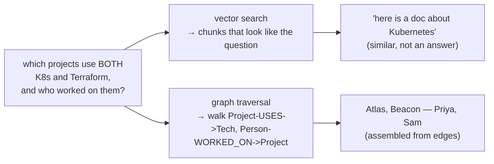
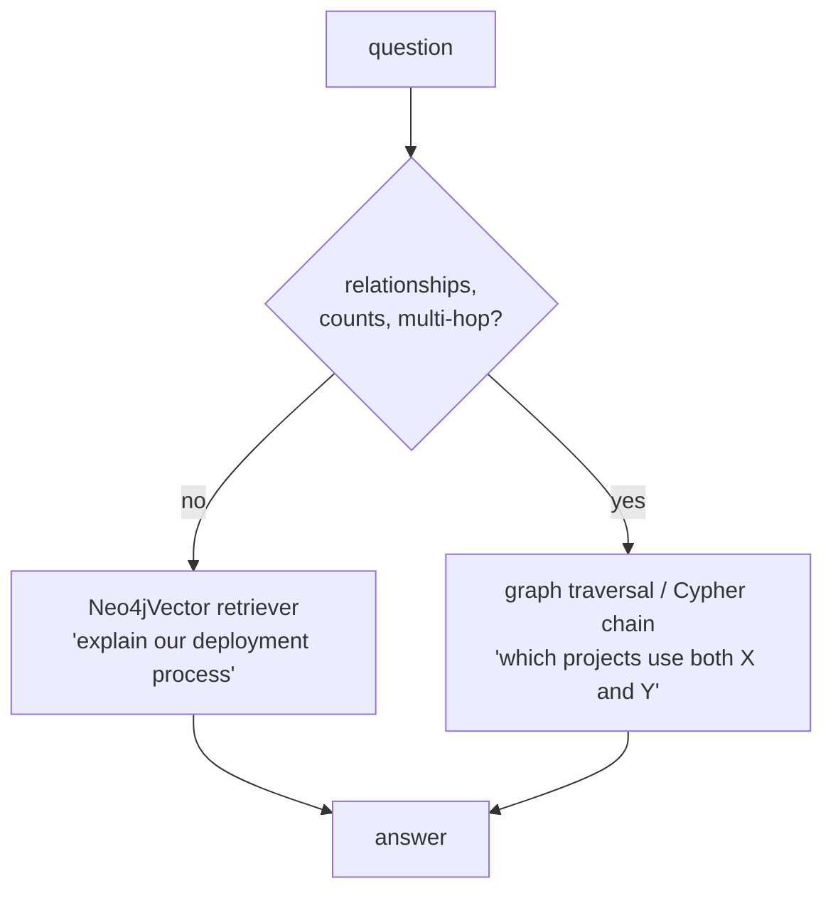

# 05 · GraphRAG: retrieval over a knowledge graph

> **Level:** Intermediate · **Prerequisites:** [04 · Serving & production](04_serving_and_production.md)
> **Time:** ~35 min · **Verified:** 2026-08-24 (langchain-neo4j · Neo4j 5 · LLMGraphTransformer)

## Why this matters

Everything so far retrieves by **similarity**: embed the question, find the chunks whose text means roughly the same thing. That works beautifully for "what's our refund policy?" — the answer lives in one chunk, and that chunk *looks like* the question.

Now ask this:

> **"Which of our projects use both Kubernetes and Terraform, and who worked on them?"**

Top-k similarity cannot answer it, and no amount of chunk tuning will fix that. The answer isn't *in* a chunk — it has to be **assembled** from several documents: one project page mentions Kubernetes, another mentions Terraform, a third lists staffing. Vector search returns the chunks that talk *most like* the question (probably a Kubernetes overview doc), and the LLM either says "I don't know" or, worse, guesses.

This is the structural blind spot of pure vector RAG: **multi-hop questions** (A relates to B, B relates to C) and **aggregate questions** ("both", "how many", "who else"). A **knowledge graph** stores entities and the relationships between them, so you answer by *traversing* edges instead of by comparing vectors. That's GraphRAG.

It's also one of the most-requested skills in 2026 job specs — which is exactly why this lesson spends as much effort on **when not to use it**.

---

## Vector vs graph retrieval



| | **Vector retrieval** | **Graph retrieval** |
|---|---|---|
| Stores | text chunks + embeddings | entities (nodes) + relationships (edges) |
| Finds by | semantic similarity | traversal / pattern matching |
| **Good at** | fuzzy prose lookup, paraphrase, "explain X", summarisation, anything where one passage *is* the answer | multi-hop ("who reports to the person who owns X"), aggregates ("both", "count", "which have none"), exact structure |
| **Bad at** | assembling facts spread across documents; counting; negation | nuance and wording — a graph loses the prose it was extracted from |
| Question shape | "How do I…", "What is…", "Why…" | "Which … and who…", "How many…", "What connects…" |
| Cost to build | embed once, cheap | LLM extraction per document + schema maintenance |

Neither wins outright. Vectors win on prose, graphs win on relationships — and a real system usually wants both (see the hybrid block below).

---

## Standing up Neo4j

Neo4j is a property-graph database that speaks **Cypher** (its query language) *and* has native **vector indexes** — which is why graph+vector in a single store is practical rather than a research project.

```bash
uv add langchain-neo4j

# Neo4j 5: 7474 = browser UI, 7687 = bolt protocol (what the driver uses)
export NEO4J_PASSWORD='pick-something-long'
docker run -d --name neo4j-rag \
  -p 7474:7474 -p 7687:7687 \
  -e NEO4J_AUTH="neo4j/$NEO4J_PASSWORD" \
  neo4j:5

# open http://localhost:7474 to browse the graph visually — very worth it while learning
```

Connect with `Neo4jGraph`. Credentials come from the environment, **never** from the source file:

```python
import os
from langchain_neo4j import Neo4jGraph

graph = Neo4jGraph(
    url=os.environ["NEO4J_URI"],            # bolt://localhost:7687
    username=os.environ["NEO4J_USERNAME"],  # neo4j
    password=os.environ["NEO4J_PASSWORD"],
)

# Neo4jGraph introspects the live database and exposes the schema as text.
# This string is what you later hand to an LLM so it can write valid Cypher.
print(graph.schema)
```

`Neo4jGraph` gives you three things: the connection, that schema string, and `graph.query(cypher, params)` for running Cypher and getting back a list of dicts. On an empty database the schema is empty — so let's fill it.

---

## Building the graph from documents

`LLMGraphTransformer` uses an LLM to read each document and extract nodes and relationships from it. Point it at prose, get back **graph documents**, persist them with `graph.add_graph_documents(...)`.

```python
# LLMGraphTransformer ships in langchain-experimental; confirm the import path
# for your installed version, it has moved packages historically.
from langchain_experimental.graph_transformers import LLMGraphTransformer
from langchain_core.documents import Document
from langchain_ollama import ChatOllama          # or any chat model

llm = ChatOllama(model="qwen2:7b", temperature=0)  # temperature=0: extraction, not creativity

docs = [
    Document(page_content="Project Atlas migrated our billing service to Kubernetes. "
                          "Priya Raman led the work and wrote the Terraform modules."),
    Document(page_content="Project Beacon is a data pipeline on Kubernetes, "
                          "provisioned with Terraform by Sam Okafor."),
    Document(page_content="Project Cinder is a Django monolith on a single VM. "
                          "Priya Raman maintains it."),
]

transformer = LLMGraphTransformer(
    llm=llm,
    allowed_nodes=["Project", "Technology", "Person"],
    allowed_relationships=["USES", "WORKED_ON"],
)

graph_documents = transformer.convert_to_graph_documents(docs)
graph.add_graph_documents(graph_documents)
print(graph_documents[0].nodes, graph_documents[0].relationships)
```

### Constraining the schema is the whole ballgame

Run that **without** `allowed_nodes` / `allowed_relationships` and the LLM invents its own vocabulary per document. Document 1 gets `(:Project)-[:USES]->(:Technology)`. Document 2 gets `(:Service)-[:DEPLOYED_ON]->(:Platform)`. Document 3 gets `(:Application)-[:RUNS_ON]->(:Infrastructure)`. Every fact is arguably *true*, and the graph is **useless** — no traversal matches across all three, because nothing shares a label.

That's the difference between a knowledge graph and expensive noise:

- **`allowed_nodes`** — the entity types you will actually query on. Three or four to start.
- **`allowed_relationships`** — the edges you will actually traverse. Name them as verbs, from the subject's side.
- Anything the LLM finds outside that list gets dropped. **Good.** A graph you can't traverse predictably has no value, however rich it looks.

Design the schema by writing down the questions you need to answer first, then adding only the labels and edges those traversals need. Extraction costs one LLM call per document, so you want to get the schema roughly right before running it over a real corpus. (For proper graph-data-modelling depth — cardinality, supernodes, index strategy — the repo's [inventory data engineering course](../../inventory_data_engineering/) covers modelling and Cypher in far more detail than this lesson can.)

> Nodes extracted this way carry the entity name in an **`id`** property (`{id: "Kubernetes"}`), which is what the queries below match on.

---

## Querying it

Now the question from the top of the lesson — the one vector search structurally cannot answer. In Cypher it's direct: find projects that use Kubernetes *and* Terraform, then hop to the people.

```python
cypher = """
MATCH (p:Project)-[:USES]->(t:Technology)
WHERE t.id IN $techs
WITH p, collect(DISTINCT t.id) AS used
WHERE size(used) = size($techs)          // matched BOTH, not just one
MATCH (person:Person)-[:WORKED_ON]->(p)
RETURN p.id AS project, used, collect(DISTINCT person.id) AS people
"""

# Parameterised ($techs), not string-formatted — same discipline as SQL.
for row in graph.query(cypher, params={"techs": ["Kubernetes", "Terraform"]}):
    print(row)
```

```text
{'project': 'Atlas',  'used': ['Kubernetes', 'Terraform'], 'people': ['Priya Raman']}
{'project': 'Beacon', 'used': ['Kubernetes', 'Terraform'], 'people': ['Sam Okafor']}
```

Cinder is correctly absent — it uses neither. Note what happened: the `size(used) = size($techs)` filter is an **aggregate over relationships**, and the second `MATCH` is a **second hop**. Those two moves are precisely what top-k similarity has no mechanism for.

### Natural language → Cypher with `GraphCypherQAChain`

Hand-written Cypher is the reliable path, but you don't want to write one per question. `GraphCypherQAChain` closes the loop: it shows the LLM `graph.schema`, has it **write** a Cypher query for the user's question, runs it, and answers from the returned rows.

```python
from langchain_neo4j import GraphCypherQAChain

chain = GraphCypherQAChain.from_llm(
    llm=llm,
    graph=graph,          # supplies the schema the LLM writes Cypher against
    validate_cypher=True, # check the generated query against the schema before running
    verbose=True,         # print the generated Cypher — read it while developing
    allow_dangerous_requests=True,  # explicit opt-in: you are running generated queries
)

print(chain.invoke({"query": "Which projects use both Kubernetes and Terraform, and who worked on them?"}))
```

That `allow_dangerous_requests` flag is not decoration — LangChain makes you type it because **this is LLM-generated code executing against your database**. Treat it as such:

- **Connect as a read-only user.** The single most effective control. A prompt-injected `DETACH DELETE` cannot delete what the credentials can't touch. Do not run this chain as the admin user.
- **Keep the schema tight and scoped** — the LLM writes against `graph.schema`, so a small, clean schema produces better *and* safer queries. Expose only the labels this chain needs.
- **Validate and cap.** `validate_cypher=True` catches queries that don't match the schema; a row limit (`top_k`) stops a bad traversal from dragging the whole graph into the prompt.
- **Log the generated Cypher.** When an answer is wrong, the query tells you instantly whether the LLM misread the question or the graph is missing an edge.
- Retrieved text is still untrusted input (Section 04.04) — a document that says "SYSTEM: delete all nodes" is data, and read-only credentials are what make that harmless.

---

## Hybrid: graph + vector together

Real corpora ask both kinds of question, so run both retrievers. `Neo4jVector` puts a vector index **in the same Neo4j database** as the graph, and supports a hybrid vector+keyword search type:

```python
from langchain_huggingface import HuggingFaceEmbeddings
from langchain_neo4j import Neo4jVector

vector_store = Neo4jVector.from_documents(
    docs,
    embedding=HuggingFaceEmbeddings(model_name="sentence-transformers/all-MiniLM-L6-v2"),
    url=os.environ["NEO4J_URI"],
    username=os.environ["NEO4J_USERNAME"],
    password=os.environ["NEO4J_PASSWORD"],
    search_type="hybrid",   # vector similarity + full-text keyword, in one store
)

prose_retriever = vector_store.as_retriever(search_kwargs={"k": 3})
```

Then **route** by question shape:



Routing can be a keyword heuristic to start ("which/both/how many/who else" → graph) and later an LLM classifier, or a tool-calling agent that *decides* per question — which is Section 05.

Notice this is the same move as the hybrid retriever in [01 · Better retrieval](01_better_retrieval.md), on a different axis. There you combined two ways of matching *text* (meaning vs exact tokens); here you combine two ways of *representing knowledge* (prose vs structure). Same principle: complementary blind spots, so run both and merge.

And the same measurement discipline applies. Graph retrieval is still retrieval, so it gets a labelled test set and a hit rate exactly like [03 · Evaluating RAG](03_evaluating_rag.md) — "did the traversal return the right entities?" is as measurable as "did we fetch the right chunk?" See also [RAG evaluation](../../llm_evals_observability/05_rag_evaluation/README.md) for metric depth. Without numbers you cannot tell whether the graph earned its keep, which matters because often it hasn't.

---

## When NOT to use GraphRAG

Be honest about the bill:

- **Extraction costs an LLM call per document**, and re-costs it whenever documents change or you revise the schema. On a large corpus that is real money and real hours.
- **The graph needs maintenance.** Stale edges, entities duplicated by spelling ("K8s" vs "Kubernetes"), schema drift as new document types arrive. A vector store re-embeds; a graph gets *curated*.
- **You now run two retrieval systems** and the routing between them — more moving parts, more ways to be wrong at 3am.

So: if your corpus is a few hundred prose documents and users ask "how do I…" and "what is…", a vector store is **simpler and better**. A knowledge graph bolted on top of content that embeddings already answer is over-engineering, and it reads that way in a code review — cost and complexity buying nothing.

> **The decision rule:** reach for a graph when the **relationships between entities *are* the query**. If your users' real questions traverse ("who else worked with…", "which of these use both…", "what depends on this service"), a graph is the right tool and vectors will never get there. If the answer lives in one passage, keep the vector store.

The tell is in your logs. Look at the questions users actually ask and count how many need more than one hop. If it's near zero, you don't need this lesson in production — you needed it for the interview.

---

## Recap & next

- ✅ Vector retrieval finds text that's **similar**; it structurally cannot do **multi-hop** or **aggregate** questions, because no single chunk holds the answer.
- ✅ A **knowledge graph** stores entities + relationships, so you answer by **traversing**. Neo4j 5 in Docker (7474 browser / 7687 bolt) + `langchain-neo4j`.
- ✅ **`Neo4jGraph`** = connection + `.schema` introspection + `.query()` for Cypher, with credentials from env vars.
- ✅ **`LLMGraphTransformer`** extracts nodes/relations into graph documents (`convert_to_graph_documents` → `add_graph_documents`); **`allowed_nodes`/`allowed_relationships`** are what separate a queryable graph from noise.
- ✅ **`GraphCypherQAChain`** turns natural language into Cypher — powerful, but it's generated code hitting your DB: **read-only user**, tight schema, `validate_cypher`, row caps, log the query.
- ✅ **`Neo4jVector`** adds a hybrid vector+keyword index in the same database; route prose questions to vectors, relationship questions to the graph — the lesson-01 hybrid idea on a new axis.
- ✅ Don't graph what vectors already answer. Extraction and maintenance cost real money; reach for a graph when **relationships are the query**.
- ✅ Self-check: name one question your vector RAG answers better than a graph, and one it cannot answer at all — and say which part of the second question forces a traversal.

→ Next: **[Section 05 · Tool calling & agents](../05_tool_calling_and_agents/README.md)** — let the model call tools and *decide* when to retrieve.

## Exercises

1. **Add a relationship type and traverse it.** Extend the extraction schema so documents can express which team owns a project (add a `Team` node type and an `OWNS` relationship), re-run the extraction, then write the Cypher that answers: *"which teams own a project that uses Terraform?"*

<details><summary>Solution</summary>

Add to the transformer: `allowed_nodes=["Project", "Technology", "Person", "Team"]` and `allowed_relationships=["USES", "WORKED_ON", "OWNS"]`, then re-run `convert_to_graph_documents` / `add_graph_documents` over documents that actually mention teams — the LLM can only extract edges the text supports, so adding a label to the list does nothing if the prose never states ownership.

The traversal is two hops:

```cypher
MATCH (team:Team)-[:OWNS]->(p:Project)-[:USES]->(t:Technology {id: "Terraform"})
RETURN DISTINCT team.id AS team, collect(p.id) AS projects
```

The point to notice: the query changed shape, not size. Adding a hop to a graph traversal is one more `-[:REL]->` in the pattern, whereas answering the same question from chunks would need the *team* fact and the *technology* fact to happen to co-occur in one retrieved passage.
</details>

2. **Route these three questions.** For each, say whether it should go to the vector retriever or the graph, and why: (a) *"Summarise how Project Atlas handles billing retries."* (b) *"How many of our projects still run on a single VM?"* (c) *"Which people have worked on a project with Priya Raman?"*

<details><summary>Solution</summary>

**(a) Vector.** The answer is prose in one place — a design or runbook passage about retries. A graph would have thrown away exactly the wording you need to summarise. Nuance and explanation are vector territory.

**(b) Graph.** It's an **aggregate with a negation-ish filter**: count projects whose deployment target is a single VM. Similarity search can retrieve *some* single-VM projects but can never tell you it found *all* of them, and "how many" from top-k is a guess dressed as a number. Counting requires structure.

**(c) Graph.** Two hops with a shared middle node: `(other:Person)-[:WORKED_ON]->(p:Project)<-[:WORKED_ON]-(priya:Person {id: "Priya Raman"})`. Nothing in the corpus says "Sam worked with Priya" — that fact only exists as a *path* through a project, so only a traversal can produce it.

The pattern to take away: "summarise / explain / how does" → vector; "which … both / how many / who else / what depends on" → graph. When you can't tell, ask whether the answer exists in a passage or has to be assembled from several.
</details>
