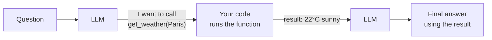
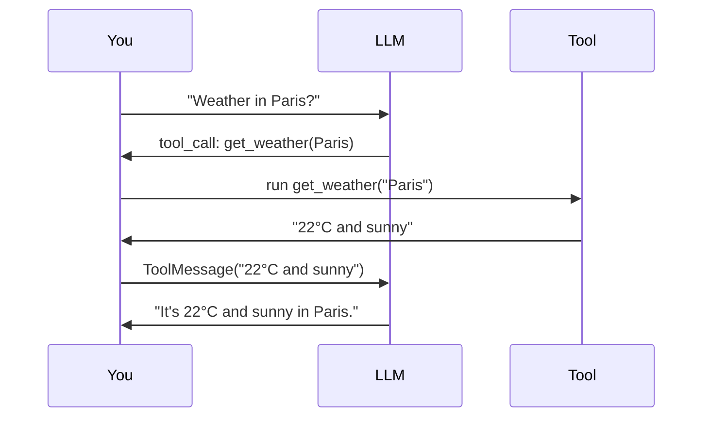

# 01: What is tool calling?

> **Level:** Intermediate · **Prerequisites:** [01.03 · Your first chat model](../01_foundations/03_your_first_chat_model.md)
> **Time:** ~1.5 hours · **Verified:** 2026-07-05 (langchain-core 1.4.7, langchain-ollama 1.1.0, local qwen2:7b)

## Why this matters

An LLM is brilliant at language but helpless at a lot of simple things: it can't reliably do arithmetic, it doesn't know today's weather, and it can't look anything up — it only has its frozen training memory. **Tool calling** fixes this by giving the model *hands*: you describe some functions ("tools"), and the model can ask to **run one** and use the result. This is the foundation of every "agent," and — crucially for us — it's how we'll turn **document retrieval into something the model decides to do**, instead of a fixed step (Module 03).

> ⚠️ **Needs a tool-capable model.** Every example here uses local **`qwen2:7b`** via Ollama. The fake model can't call tools; small models do it unreliably. See the section [README](README.md).

## The key idea: the model *requests*, your code *runs*

This is the one thing beginners get wrong, so let's be blunt up front:

> **The LLM never runs your code.** It only outputs a structured *request* that says "please call `get_weather` with `city='Paris'`." **Your program** runs the function and hands the result back. The model then writes the final answer using that result.



That gap — model asks, you execute — is why tool calling is safe *and* why you're always in control of what actually runs.

## Step 1 — A tool is just a function + a description

The `@tool` decorator turns a normal Python function into a tool. The **docstring is not optional** — it's the *only* thing the model sees to decide whether and how to use the tool:

```python
from langchain_core.tools import tool

@tool
def get_weather(city: str) -> str:
    """Get the current weather for a given city."""
    return f"It's 22°C and sunny in {city}."

print("name:", get_weather.name)
print("description:", get_weather.description)
print("args:", get_weather.args)
print("direct call:", get_weather.invoke({"city": "Berlin"}))
```

**Output (real run):**

```text
name: get_weather
description: Get the current weather for a given city.
args: {'city': {'title': 'City', 'type': 'string'}}
direct call: It's 22°C and sunny in Berlin.
```

LangChain read the **function name**, the **docstring** (→ description), and the **type hints** (→ an args schema) automatically. A tool is still a plain callable — `.invoke({...})` runs it directly, exactly as your code will in Step 3.

## Step 2 — `bind_tools`: let the model see them

`bind_tools` attaches your tools to a chat model. Now, instead of answering directly, the model can respond with a **tool call**:

```python
from langchain_ollama import ChatOllama

llm = ChatOllama(model="qwen2:7b", temperature=0)
llm_with_tools = llm.bind_tools([get_weather])

resp = llm_with_tools.invoke("What's the weather in Paris?")
print("content:", repr(resp.content))
print("tool_calls:", resp.tool_calls)
```

**Output (real run):**

```text
content: ''
tool_calls: [{'name': 'get_weather', 'args': {'city': 'Paris'}, 'id': '1db33953-...', 'type': 'tool_call'}]
```

Notice: `content` is **empty** — the model didn't answer. Instead `tool_calls` holds its request: *call `get_weather` with `city='Paris'`*. It even extracted "Paris" from the question into the right argument. It has **not** run anything — that's your job next.

### The model decides *whether* to call a tool

Bind the same tool, ask something it can answer from its own knowledge, and it just... answers — no tool call:

```python
resp = llm_with_tools.invoke("What is the capital of France?")
print("tool_calls:", resp.tool_calls)
print("content:", repr(resp.content))
```

**Output (real run):**

```text
tool_calls: []
content: 'The capital of France is Paris.'
```

Empty `tool_calls`, a normal answer. **The model chooses** — tool only when the question needs it. Hold onto that idea; it's the whole basis of agentic RAG.

## Step 3 — The full loop: call → execute → respond

A tool call on its own isn't an answer. You complete the round trip in three steps: the model requests, **you run the tool**, and the model uses the result to write the final reply.

```python
from langchain_core.messages import HumanMessage

tools_by_name = {"get_weather": get_weather}
messages = [HumanMessage("What's the weather in Paris?")]

# Step 1: model asks to call the tool
ai = llm_with_tools.invoke(messages)
messages.append(ai)

# Step 2: WE run each requested tool and add the result as a ToolMessage
for call in ai.tool_calls:
    result = tools_by_name[call["name"]].invoke(call)   # returns a ToolMessage
    messages.append(result)
    print("tool result:", result.content)

# Step 3: model sees the result and writes the final answer
final = llm_with_tools.invoke(messages)
print("final:", repr(final.content))
```

**Output (real run, local qwen2:7b):**

```text
tool result: It's 22°C and sunny in Paris.
final: 'The current weather in Paris is 22 degrees Celsius and it's sunny.'
```

That's the entire mechanism. Passing the tool call *object* to `.invoke(call)` conveniently returns a `ToolMessage` already tagged with the call's `id`, so the model knows which request the result answers.



**Doing this loop for you — automatically, for as many rounds as needed — is exactly what an "agent" is.** You'll use a prebuilt one in Module 03 rather than hand-writing this loop every time.

## Safety: you control what runs

Because *your* code executes the tool (Step 2), you decide what's allowed. The model can only *ask*. That means:

- **Never blindly execute** dangerous requests — validate arguments before running a tool that deletes files, spends money, or sends email.
- **A tool call is untrusted input.** Treat `call["args"]` like any user input: check ranges, escape queries, catch errors.
- Read-only tools (search, fetch, calculate) are the safe place to start — which is exactly what RAG needs.

## Recap & next

- ✅ **Tool calling** lets an LLM *request* that a function be run — the **model never runs it, your code does**, then feeds the result back.
- ✅ `@tool` turns a function into a tool; its **docstring and type hints** are what the model uses to decide how to call it.
- ✅ `bind_tools` exposes tools; the model replies with `tool_calls` (and empty `content`) — or answers directly when **it decides** no tool is needed.
- ✅ The **call → execute → respond** loop is the core mechanism; automating it is what an **agent** does.
- ✅ You stay in control: validate tool arguments, treat them as untrusted input.
- ✅ Self-check: when the model wants a tool, where is the request found and what's in `.content`? Who actually runs the function?

→ Next: **[02 · Building useful tools](02_building_useful_tools.md)** — write tools the model uses well, including one that fetches from the web.

## Exercises

1. **Add a second tool.** Write an `add(a: int, b: int) -> int` tool, bind *both* it and `get_weather`, and ask a math question and a weather question. Does the model pick the right tool each time?

<details><summary>Solution</summary>

```python
@tool
def add(a: int, b: int) -> int:
    """Add two numbers together."""
    return a + b

llm_with_tools = llm.bind_tools([get_weather, add])
print(llm_with_tools.invoke("What is 128 plus 273?").tool_calls)   # -> add(a=128, b=273)
print(llm_with_tools.invoke("What's the weather in Tokyo?").tool_calls)  # -> get_weather(city='Tokyo')
```

The model routes each question to the tool whose **description** fits — so clear, distinct docstrings matter (Module 02). With `qwen2:7b` this reliably calls `add` for the sum and `get_weather` for the weather.
</details>

2. **Break the loop on purpose.** Run only Step 1 (get the `tool_calls`) and then *stop* — don't run the tool, just print `ai.content`. Why is there no answer yet?

<details><summary>Solution</summary>

`ai.content` is empty. The model hasn't answered the question — it has only *requested* a tool call and is waiting for the result. Without Step 2 (you running the tool) and Step 3 (feeding the `ToolMessage` back), there's nothing for the model to base an answer on. This shows the answer emerges from the **round trip**, not from the first model call.
</details>

3. **Why the docstring matters.** Change `get_weather`'s docstring to just `"""x"""` and re-ask the weather question. Does the model still call it reliably? What does that tell you?

<details><summary>Solution</summary>

With a meaningless docstring the model has no signal that this tool is about weather, so it may fail to call it (or call it for the wrong things). The docstring is the model's **only** description of what a tool does and when to use it — treat it as part of the prompt, not as an afterthought. Good tool design is mostly good descriptions.
</details>
