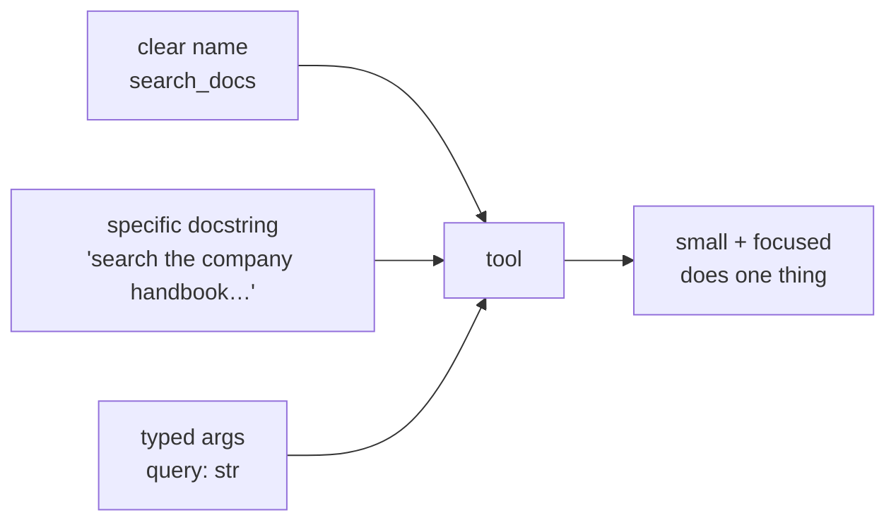

# 02: Building useful tools

> **Level:** Intermediate · **Prerequisites:** [01 · What is tool calling?](01_what_is_tool_calling.md)
> **Time:** ~1.5 hours · **Verified:** 2026-07-05 (langchain-core 1.4.7, langchain-community 0.4.1, local qwen2:7b)

## Why this matters

A tool is only as good as the model's ability to *understand* it. In Module 01 you saw the mechanism; here you learn to write tools the model uses **correctly and reliably** — because the model picks a tool based entirely on its **name, description, and arguments**. We'll give the model several tools and watch it route to the right one, then build the tool that matters most for RAG: one that **fetches live web content**.

## Give the model a choice, and it routes

Bind more than one tool and the model selects based on each tool's description:

```python
from langchain_core.tools import tool
from langchain_ollama import ChatOllama

@tool
def get_weather(city: str) -> str:
    """Get the current weather for a given city."""
    return f"It's 22°C and sunny in {city}."

@tool
def add(a: int, b: int) -> int:
    """Add two numbers together."""
    return a + b

llm = ChatOllama(model="qwen2:7b", temperature=0)
llm_with_tools = llm.bind_tools([get_weather, add])

for q in ["What's the weather in Tokyo?", "What is 128 plus 273?"]:
    call = llm_with_tools.invoke(q).tool_calls[0]
    print(f"{q} -> {call['name']}({call['args']})")
```

**Output (real run):**

```text
What's the weather in Tokyo? -> get_weather({'city': 'Tokyo'})
What is 128 plus 273? -> add({'a': 128, 'b': 273})
```

The model matched each question to the tool whose **description** fit. This is why vague or overlapping docstrings hurt: if two tools sound alike, the model guesses. **Distinct, specific descriptions are the single biggest lever** on tool-calling reliability.

## Anatomy of a good tool



The rules that make a tool the model can use well:

| Rule | Why |
|------|-----|
| **Descriptive name** (`search_docs`, not `f1`) | the model reads the name as a hint |
| **Specific docstring** — say *what it does and when to use it* | it's the model's only description |
| **Typed arguments** (`query: str`, `limit: int`) | LangChain builds the args schema from hints |
| **One job per tool** | ambiguity between tools makes the model pick wrong |
| **Return a string** (or something string-able) | the model reads the result as text |
| **Handle errors inside** | return `"No results found"`, don't crash the loop |

## A web-search / fetch tool

Here's a tool with real utility — it fetches a live web page (reusing `WebBaseLoader` from [03.06](../03_rag_fundamentals/06_web_sources.md)) so the model can read pages it was never trained on:

```python
from langchain_core.tools import tool
from langchain_core.messages import HumanMessage
from langchain_community.document_loaders import WebBaseLoader

@tool
def fetch_web_page(url: str) -> str:
    """Fetch the visible text of a web page given its URL."""
    docs = WebBaseLoader(url).load()
    return docs[0].page_content.strip()[:500]   # trim so we don't flood the prompt

llm_with_tools = llm.bind_tools([fetch_web_page])
tools_by_name = {"fetch_web_page": fetch_web_page}

messages = [HumanMessage("What does the page at https://example.com say? Summarize it.")]
ai = llm_with_tools.invoke(messages)
messages.append(ai)
print("tool_calls:", ai.tool_calls)

for call in ai.tool_calls:                       # the same loop as Module 01
    messages.append(tools_by_name[call["name"]].invoke(call))

print("final:", repr(llm_with_tools.invoke(messages).content))
```

**Output (real run, local qwen2:7b):**

```text
tool_calls: [{'name': 'fetch_web_page', 'args': {'url': 'https://example.com'}, ...}]
final: "The webpage at https://example.com serves as an example domain. It's designed
   for illustrating how to use web content in documentation scenarios where explicit
   permission isn't required. The page advises against using this domain in actual
   operational tasks and encourages users to explore further details..."
```

The model pulled the URL from the question, called the tool, and summarized live content. Note the `[:500]` trim — tool results go straight into the prompt, so **keep them small** or you'll blow the context window and the budget.

## Don't reinvent — LangChain ships prebuilt tools

`fetch_web_page` needs you to know the URL. For open-ended "search the web" behaviour and other common needs, LangChain already provides ready-made tools you just import and bind — no need to write them yourself:

| Tool | Import | Note |
|------|--------|------|
| **Tavily search** (recommended) | `from langchain_tavily import TavilySearch` | web search built for LLMs; ranked results + snippets. `pip install langchain-tavily`, set `TAVILY_API_KEY` (free tier available) |
| **DuckDuckGo search** | `from langchain_community.tools import DuckDuckGoSearchRun` | no API key; `pip install duckduckgo-search`. Handy for demos; can rate-limit |
| **Requests toolkit** | `from langchain_community.agent_toolkits.openapi.toolkit import RequestsToolkit` | let the model make HTTP GET/POST calls to an API |

Using Tavily is a two-liner — it binds and gets called **exactly like** any tool you wrote:

```python
from langchain_tavily import TavilySearch      # pip install langchain-tavily

search = TavilySearch(max_results=3)            # needs TAVILY_API_KEY
llm_with_tools = llm.bind_tools([search])       # same bind_tools as your own tools
```

These need an API key (or extra install), so they're **not run here** — but the mechanism is identical to `get_weather`: the model sees the tool's description and calls it when relevant. The full, current catalog is at **[docs.langchain.com → integrations → tools](https://docs.langchain.com/oss/python/integrations/tools)**.

> **Reach for a prebuilt tool first**, write your own (like `fetch_web_page`) when nothing off-the-shelf fits — e.g. querying *your* internal API or database.

## Tools can fail — handle it inside

The tool-calling loop breaks if a tool throws. Guard risky work and return a message the model can act on:

```python
@tool
def fetch_web_page(url: str) -> str:
    """Fetch the visible text of a web page given its URL."""
    try:
        docs = WebBaseLoader(url).load()
        return docs[0].page_content.strip()[:500] or "The page had no readable text."
    except Exception as exc:
        return f"Could not fetch {url}: {exc}"
```

Now a dead link returns `"Could not fetch ..."` — the model can apologise or try another URL, instead of the whole program crashing mid-loop.

## Recap & next

- ✅ The model routes to a tool by its **name + description + args** — make each tool **distinct and specifically described**.
- ✅ Good tools are **small, single-purpose, typed, string-returning**, and **catch their own errors**.
- ✅ A `fetch_web_page` tool (via `WebBaseLoader`) lets the model read pages on demand — **trim the result** so it fits the prompt.
- ✅ For open-ended web *search*, wrap a search API (e.g. **Tavily**) as a tool — it binds in identically.
- ✅ Self-check: what three things does the model use to choose a tool? Why trim a tool's return value?

→ Next: **[03 · Agentic RAG](03_agentic_rag.md)** — make **retrieval** a tool, so the model searches your documents only when it needs to.

## Exercises

1. **Sharpen a description.** Write two tools — `get_stock_price(ticker)` and `get_weather(city)` — but give both the vague docstring `"""Get some data."""`. Ask a stock question. Does the model reliably pick the right tool? Now write specific docstrings and retry.

<details><summary>Solution</summary>

With identical vague docstrings the model has nothing to distinguish them and may call the wrong one (or pass the wrong argument). With specific docstrings — `"""Get the latest share price for a stock ticker symbol."""` vs `"""Get the current weather for a city."""` — it routes correctly. This is the core lesson: **tool selection quality is description quality.**
</details>

2. **Make a safe calculator.** Write a `divide(a: float, b: float)` tool that returns a helpful string when `b == 0` instead of raising `ZeroDivisionError`. Why does returning a message beat letting it throw?

<details><summary>Solution</summary>

```python
@tool
def divide(a: float, b: float) -> str:
    """Divide a by b."""
    if b == 0:
        return "Cannot divide by zero."
    return str(a / b)
```

If the tool raises, it breaks the call→execute→respond loop and your app errors out. Returning `"Cannot divide by zero."` keeps the loop alive — the model reads the message and can explain the problem to the user. Tools should fail *gracefully into text*, not crash.
</details>

3. **Trim and justify.** `fetch_web_page` returns only the first 500 characters. What are the two costs of returning the *entire* page instead, and how might you keep more of the useful content without dumping everything?

<details><summary>Solution</summary>

Two costs: (1) a huge page can **exceed the model's context window**, causing an error or truncation; (2) even if it fits, you **pay for every token** and bury the relevant part in noise, hurting answer quality. Better than a blind trim: clean the HTML with a `SoupStrainer` to keep only the main content ([03.06](../03_rag_fundamentals/06_web_sources.md)), or **split + retrieve** the most relevant chunks of the page — which is exactly RAG, and leads straight into the next module.
</details>
