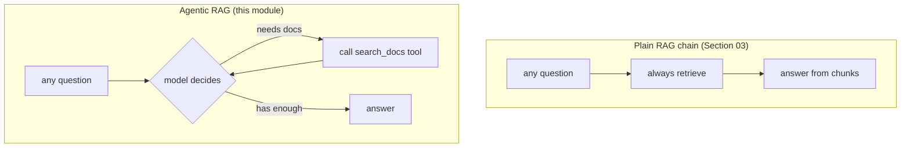

# 03: Agentic RAG

> **Level:** Intermediate · **Prerequisites:** [02 · Building useful tools](02_building_useful_tools.md), [03.04 · Build a RAG chain](../03_rag_fundamentals/04_build_a_rag_chain.md)
> **Time:** ~1.5 hours · **Verified:** 2026-07-05 (langchain 1.2.16 `create_agent`, langchain-core 1.4.7, langgraph 1.1.10, MiniLM, local qwen2:7b)

## Why this matters

Your RAG chain from Section 03 always does the same thing: **retrieve, then answer** — even when the question is "hello" or "thanks", where retrieval is pointless (and can inject irrelevant chunks that *worsen* the reply). **Agentic RAG** flips this: you make retrieval a **tool**, and let the model **decide** whether to search, using everything you learned in Modules 01–02. The model searches when a question needs your documents, answers directly when it doesn't, and can even search **multiple times** to gather enough context.

## Fixed chain vs. agent



| | Plain RAG chain | Agentic RAG |
|---|-----------------|-------------|
| Retrieval | **always**, exactly once | **only when the model chooses**, 0…N times |
| "Hello" / chit-chat | still retrieves (wasteful) | answers directly, no search |
| Complex multi-part question | one retrieval, may miss parts | can search several times / several tools |
| Predictability & speed | **high** — same path every time | lower — model decides, may loop |
| Cost | one LLM call | multiple LLM calls |

Neither is "better" — they're different trade-offs. We'll build the agent, then discuss when each wins.

## Step 1 — Make retrieval a tool

Build the retriever exactly as in Section 03 (here over the capstone's `data/` docs), then wrap it in a `@tool` with a clear description so the model knows when to reach for it:

```python
from langchain_community.document_loaders import DirectoryLoader, TextLoader
from langchain_text_splitters import RecursiveCharacterTextSplitter
from langchain_huggingface import HuggingFaceEmbeddings
from langchain_core.vectorstores import InMemoryVectorStore
from langchain_core.tools import tool

# --- the familiar ingestion pipeline (Section 03) ---
docs = DirectoryLoader("data", glob="*.md", loader_cls=TextLoader).load()
chunks = RecursiveCharacterTextSplitter(chunk_size=500, chunk_overlap=50).split_documents(docs)
store = InMemoryVectorStore(HuggingFaceEmbeddings(
    model_name="sentence-transformers/all-MiniLM-L6-v2"))
store.add_documents(chunks)
retriever = store.as_retriever(search_kwargs={"k": 3})

# --- the one new idea: retrieval as a tool ---
@tool
def search_docs(query: str) -> str:
    """Search the Acme company handbook for refunds, shipping, and company info."""
    return "\n\n".join(d.page_content for d in retriever.invoke(query))
```

That docstring is doing real work: it tells the model *this tool is for questions about Acme's refunds/shipping/company* — so the model knows to call it for those and skip it otherwise.

## Step 2 — Give it to a prebuilt agent

Remember the call → execute → respond loop from Module 01? An **agent** runs that loop for you, repeatedly, until the model has its answer. LangChain 1.x ships a prebuilt one, `create_agent`, so you don't hand-write the loop:

```python
from langchain.agents import create_agent      # the LangChain 1.x agent constructor
from langchain_ollama import ChatOllama

llm = ChatOllama(model="qwen2:7b", temperature=0)

# A system prompt tells the agent WHEN to reach for the tool (see §01.03).
SYSTEM = (
    "You are Acme's support assistant. Use the search_docs tool ONLY for questions "
    "about Acme's refunds, shipping, or company details. For greetings or small talk, "
    "reply directly without using any tool."
)
agent = create_agent(llm, [search_docs], system_prompt=SYSTEM)

result = agent.invoke({"messages": [{"role": "user", "content": "How long do I have to return something?"}]})
print(result["messages"][-1].content)
```

**Output (real run, local qwen2:7b):**

```text
According to our company policy, you have 30 days from the date of purchase to return
most items for a full refund. Items must be unused and in their original packaging.
Refunds are issued back to your original payment method and typically take 5-7 business
days to appear. Gift cards and downloadable software are non-refundable. If you need to
start a return, please email returns@acme.example with your order number.
```

The agent, on its own: saw the question → **called `search_docs`** → read the chunks → wrote a grounded answer. That `system_prompt` is doing real work — it's how you steer a small model toward *good* tool decisions (without it, `qwen2` tends to over-call the tool, even on "hello"). The message trace confirms the loop:

```text
[HumanMessage, AIMessage(tool_calls=[search_docs]), ToolMessage(chunks), AIMessage(answer)]
```

That's precisely Module 01's loop — `create_agent` just automated it. *(LLM wording varies run to run; the shape is what's stable.)*

> **`create_agent` vs. `create_react_agent`.** You'll see older tutorials use `from langgraph.prebuilt import create_react_agent`. That still works and is the lower-level LangGraph primitive `create_agent` is built on. On LangChain 1.x, **`langchain.agents.create_agent` is the recommended entry point** — same idea, same message shape.

## Step 3 — Watch it *skip* retrieval

The payoff. Ask something that isn't about the docs and the agent **doesn't search** — it just answers:

```python
result = agent.invoke({"messages": [{"role": "user", "content": "Hello, who are you?"}]})
# inspect whether any message asked for a tool
searched = any(getattr(m, "tool_calls", None) for m in result["messages"])
print("searched?:", searched)
print(result["messages"][-1].content[:80])
```

**Output (real run):**

```text
searched?: False
Hello! I'm Acme's support assistant. How can I help you today?
```

No wasted retrieval on a greeting. A plain RAG chain would have embedded "Hello, who are you?", pulled three random handbook chunks, and stuffed them into the prompt anyway. **That decision — search or don't — is the whole point of agentic RAG.**

> **Small models need the nudge.** With no system prompt, `qwen2:7b` called `search_docs` even for "hello". The `SYSTEM` instruction fixed that. Larger models (Claude, GPT-4-class) judge this more reliably on their own — another place where [model choice](../01_foundations/02_environment_setup.md) shows up.

## When should you use an agent?

Reach for **agentic RAG** when:

- Your app mixes **retrieval-worthy questions with chit-chat** or general knowledge.
- Questions need **multiple or multi-step searches** ("compare our refund policy to our shipping policy").
- You have **several tools** (search docs *and* fetch the web *and* do math) and the model must choose.

Stick with a **plain RAG chain** when:

- **Every** query is a document question (a pure Q&A-over-docs bot) — the agent's decision step is just overhead.
- You need **predictable latency and cost** — one retrieval, one answer, every time.
- You want maximum **debuggability** — a fixed pipeline is far easier to reason about than a model's choices.

> **Agents trade control for flexibility.** They can call a tool the "wrong" way, search when they shouldn't, or loop. Start with the simplest thing that works — often a plain chain — and go agentic when a *fixed* path genuinely can't express what your app needs.

## Bringing it back to the capstone

The capstone in Section 99 is a plain RAG chain — perfect for its job (pure doc Q&A). To make it **agentic**, you'd wrap its retriever as a `search_docs` tool and hand it to `create_agent`, exactly as above. That's listed as a stretch goal in the [project README](../99_project_doc_assistant/README.md) — you now have everything you need to do it.

## Recap & next

- ✅ **Agentic RAG** turns retrieval into a **tool** and lets the model **decide** whether (and how often) to search — vs. a plain chain that always retrieves once.
- ✅ Wrap your Section-03 retriever in a `@tool` with a clear docstring, then hand it to a prebuilt agent (`create_agent`, LangChain 1.x) that runs Module 01's loop automatically.
- ✅ Verified: the agent **searches** for a document question and **skips** search for a greeting.
- ✅ Use an agent for **mixed / multi-step / multi-tool** needs; use a **plain chain** for pure, predictable doc Q&A.
- ✅ Self-check: what does an agent do that a fixed RAG chain can't? Name one cost of going agentic.

→ Next: **[Section 99 · Project: document assistant](../99_project_doc_assistant/README.md)** — the complete runnable app, now with an agentic stretch goal you can build.

## Exercises

1. **Give the agent two tools.** Add the `fetch_web_page` tool from Module 02 alongside `search_docs`. Ask a docs question and a "summarize this URL" question. Does the agent pick the right tool for each?

<details><summary>Solution</summary>

```python
agent = create_agent(llm, [search_docs, fetch_web_page])
agent.invoke({"messages": [{"role": "user", "content": "How long are returns?"}]})          # -> search_docs
agent.invoke({"messages": [{"role": "user", "content": "Summarize https://example.com"}]})  # -> fetch_web_page
```

With distinct docstrings the agent routes a refund question to `search_docs` and a URL question to `fetch_web_page`. This is a mini research assistant: it consults your private docs *or* the live web depending on what's asked — impossible with a single fixed chain.
</details>

2. **Prove the skip.** Ask the single-tool agent three questions: one about refunds, one greeting, one general-knowledge ("what's the capital of France?"). For each, inspect whether any message has `tool_calls`. Which searched, and why?

<details><summary>Solution</summary>

Only the **refund** question triggers `search_docs` — it's the one the handbook can answer. The greeting and the France question are answered from the model's own knowledge with no search. This demonstrates the model using the tool's *description* to judge relevance: it searches when the question matches "refunds, shipping, and company info," and skips otherwise. (Note: exactly when a model chooses to search can vary by model — smaller models sometimes over- or under-call.)
</details>

3. **Argue the trade-off.** You're building (a) an internal HR-policy Q&A bot and (b) a general assistant that answers company questions *and* does small talk *and* looks things up online. Which gets a plain RAG chain, which gets an agent, and why?

<details><summary>Solution</summary>

(a) **Plain RAG chain** — every question is a policy lookup, so always-retrieve is exactly right; you gain predictability, lower cost, and easy debugging, and lose nothing. (b) **Agent** — it must decide between three behaviours (search docs, chat, browse the web), which a fixed pipeline can't express; the flexibility is worth the extra LLM calls and reduced predictability. Rule of thumb: **fixed need → fixed chain; branching need → agent.**
</details>
