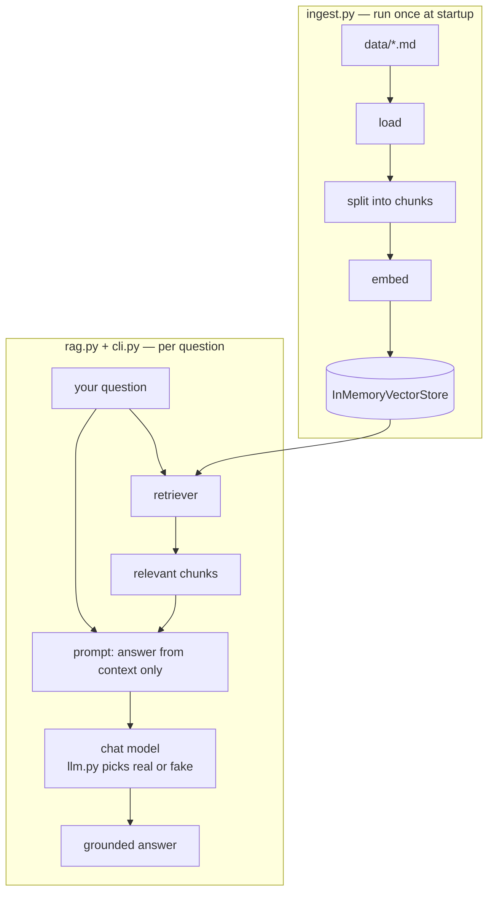

# Section 99 · The complete document assistant

> **Prerequisites:** Sections 01–04.
> **Time:** ~4–6 hours · **Verified:** 2026-07-05 — runs against the live local LLM, 7/7 tests pass offline.

This folder is the **finished RAG app** — every concept from Sections 01–04 assembled into one small, runnable "chat with your documents" assistant (~230 lines of code) that answers grounded questions *and cites its sources*. Read it as the reference implementation, run it against the included sample docs, and then extend it.

It runs three ways, so it works for everyone:

- **Real answers, local, no key** — with [Ollama](https://ollama.com) (recommended).
- **Real answers, hosted** — with an OpenAI-compatible endpoint (a key).
- **Fully offline, zero setup** — falls back to a fake model so the pipeline still runs.

## Layout

```
99_project_doc_assistant/
├── requirements.txt          # pinned, verified versions
├── data/                     # the documents the assistant answers from
│   ├── refunds.md
│   ├── shipping.md
│   └── company.md
├── rag_app/
│   ├── llm.py                # choose embeddings + chat model (real or fake)   §01, §03
│   ├── ingest.py             # load → split → embed → InMemoryVectorStore      §03.03
│   ├── rag.py                # the LCEL RAG chain                              §03.04
│   └── cli.py                # ask questions from the command line
└── tests/
    └── test_rag.py           # 7 deterministic offline tests                   §07-style
```

Each file maps to something you built:

| File | What it is | Section |
|------|-----------|---------|
| `llm.py` | `get_embeddings()` / `get_chat_model()` with graceful fallback to fakes | [01.02](../01_foundations/02_environment_setup.md), [03.01](../03_rag_fundamentals/01_embeddings.md) |
| `ingest.py` | loaders + splitter + vector store (in-memory, or on-disk FAISS via `build_or_load_faiss`) | [03.03](../03_rag_fundamentals/03_loaders_and_splitters.md) |
| `rag.py` | `{context, question} \| prompt \| llm \| parser`, plus a sources-aware chain that cites files | [03.04](../03_rag_fundamentals/04_build_a_rag_chain.md) |
| `cli.py` | wires it together, runs questions | — |
| `tests/` | fake embeddings + fake model, deterministic | [04.03](../04_advanced_rag/03_evaluating_rag.md) |

## Run it

```bash
cd 99_project_doc_assistant
python -m venv .venv && source .venv/bin/activate
pip install -r requirements.txt
```

**Real answers (recommended)** — make sure Ollama is running with a model pulled (`ollama pull qwen2:7b`), then:

```bash
python -m rag_app.cli
```

**Verified output (local qwen2:7b + MiniLM embeddings):**

```text
Q: How long do I have to return something?
A: You have 30 days from the purchase date to return most items for a full refund,
   provided you have the original receipt, the item is unused, and in its original packaging.
Sources: refunds.md, shipping.md, company.md

Q: Is shipping free?
A: Yes, shipping is free on orders over $50 within the continental US.
Sources: shipping.md, refunds.md, company.md

Q: Where is the company based?
A: The company is based in Berlin, Germany.
Sources: company.md, shipping.md, refunds.md

Q: What is the CEO's salary?
A: I don't know.
Sources: company.md, shipping.md, refunds.md
```

Three grounded answers from the docs, and an honest "I don't know" for the question the docs don't cover — the core RAG behaviour, working. Each answer also **cites its sources** (the files the retrieved chunks came from).

> **Why does every answer cite all three files?** With only three tiny documents and `k=3`, the retriever pulls one chunk from each file for almost any question, so all three get listed. On a real corpus of dozens of documents, `k=3` surfaces only the genuinely relevant files — and the citation pinpoints exactly where an answer came from. The mechanism is the same; the tiny demo corpus just makes it look indiscriminate.

**Ask your own question:**

```bash
python -m rag_app.cli "Do you ship internationally?"
```

**Fully offline (no LLM, no model download):**

```bash
DOC_ASSISTANT_FAKE_EMBEDDINGS=1 DOC_ASSISTANT_LLM=fake python -m rag_app.cli "How long are returns?"
```

**Verified output:**

```text
Q: How long are returns?
A: [fake LLM] Set DOC_ASSISTANT_LLM=ollama (or openai) for a real answer.
Sources: refunds.md, shipping.md, company.md
```

This proves the *pipeline* runs end-to-end with zero setup — the same code, just fake components.

**Persist the index to disk (embed once, reuse):** by default the app rebuilds the index in memory every run. Set `DOC_ASSISTANT_INDEX_DIR` to save a FAISS index to disk instead — the first run builds and saves it, later runs just load it:

```bash
pip install faiss-cpu
DOC_ASSISTANT_INDEX_DIR=./index python -m rag_app.cli "How long are returns?"   # run 1: builds ./index/
DOC_ASSISTANT_INDEX_DIR=./index python -m rag_app.cli "Is shipping free?"        # run 2: loads ./index/
```

After run 1, `./index/` holds `index.faiss` + `index.pkl`; run 2 skips embedding entirely. `build_or_load_faiss` (in `ingest.py`) returns a store with the *same* `as_retriever` interface, so nothing else in the app changes.

> **Won't feel faster on this tiny demo.** With only ~10 chunks, most of each run's time is loading the embedding *model*, not embedding the chunks — so run 2 isn't visibly quicker. On a real corpus (thousands of chunks), embedding is the expensive step and persistence turns a minutes-long startup into an instant load. See [03.02 · Vector stores](../03_rag_fundamentals/02_vector_stores.md) for the persistence concept.

## Run the tests

```bash
pytest -q
```

**Verified output:**

```text
.......                                                                  [100%]
7 passed in 4.14s
```

The tests use a **fake embedding model and a fake chat model**, so they run offline, instantly, and deterministically — yet exercise the real ingestion and RAG-chain code (loading, splitting, retrieval shape, the full chain wiring, and source citations).

## How it works, end to end



The whole app is the course in miniature: embeddings (§03.01) feed a vector store (§03.02), built from loaded+split docs (§03.03), queried by a retriever inside an LCEL chain (§03.04), with the LLM chosen flexibly (§01.02) and the "answer only from context" prompt keeping it grounded (§02.01).

## The grounding rule, in code

The single line that makes this a *RAG* app and not a guessing LLM lives in `rag.py`:

> "Answer the question using ONLY the context below. If the answer is not in the context, say you don't know."

That instruction is why the assistant said "I don't know" about the CEO's salary instead of inventing one.

## Extensions (stretch goals)

The app is intentionally small. Level it up using what you learned:

- **Hybrid retrieval** — add BM25 + `EnsembleRetriever` for exact-term queries ([04.01](../04_advanced_rag/01_better_retrieval.md)).
- **Conversational mode** — wrap the chain in `RunnableWithMessageHistory` for follow-ups ([04.02](../04_advanced_rag/02_conversational_rag.md)).
- **Go agentic** — wrap the retriever as a `search_docs` tool and hand it to `create_agent`, so the model *decides* when to search (and you can add a web tool too) ([05.03](../05_tool_calling_and_agents/03_agentic_rag.md)).
- **Serve it** — put the chain behind a FastAPI `/ask` endpoint ([04.04](../04_advanced_rag/04_serving_and_production.md)).
- **Evaluate** — add a question→expected-source test set and track hit rate ([04.03](../04_advanced_rag/03_evaluating_rag.md)).

> ✅ **Already built in:** *source citations* (`rag.py`'s `build_rag_chain_with_sources`), *swappable LLMs* (`llm.py`), and *optional on-disk persistence* (`build_or_load_faiss`, via `DOC_ASSISTANT_INDEX_DIR`). Hybrid retrieval and conversational mode remain great next steps.

## Self-assessment

You've finished the course if you can:

- ☑ Explain every box in the diagram above and point to the file that implements it.
- ☑ Add a new document to `data/`, re-run, and get answers from it.
- ☑ Change the prompt and predict how answers change.
- ☑ Swap the LLM (fake ↔ Ollama ↔ hosted) without touching `ingest.py` or `rag.py`.
- ☑ Implement at least one extension above.

## Exercises

1. **Add a document, ask about it.** Drop a new `data/returns_intl.md` describing international returns, re-run the CLI, and ask a question only that file answers. Did the assistant use it — and why didn't you change any code?

<details><summary>Solution</summary>

`ingest.py`'s `load_documents` globs `data/*.md`, so a new file is picked up automatically on the next run — no code change needed. Ask "How do international returns work?" and the new chunk is retrieved and used. This demonstrates RAG's killer property: **update knowledge by editing data, not code or the model.**
</details>

2. **Break grounding, observe.** In `rag.py`, remove "using ONLY the context … say you don't know" from the prompt. Re-run the CEO-salary question with a real LLM. What changes, and what does that teach about where grounding lives?

<details><summary>Solution</summary>

Without the grounding instruction, the model is more likely to *guess* a CEO/salary from its training knowledge instead of admitting ignorance. This shows grounding is enforced by the **prompt**, not by RAG magic — retrieval supplies the context, but the instruction is what makes the model stick to it and refuse otherwise. Put the line back.
</details>

3. **Swap the LLM with zero pipeline changes.** Run the app with `DOC_ASSISTANT_LLM=fake`, then with Ollama. Which files did you edit to switch? Why is that possible?

<details><summary>Solution</summary>

You edited **no** pipeline files — only an environment variable, which `llm.py`'s `get_chat_model()` reads. `ingest.py` and `rag.py` accept whatever chat model they're given, because every LangChain chat model shares the same interface (Section 01.03). That swappability — the whole reason to use LangChain's abstractions — lets you develop offline with the fake model and flip to a real one for production without touching your RAG logic.
</details>
