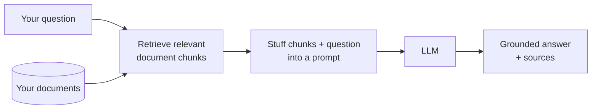
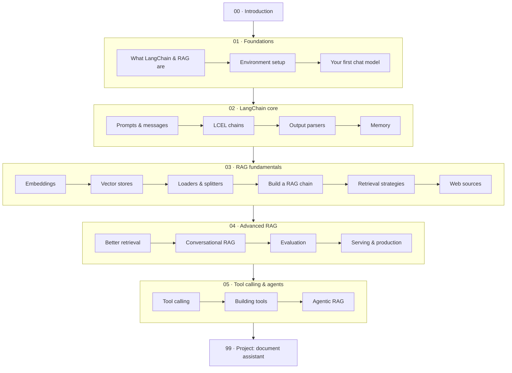

# LangChain & RAG — from your first LLM call to a document assistant you can actually run

> **Verified:** 2026-06-15 against **Python 3.10.12**, **langchain 1.2.16**, **langchain-core 1.3.2**, **langchain-community 0.4.1**, **langchain-text-splitters 1.1.2**, **langchain-huggingface 1.2.2**, **sentence-transformers 5.5.1**, **langchain-ollama 1.1.0**, **langchain-openai 1.2.1**, **rank-bm25 0.2.2**.
> Every code sample was **actually run** in that environment and the real output is shown. The whole course runs **offline with no API key** using a small local embedding model and either a local LLM (Ollama) or a built-in fake model. A hosted LLM (NVIDIA / OpenAI-compatible) is shown as an optional upgrade and clearly labelled.

This is a hands-on, beginner-friendly course. You'll start by understanding what an LLM can and can't do, learn the few LangChain building blocks that matter, and then build **RAG** (Retrieval-Augmented Generation) — the technique that lets an LLM answer questions about *your* documents instead of only what it memorised during training. You finish by building **a working "chat with your documents" assistant** that you run on your own machine.

> ⚠️ **Built for LangChain 1.x.** LangChain changed a lot between the 0.1 era and 1.0 — older tutorials use imports like `from langchain.chains import LLMChain` and `RetrievalQA` that **no longer exist**. This course uses the modern **LCEL** (`|` pipe) style and `langchain-core` imports throughout, all verified against the versions above.

## Who this is for

You're **comfortable with Python** (functions, classes, dicts, list comprehensions, `with` blocks) but **new to LLMs, LangChain, and RAG**. You do *not* need any machine-learning background, math, or prior AI experience. This course teaches all of those ideas from scratch; it does not re-explain core Python.

## What is RAG, in one picture?

An LLM only knows what it saw during training — it can't know your company's refund policy or yesterday's meeting notes. **RAG fixes that**: before answering, you *retrieve* the most relevant snippets from your own documents and hand them to the LLM as context.

By the end you'll have built exactly this, and understand every box.

## The stack we use (and why)

RAG has three swappable pieces. Here's exactly what this course uses, **why**, and what you'd swap to in production:

| Piece | We use | Why this choice | Swap to (production) |
|-------|--------|-----------------|----------------------|
| **Vector store / RAG DB** | **`InMemoryVectorStore`** (built into `langchain-core`) | **Zero setup, zero dependencies, no server, no API key** — it lives in `langchain-core`, so you can focus on *understanding* retrieval instead of installing a database. Perfect for learning and tests. | **Chroma** or **FAISS** for a local store that persists to disk; **pgvector / Pinecone / Weaviate / Qdrant** for hosted, large-scale, concurrent workloads |
| **Embeddings** | **`all-MiniLM-L6-v2`** (local, via `langchain-huggingface`) | Free, private, runs **offline** after a one-time ~80 MB download — real semantic search with no API key | hosted embeddings (OpenAI, Cohere, Voyage) for higher quality — a one-line change |
| **LLM** | **Ollama** (local) or a built-in **fake model** | Real grounded answers with **no API key**, or zero-setup fake replies to run the pipeline anywhere | any hosted model — NVIDIA / OpenAI-compatible / **Anthropic Claude** — all covered, plus how to *choose* one |

> **Why `InMemoryVectorStore` and not Chroma/Pinecone from day one?** A beginner shouldn't have to stand up a database server or sign up for a hosted service just to learn how retrieval *works*. Every vector store in LangChain shares the **same interface** (`add_documents`, `similarity_search`, `as_retriever`), so the RAG code you write here is **identical** whether the store is in memory, on disk (Chroma/FAISS), or in the cloud (Pinecone). You learn the concepts once, then switching databases is nearly a one-line change. Section [03.02 · Vector stores](03_rag_fundamentals/02_vector_stores.md) covers the trade-offs and exactly how to swap.

## Prerequisites

- Python **3.10+** installed (`python3 --version`).
- A terminal and a code editor; basic command-line comfort.
- **No** API key required to complete the course. (Optional: a local [Ollama](https://ollama.com) model for real local answers, or a free hosted key for a hosted LLM — both covered in setup.)

You'll install LangChain and a small embedding model in Section 01.

## The learning path

| # | Section | Modules | You'll be able to… | Time |
|---|---------|---------|--------------------|------|
| 00 | [Introduction](00_introduction.md) | — | Explain what you're building and why RAG matters | ~30 min |
| 01 | [Foundations](01_foundations/README.md) | 3 | Set up LangChain, choose a model, and make your first LLM call | ~3–4 h |
| 02 | [LangChain core](02_langchain_core/README.md) | 4 | Compose prompts, chains, parsers, and memory with LCEL | ~5–7 h |
| 03 | [RAG fundamentals](03_rag_fundamentals/README.md) | 6 | Build a document Q&A system end to end, incl. web pages | ~8–11 h |
| 04 | [Advanced RAG](04_advanced_rag/README.md) | 4 | Improve retrieval, add chat memory, evaluate, and serve it | ~6–9 h |
| 05 | [Tool calling & agents](05_tool_calling_and_agents/README.md) | 3 | Let the model call tools and *decide* when to retrieve (agentic RAG) | ~4–6 h |
| 99 | [Project: document assistant](99_project_doc_assistant/README.md) | — | Run & extend a complete RAG app (with citations) | ~4–6 h |

**Total:** ~31–43 hours. Each module ends with a recap, a self-check, and exercises with collapsible solutions.

### Two tracks

- **Full course (recommended):** `00 → 01 → 02 → 03 → 04 → 05 → 99`. The cohesive path from zero to a working, improvable RAG app that can also call tools.
- **"Just build a RAG app fast" track:** `00 → 01 → 03 → 99`. If you only want a working document Q&A system, Sections 01 and 03 plus the project get you there; come back for Section 02 (LCEL depth), Section 04 (quality/production), and Section 05 (tool calling & agentic RAG) afterward.

## How to use this course

1. Go in order — each module builds on the previous one.
2. **Type the code yourself** and run it. RAG only clicks when you watch retrieval pull the right chunk.
3. Do the exercises before opening the solution.
4. Keep the [capstone app](99_project_doc_assistant/) open as a reference — it's the finished version of everything you build.

→ Start here: **[00 · Introduction](00_introduction.md)**
