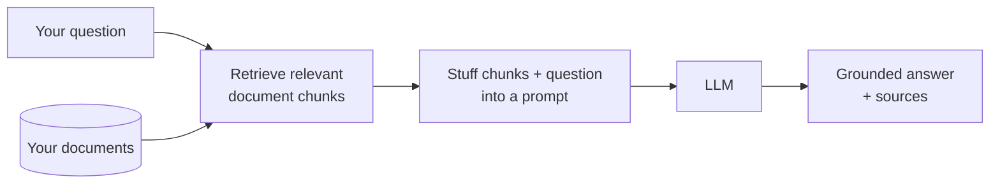
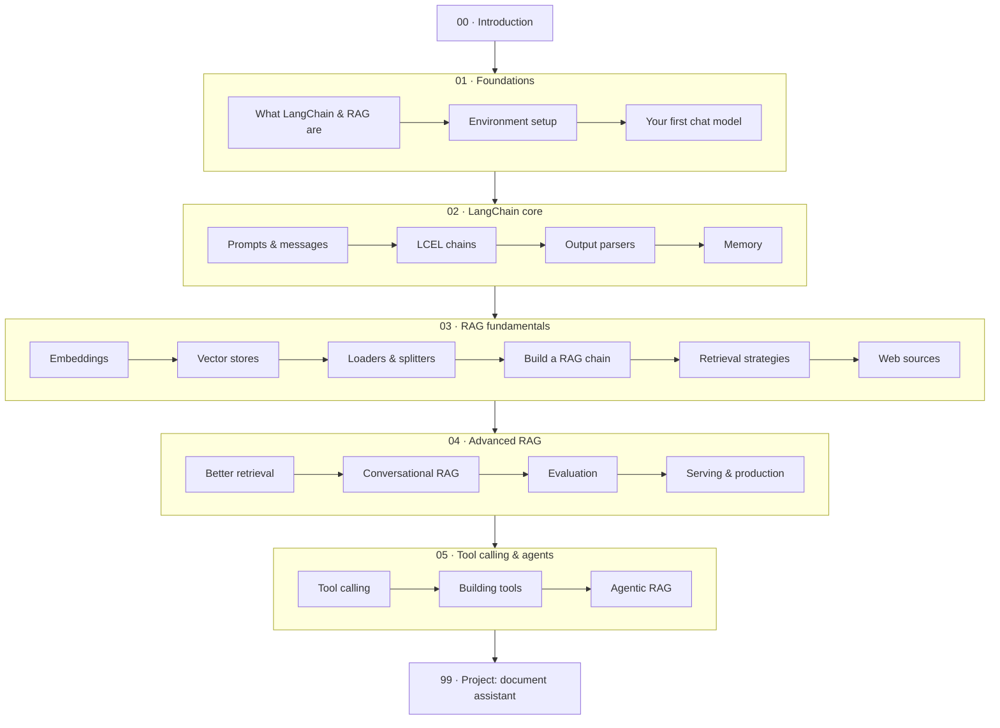

# LangChain & RAG — from your first LLM call to a document assistant you can actually run

> **Verified:** 2026-06-15 against **Python 3.10.12**, **langchain 1.2.16**, **langchain-core 1.3.2**, **langchain-community 0.4.1**, **langchain-text-splitters 1.1.2**, **langchain-huggingface 1.2.2**, **sentence-transformers 5.5.1**, **langchain-ollama 1.1.0**, **langchain-openai 1.2.1**, **rank-bm25 0.2.2**.
> Every code sample was **actually run** in that environment and the real output is shown. Embeddings run **locally with no API key**; the chat model is **OpenAI `gpt-4o-mini`** by default, with a free local alternative (Ollama), NVIDIA's free endpoint, and Anthropic Claude covered as drop-in swaps.

This is a hands-on, beginner-friendly course. You'll start by understanding what an LLM can and can't do, learn the few LangChain building blocks that matter, and then build **RAG** (Retrieval-Augmented Generation) — the technique that lets an LLM answer questions about *your* documents instead of only what it memorised during training. You finish by building **a working "chat with your documents" assistant** that you run on your own machine.

> ⚠️ **Built for LangChain 1.x.** LangChain changed a lot between the 0.1 era and 1.0 — older tutorials use imports like `from langchain.chains import LLMChain` and `RetrievalQA` that **no longer exist**. This course uses the modern **LCEL** (`|` pipe) style and `langchain-core` imports throughout, all verified against the versions above.

## Who this is for

You're **comfortable with Python** (functions, classes, dicts, list comprehensions, `with` blocks) but **new to LLMs, LangChain, and RAG**. You do *not* need any machine-learning background, math, or prior AI experience. This course teaches all of those ideas from scratch; it does not re-explain core Python.

## What is RAG, in one picture?

An LLM only knows what it saw during training — it can't know your company's refund policy or yesterday's meeting notes. **RAG fixes that**: before answering, you *retrieve* the most relevant snippets from your own documents and hand them to the LLM as context.

By the end you'll have built exactly this, and understand every box.

## The stack we use (and why)

RAG has three swappable pieces. Here's exactly what this course uses, **why**, and what you'd swap to in production:

| Piece | We use | Why this choice | Swap to (production) |
|-------|--------|-----------------|----------------------|
| **Vector store / RAG DB** | **`InMemoryVectorStore`** (built into `langchain-core`) to learn; **pgvector** and **Qdrant** hands-on in `03-7`/`03-8`; **Neo4j** for GraphRAG in `04-5` | **Zero setup, zero dependencies, no server, no API key** for the teaching path — focus on *understanding* retrieval, not installing a database. Then you meet the ones the market actually uses. | **pgvector** is the 2026 production default (the DB you already run); **Qdrant** for pure-vector scale + filtering, **Weaviate** for built-in hybrid, **Pinecone** for zero-ops managed, **Milvus/Zilliz** for massive/on-prem — all covered with a decision guide in [03-8](03_rag_fundamentals/08_production_vector_dbs.md) |
| **Embeddings** | **`all-MiniLM-L6-v2`** (local, via `langchain-huggingface`) | Free, private, runs **offline** after a one-time ~80 MB download — real semantic search with no API key | hosted embeddings (OpenAI, Cohere, Voyage) for higher quality — a one-line change |
| **LLM** | **OpenAI `gpt-4o-mini`** (`langchain-openai`) | Cheap, fast, reliable tool calling — one env var and every snippet runs | **Ollama** (local, no key), **NVIDIA** (free endpoint), **Anthropic Claude** — all covered, plus how to *choose* one |

> **Why `InMemoryVectorStore` and not Chroma/Pinecone from day one?** A beginner shouldn't have to stand up a database server or sign up for a hosted service just to learn how retrieval *works*. Every vector store in LangChain shares the **same interface** (`add_documents`, `similarity_search`, `as_retriever`), so the RAG code you write here is **identical** whether the store is in memory, on disk (Chroma/FAISS), or in the cloud (Pinecone). You learn the concepts once, then switching databases is nearly a one-line change. Section [03.02 · Vector stores](03_rag_fundamentals/02_vector_stores.md) covers the trade-offs and exactly how to swap — then [03-7](03_rag_fundamentals/07_pgvector_postgres.md) puts it on **pgvector/Postgres** for real, and [03-8](03_rag_fundamentals/08_production_vector_dbs.md) does **Qdrant** hands-on plus how to choose between Pinecone/Weaviate/Milvus — including the **HNSW vs IVF** indexing vocabulary interviewers ask for by name.

## Prerequisites

- Python **3.10+** installed (`python3 --version`).
- A terminal and a code editor; basic command-line comfort.
- An **OpenAI API key** (`OPENAI_API_KEY`) — the course default; `gpt-4o-mini` costs cents. No key? [Ollama](https://ollama.com) gives a free local model and every snippet works with a one-line swap.

You'll install LangChain and a small embedding model in Section 01.

## The learning path

| # | Section | Modules | You'll be able to… | Time |
|---|---------|---------|--------------------|------|
| 00 | [Introduction](00_introduction.md) | — | Explain what you're building and why RAG matters | ~30 min |
| 01 | [Foundations](01_foundations/README.md) | 3 | Set up LangChain, choose a model, and make your first LLM call | ~3–4 h |
| 02 | [LangChain core](02_langchain_core/README.md) | 4 | Compose prompts, chains, parsers, and memory with LCEL | ~5–7 h |
| 03 | [RAG fundamentals](03_rag_fundamentals/README.md) | 8 | Build a document Q&A system end to end, incl. web pages, **pgvector**, and choosing a production vector DB | ~10–13 h |
| 04 | [Advanced RAG](04_advanced_rag/README.md) | 5 | Improve retrieval, add chat memory, evaluate, serve it, and add **GraphRAG** | ~7–10 h |
| 05 | [Tool calling & agents](05_tool_calling_and_agents/README.md) | 3 | Let the model call tools and *decide* when to retrieve (agentic RAG) | ~4–6 h |
| 99 | [Project: document assistant](99_project_doc_assistant/README.md) | — | Run & extend a complete RAG app (with citations) | ~4–6 h |

**Total:** ~31–43 hours. Each module ends with a recap, a self-check, and exercises with collapsible solutions.

### ⭐ Job-ready core track (start here if the course feels big)

This course is thorough (~31–43 h), but a **RAG job doesn't need all of it**. These **8 lessons in order** are the interview surface — chunking, embeddings, retrieval, a grounded RAG chain, and the production vector DB — and land you at a working, shippable app:

1. [01-1 · What LangChain & RAG are](01_foundations/01_what_is_langchain_and_rag.md)
2. [01-3 · Your first chat model](01_foundations/03_your_first_chat_model.md)
3. [02-1 · Prompts & messages](02_langchain_core/01_prompts_and_messages.md)
4. [03-1 · Embeddings](03_rag_fundamentals/01_embeddings.md)
5. [03-3 · Loaders & splitters (chunking)](03_rag_fundamentals/03_loaders_and_splitters.md)
6. [03-4 · Build a RAG chain](03_rag_fundamentals/04_build_a_rag_chain.md)
7. [03-5 · Retrieval strategies](03_rag_fundamentals/05_retrieval_strategies.md) + [04-1 · Hybrid & reranking](04_advanced_rag/01_better_retrieval.md)
8. [03-7 · pgvector](03_rag_fundamentals/07_pgvector_postgres.md) — the DB you'll actually ship on → then the [capstone](99_project_doc_assistant/README.md)

**Add these to go deeper / stand out** (optional, in rough priority): [04-3 Evaluating RAG](04_advanced_rag/03_evaluating_rag.md) · [04-2 Conversational RAG](04_advanced_rag/02_conversational_rag.md) · [05 Tool calling & agents](05_tool_calling_and_agents/README.md) (or the sibling [LangGraph](../langgraph/) course) · [04-5 GraphRAG](04_advanced_rag/05_graph_rag.md) *(a differentiator, not a requirement)* · [03-8 Choosing a vector DB](03_rag_fundamentals/08_production_vector_dbs.md) *(reference)*.

> **On vector databases:** you *learn* on `InMemoryVectorStore`/FAISS (zero setup) and *ship* on **pgvector** — the 2026 production default (the DB you already run). The other engines (Qdrant/Pinecone/Weaviate/Milvus) are a decision-guide in `03-8`, not something you memorize.

**Full course:** `00 → 01 → 02 → 03 → 04 → 05 → 99` if you want the complete, cohesive path.

## How to use this course

1. Go in order — each module builds on the previous one.
2. **Type the code yourself** and run it. RAG only clicks when you watch retrieval pull the right chunk.
3. Do the exercises before opening the solution.
4. Keep the [capstone app](99_project_doc_assistant/) open as a reference — it's the finished version of everything you build.

## Related guides

- **[LangGraph](../langgraph/)** — the orchestration layer: stateful, cyclic, multi-agent graphs over these building blocks.
- **[Build MCP Servers](../mcp_servers/)** — give agents tools via a standard protocol instead of bespoke glue.
- **[LLM Evals & Observability](../llm_evals_observability/)** — the depth behind `04-3`: golden datasets, RAG metrics, LLM-as-judge, tracing, CI gates.
- **[FastAPI — from first route to production](../fastapi_complete/)** — the service your RAG app ships inside (streaming, auth, rate limits, Docker).
- **[Inventory Data Engineering](../inventory_data_engineering/)** — relational and **graph** data modeling, for the GraphRAG lesson (`04-5`).

→ Start here: **[00 · Introduction](00_introduction.md)**
