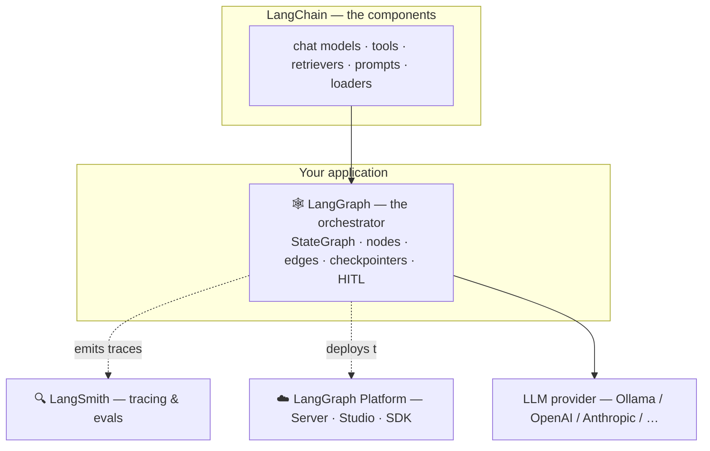

# 00 · Introduction to LangGraph

> **Level:** Absolute Beginner · **Prerequisites:** basic Python; having seen an LLM API helps but isn't required.
> **Time:** 25 min · **Verified:** 2026-07-21 (langgraph 1.2.9, langchain-core 1.5.0, Python 3.10)

This is the start of your journey into **LangGraph** — the framework that turns an LLM from a one-shot question-answerer into a **reliable, stateful agent** that can reason, loop, use tools, remember, and hand control to a human when it matters.

No prior LangGraph knowledge is assumed. And you won't need an API key: everything in this course runs **offline** with a deterministic fake model, so you can watch the *graph* work without paying for or waiting on a real LLM.

---

## Why this matters

A raw LLM call is stateless and linear: prompt in, text out. Real applications aren't linear — they retry, branch on results, call tools, ask a human to approve something, and pick up where they left off tomorrow. Bolting that onto a single `llm.invoke()` gets messy fast.

LangGraph gives you a small, sturdy vocabulary for exactly this: **state**, **nodes**, **edges**. That's the difference between a demo and something you'd put in production — and it's the #1 skill gap between "I made a chatbot" and "I ship agents."

---

## What is LangGraph?

**In one sentence:** LangGraph lets you build an AI workflow as a **graph** — each step is a *node* that does work, the connections are *edges* that decide what runs next, and a shared *state* carries data through it all. Think of it as a flowchart your program actually executes.

> **Analogy — a hospital emergency room.** A triage nurse (a node) assesses you. Based on severity you're *routed* (a conditional edge) to a specialist or to general care. A doctor might *loop back* for more tests (a cycle). A pharmacist picks up where the doctor left off (state passed along). At any point a supervisor can step in (human-in-the-loop). LangGraph builds systems that work exactly like that.

---

## Where LangGraph fits

LangGraph doesn't replace LangChain — it orchestrates it. Here's who does what in the wider stack:



| Framework | Purpose | Best for |
|-----------|---------|----------|
| **LangChain** | Individual components — models, tools, retrievers, prompts | Linear RAG, simple chatbots, prototyping |
| **LangGraph** | Orchestration of those components into stateful workflows | Agents, loops, multi-step reasoning, production |
| **LangSmith** | Observability — tracing, evaluation | Debugging and measuring any of the above |
| **LangGraph Platform** | Hosting — Server, Studio, SDK | Deploying and operating graphs |

**Mental model:** LangChain gives you LEGO bricks; LangGraph is the instruction manual that assembles them into something complex *and reliable*.

---

## Set up (offline, no API key)

```bash
python -m venv .venv && source .venv/bin/activate     # Windows: .venv\Scripts\activate
pip install "langgraph==1.2.9" "langchain-core==1.5.0"
```

That's all you need for every lesson. (Optional, for real local generation later: `pip install langchain-ollama` and `ollama pull qwen2.5:0.5b`.)

### Your first graph

```python
# hello_graph.py — the smallest useful LangGraph program.
from typing import TypedDict
from langgraph.graph import StateGraph, START, END

class State(TypedDict):        # the shared data flowing through the graph
    message: str

def hello(state: State) -> dict:
    # A node: receives state, returns a PARTIAL update (just the keys it changes).
    return {"message": "LangGraph is working! 🎉"}

builder = StateGraph(State)    # build-time: declare structure
builder.add_node("hello", hello)
builder.add_edge(START, "hello")   # START → hello
builder.add_edge("hello", END)     # hello → END

app = builder.compile()        # validate + return a runnable
print(app.invoke({"message": ""}))
```

**Output (real run):**
```
{'message': 'LangGraph is working! 🎉'}
```

You just built a one-node graph: declared state, wrote a node, wired edges from `START` to `END`, compiled, and invoked. Every graph in this course — including a 4-agent research assistant — is that same pattern, scaled up.

---

## Key terms (one line each)

- **Graph** — a workflow of nodes connected by edges.
- **State** — a typed dict carried through the whole run; the single source of truth.
- **Node** — a function that reads state, does work, returns a partial update.
- **Edge** — a connection between nodes; fixed or conditional.
- **Reducer** — how a state update is *merged* (append vs. replace).
- **Compile** — locks the structure and returns a runnable app.
- **Checkpointer** — saves state per step; enables memory, resume, and time-travel.
- **`Command`** — a value a node returns to update state *and* choose where to go next.
- **`Send`** — dispatches dynamic parallel work (map-reduce fan-out).

---

## Common misconceptions

| ❌ Misconception | ✅ Reality |
|-----------------|-----------|
| "LangGraph replaces LangChain" | Complementary — LangChain = components, LangGraph = orchestration |
| "It's only for chatbots" | Any stateful workflow: ETL, automation, multi-agent systems |
| "Graphs are complex" | A basic graph is ~15 lines. Complexity is opt-in |
| "You need OpenAI" | Works with any model — this whole course runs on a fake/local model |
| "It's just a wrapper" | It provides state, persistence, and human-in-the-loop — things raw LLM APIs don't |

---

## Recap & next

- ✅ LangGraph models workflows as **state → nodes → edges**, executed as a real graph.
- ✅ It **orchestrates** LangChain components; LangSmith observes them; the Platform hosts them.
- ✅ You installed it and ran a one-node graph — **offline, no key**.
- ✅ Self-check: in `hello_graph.py`, why does the node return `{"message": ...}` and not the whole state?

→ Next: **[01 · Foundations](01_foundations/README.md)** — state, nodes, edges, and reducers in depth.
