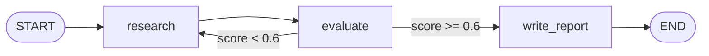

# 02-1 · The super-step model

> **Level:** Beginner → Intermediate · **Prerequisites:** [01 · Foundations](../01_foundations/README.md)
> **Time:** 25 min · **Verified:** 2026-07-21 (langgraph 1.2.9)

## Why this matters

Two questions cause most LangGraph confusion: *"why did my change to the graph not take effect?"* (build vs runtime) and *"in what order did my nodes run?"* (the super-step model). Answer both here and the rest of the course reads cleanly.

> **Analogy — a compiled program.** You write source (`add_node`/`add_edge`), *compile* it (validate + freeze), then *run* it (`invoke`). You can't edit source while it's running — same with graphs.

---

## Phase 1 — build time (`StateGraph` → `compile()`)

`compile()` is a checkpoint of correctness. It validates and then **freezes** the topology.

```python
graph = builder.compile()   # after this, the structure is immutable
```

What `compile()` checks:

- All nodes are reachable and every edge points at a real node.
- `START` has an outgoing edge, and there's at least one path to `END`.
- The state schema is consistent.

It returns a **`CompiledStateGraph`** — a LangChain `Runnable`, so it has `invoke`, `ainvoke`, `stream`, `astream`, `batch`.

> **Tip:** If you edited the graph but nothing changed, you almost certainly re-ran an *old* compiled object. Re-compile after any structural change.

---

## Phase 2 — runtime: the super-step model

LangGraph is a **Pregel**-style engine (bulk-synchronous parallel). Execution proceeds in **super-steps**:

1. Find every node whose incoming edges are satisfied ("ready").
2. Execute those nodes — **in parallel** if there's more than one.
3. Apply all their state updates through the reducers.
4. Save a checkpoint (if a checkpointer is attached).
5. Evaluate outgoing edges to pick the next super-step's nodes.
6. Repeat until `END`.



The practical upshot: **two nodes in the same super-step see the same starting state and run concurrently**, so never have them write the same non-reducer key (last-writer-wins). Parallel fan-out is covered in [04-3 · Send & map-reduce](../04_control_flow/03_send_map_reduce.md).

---

## Seeing super-steps

The easiest way to watch execution is `stream_mode="updates"` — it emits one entry per node as it finishes:

```python
from typing import TypedDict, Annotated
import operator
from langgraph.graph import StateGraph, START, END

class S(TypedDict):
    x: int
    log: Annotated[list, operator.add]

def a(state): return {"x": state["x"] + 1, "log": ["a"]}
def b(state): return {"x": state["x"] * 2, "log": ["b"]}

g = StateGraph(S)
g.add_node("a", a); g.add_node("b", b)
g.add_edge(START, "a"); g.add_edge("a", "b"); g.add_edge("b", END)
app = g.compile()

for step in app.stream({"x": 1, "log": []}, stream_mode="updates"):
    print(step)
```

**Output (real run):**
```
{'a': {'x': 2, 'log': ['a']}}
{'b': {'x': 4, 'log': ['b']}}
```

Each line is one super-step: node `a` ran (x 1→2), then node `b` (x 2→4). The full menu of stream modes is the next lesson.

---

## Visualizing the graph

A compiled graph can draw itself as Mermaid — invaluable for catching a miswired edge:

```python
print(app.get_graph().draw_mermaid())
```

**Output (real run):**
```
---
config:
  flowchart:
    curve: linear
---
graph TD;
	__start__([<p>__start__</p>]):::first
	a(a)
	b(b)
	__end__([<p>__end__</p>]):::last
	__start__ --> a;
	a --> b;
	b --> __end__;
	classDef default fill:#f2f0ff,line-height:1.2
	classDef first fill-opacity:0
	classDef last fill:#bfb6fc
```

(`draw_mermaid_png(...)` renders a PNG if you have the optional deps.)

---

## Recap & next

- ✅ **Build time** validates + freezes; **runtime** executes in **super-steps** (ready nodes run together, updates merge via reducers, then a checkpoint).
- ✅ Nodes in the same super-step share input state and run concurrently — don't fight over non-reducer keys.
- ✅ `stream_mode="updates"` shows the execution step by step; `draw_mermaid()` shows the structure.
- ✅ Self-check: if nodes `a` and `b` both run in one super-step and both return `{"x": ...}` with no reducer, what's the final `x`?

→ Next: **[02-2 · Streaming](02_streaming.md)**

## Exercises

1. Add a third node `c` that also runs after `a` (fan-out `a → b` and `a → c`), give `x` the `operator.add` reducer, and observe both in one super-step via `stream_mode="updates"`.

<details>
<summary>Solution</summary>

```python
from typing import TypedDict, Annotated
import operator
from langgraph.graph import StateGraph, START, END

class S(TypedDict):
    x: Annotated[int, operator.add]

def a(state): return {"x": 1}
def b(state): return {"x": 10}
def c(state): return {"x": 100}

g = StateGraph(S)
for n, f in [("a", a), ("b", b), ("c", c)]: g.add_node(n, f)
g.add_edge(START, "a"); g.add_edge("a", "b"); g.add_edge("a", "c")
g.add_edge("b", END); g.add_edge("c", END)
for step in g.compile().stream({"x": 0}, stream_mode="updates"):
    print(step)
```
`b` and `c` land in the same super-step; the `operator.add` reducer sums their contributions instead of one clobbering the other.
</details>
