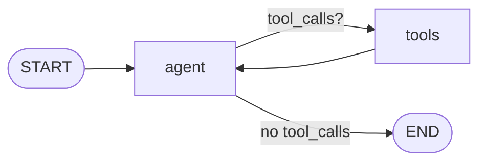

# 03-2 · Tools & the ReAct loop

> **Level:** Intermediate · **Prerequisites:** [03-1 · Your first chatbot](01_first_chatbot.md)
> **Time:** 35 min · **Verified:** 2026-07-21 (langgraph 1.2.9, langchain-core 1.5.0)

## Why this matters

A chatbot that can only talk is limited. A chatbot that can **call tools** — search, calculate, hit an API — is an *agent*. The dominant pattern is **ReAct** (Reason + Act): the LLM decides whether to call a tool, the tool runs, the LLM sees the result and decides again, looping until it can answer. LangGraph gives you `ToolNode` and `tools_condition` to build this loop in a few lines.

---

## The three moving parts

1. **A tool** — a plain function with the `@tool` decorator (its docstring/signature tells the LLM how to call it).
2. **`ToolNode`** — a prebuilt node that reads the tool calls from the last AI message, runs them, and returns `ToolMessage`s.
3. **`tools_condition`** — a prebuilt router: if the last AI message contains tool calls → go to `"tools"`, else → `END`.



---

## Building it

`llm.bind_tools([...])` tells the model which tools exist; the model then *decides* when to call one. `ToolNode` runs the call and `tools_condition` routes on whether there was one.

```python
from langchain_openai import ChatOpenAI
from langchain_core.messages import HumanMessage
from langchain_core.tools import tool
from langgraph.graph import StateGraph, START, END, MessagesState
from langgraph.prebuilt import ToolNode, tools_condition

@tool
def calculator(expression: str) -> str:
    """Evaluate a math expression like '85 * 0.15'."""
    return f"{expression} = {eval(expression)}"

model = ChatOpenAI(model="gpt-4o-mini", temperature=0).bind_tools([calculator])

def agent(state: MessagesState) -> dict:
    return {"messages": [model.invoke(state["messages"])]}

builder = StateGraph(MessagesState)
builder.add_node("agent", agent)
builder.add_node("tools", ToolNode([calculator]))
builder.add_edge(START, "agent")
builder.add_conditional_edges("agent", tools_condition)    # agent → tools OR END
builder.add_edge("tools", "agent")                          # after tools, back to agent
app = builder.compile()

out = app.invoke({"messages": [HumanMessage(content="What's a 15% tip on $85?")]})
for m in out["messages"]:
    print(m.type, "|", repr(m.content), "| tool_calls:", getattr(m, "tool_calls", None) or "")
```

**Output (representative — your wording will differ):**
```
human | "What's a 15% tip on $85?" | tool_calls:
ai | '' | tool_calls: [{'name': 'calculator', 'args': {'expression': '85*0.15'}, 'id': 'call_9xK2mQ', 'type': 'tool_call'}]
tool | '85*0.15 = 12.75' | tool_calls:
ai | 'A 15% tip on $85 is $12.75.' | tool_calls: []
```

Read the loop top to bottom: the user asks → the agent emits a **tool call** (no content) → `tools_condition` routes to `ToolNode`, which runs `calculator` and appends a **`ToolMessage`** (`= 12.75`) → back to the agent → now it emits a **final answer** → `tools_condition` sees no tool calls → `END`.

> ⚠️ `eval()` is fine for a demo; never run it on untrusted input in production. Use `ast.literal_eval` or a real math parser.

---

## With a local model

Any tool-calling model works. For a free local one:

```python
# from langchain_ollama import ChatOllama
# model = ChatOllama(model="qwen2.5:0.5b", temperature=0).bind_tools([calculator])
```

Very small local models call tools unreliably (wrong tool, malformed args) — if that happens it's the model, not your graph. Everything else — `ToolNode`, `tools_condition`, the edges — is identical.

---

## Recap & next

- ✅ ReAct loop = `agent → (tools_condition) → tools → agent → … → END`.
- ✅ `@tool` defines a callable; `ToolNode` executes the calls; `tools_condition` routes.
- ✅ `bind_tools` tells the model which tools exist; the model decides when to call them.
- ✅ Self-check: which message type carries a tool's *result* back into the conversation?

→ Next: **[03-3 · Prebuilt agents](03_create_react_agent.md)**

## Exercises

1. Add a second tool `search_web(query)`, bind both, and ask something that needs both (e.g. "Look up the price of X, then add a 15% tip").

<details>
<summary>Solution</summary>

Add `search_web` to both `bind_tools([...])` and the `ToolNode` list. The model emits a search call, then a calculator call, then the answer: `agent → tools → agent → tools → agent → END` — two trips through `tools`. Print the messages to confirm.
</details>
