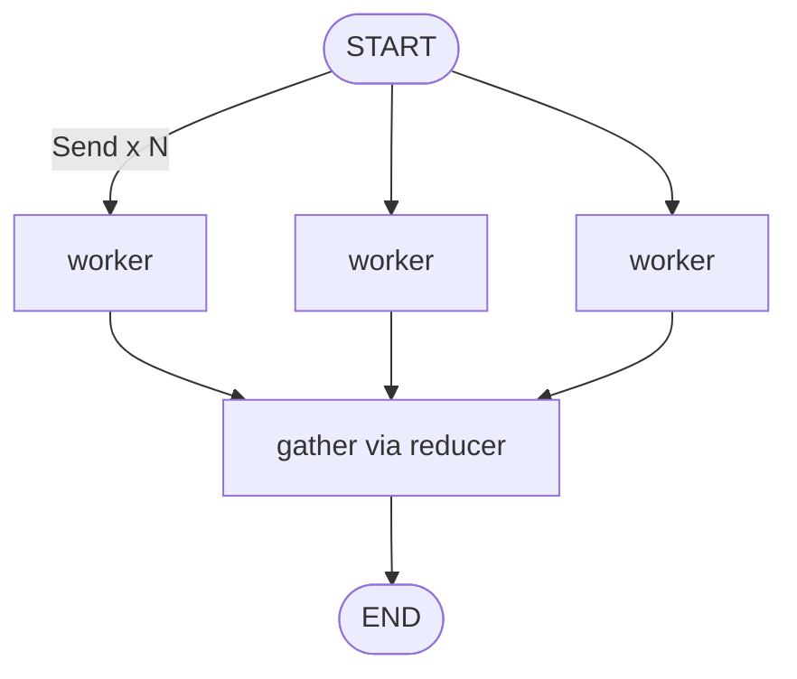

# 04-3 · `Send` & map-reduce

> **Level:** Intermediate · **Prerequisites:** [04-1 · Conditional edges](01_conditional_edges.md)
> **Time:** 30 min · **Verified:** 2026-07-21 (langgraph 1.2.9)

## Why this matters

Sometimes you don't know at build time *how many* parallel branches you need — it depends on the data. "Summarize each of these N documents", "check each of these M subtasks", "generate a joke about each topic in the list". The **`Send`** API lets a node dynamically dispatch work to N copies of another node, each with its **own** input, then reduce the results. That's map-reduce, and it's how you get real parallelism over variable-length data.

---

## The idea

A routing function returns a **list of `Send` objects** instead of a string. Each `Send("node_name", payload)` schedules one run of `node_name` with `payload` as its state. All of them run in the same super-step (concurrently), and their outputs merge through the reducer.



---

## Map-reduce over a list

```python
from typing import TypedDict, Annotated
import operator
from langgraph.graph import StateGraph, START, END
from langgraph.types import Send

class MRState(TypedDict):
    items: list[int]
    results: Annotated[list[int], operator.add]   # the "reduce" side

def fan_out(state: MRState):
    # MAP: one Send per item → one `worker` run each, with its own payload
    return [Send("worker", {"item": i}) for i in state["items"]]

def worker(state: dict) -> dict:
    return {"results": [state["item"] ** 2]}       # each worker sees only its item

builder = StateGraph(MRState)
builder.add_node("worker", worker)
builder.add_conditional_edges(START, fan_out, ["worker"])   # START fans out
builder.add_edge("worker", END)

print(builder.compile().invoke({"items": [1, 2, 3, 4], "results": []}))
```

**Output (real run):**
```
{'items': [1, 2, 3, 4], 'results': [1, 4, 9, 16]}
```

Four workers ran in parallel, each squaring its own `item`; the `operator.add` reducer gathered the four one-element lists into `[1, 4, 9, 16]`. Change `items` to a 100-element list and you get 100 parallel dispatches — no graph changes.

> **Key detail:** each `Send` payload becomes that worker's *entire* input state. The worker doesn't see the parent's `items` list — only what you handed it (`{"item": i}`). Results flow back into the parent through the shared reducer key (`results`).

---

## Why not just a Python loop?

A `for` loop inside one node also processes the list — but sequentially, as one opaque node (no per-item checkpointing, no parallelism, no per-item retry/streaming). `Send` makes each item a *first-class* unit of work: independently retried, cached, streamed, and run concurrently. Use `Send` when items are independent and you want real fan-out; use a plain loop for cheap, tightly-coupled iteration.

---

## Recap & next

- ✅ A router returning `[Send("worker", payload), ...]` dispatches **dynamic** parallel work.
- ✅ Each `Send` payload is that worker's full input; results merge back via a reducer.
- ✅ `Send` gives per-item parallelism, checkpointing, and retries — beyond a plain loop.
- ✅ Self-check: what does each `worker` see in its `state`, and how do the pieces get recombined?

→ Next: **[04-4 · Subgraphs](04_subgraphs.md)**

## Exercises

1. Fan out over a list of words and return each word's length; gather into a list of `(word, length)` pairs.

<details>
<summary>Solution</summary>

```python
def fan_out(state): return [Send("count", {"word": w}) for w in state["words"]]
def count(state):   return {"pairs": [(state["word"], len(state["word"]))]}
# state: words: list[str]; pairs: Annotated[list, operator.add]
```
Each `count` worker handles one word; the reducer collects the pairs.
</details>
