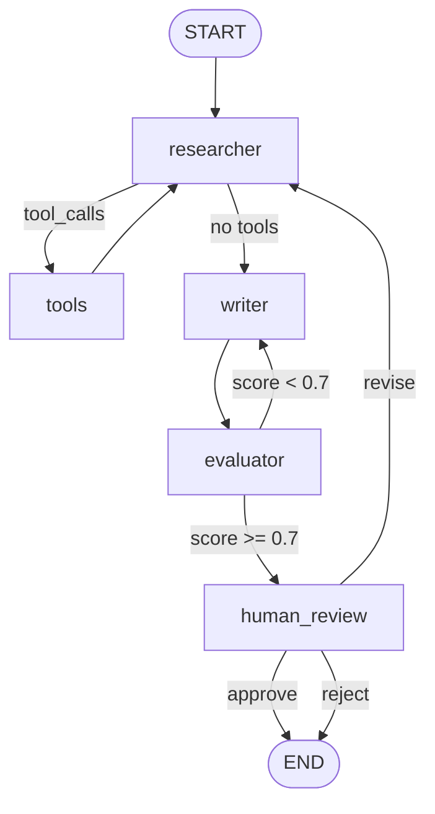

# 07: Mini Project — Build a Research Assistant Agent

> **Difficulty:** Intermediate  
> **Time:** 2–4 hours  
> **Prerequisites:** Modules 00–06  
> **Last Updated:** 2026-05-05

---

## Overview

**Building:** A Research Assistant that takes a topic, searches for information, evaluates quality, writes a report, and asks for human approval before finalizing.  
**Why:** Combines State, Nodes, Edges, Reducers, Checkpointing, Tools, HITL, and Streaming — every major concept from this series.  
**Outcome:** A production-ready agent skeleton you can extend for real projects.

---

## Requirements

| Feature | Module Ref |
|---------|------------|
| TypedDict state with reducers | Module 01 |
| Conditional edges + loops | Module 01, 02 |
| Tool calling (ReAct pattern) | Module 03 |
| Self-correction loop | Module 04 |
| Checkpointer + thread_id | Module 02, 05 |
| Human-in-the-loop approval | Module 02 |
| Streaming output | Module 02 |

---

## Project Structure

```
research_assistant/
├── agent.py          # Main graph definition
├── tools.py          # Tool definitions
├── state.py          # State schema
├── run.py            # Entry point + CLI
└── requirements.txt  # Dependencies
```

---

## Build Steps

### Phase 1: Setup

```bash
# Create project directory
mkdir research_assistant && cd research_assistant

# Create virtual environment
python -m venv .venv && source .venv/bin/activate

# Install dependencies
pip install langgraph langchain-openai langchain-core

# Set API key
export OPENAI_API_KEY="sk-your-key-here"
```

**requirements.txt:**
```text
langgraph>=0.4.0
langchain-openai>=0.3.0
langchain-core>=0.3.0
```

### Phase 2: State Schema

```python
# state.py — The shared memory of our agent
"""
What: Defines all data that flows through the research assistant graph.
Why: Typed state catches bugs early and enables IDE autocomplete.
"""

from typing import TypedDict, Annotated
import operator
from langgraph.graph import add_messages


class ResearchState(TypedDict):
    messages: Annotated[list, add_messages]
    # What: Full conversation history (user + AI + tool messages)
    # Why: LLM needs context to make decisions
    # Reducer: add_messages — appends and deduplicates by message ID

    topic: str
    # What: The research topic provided by the user
    # Why: Anchors all search and generation steps

    sources: Annotated[list[str], operator.add]
    # What: URLs/references found during research
    # Why: Accumulates across multiple search iterations
    # Reducer: operator.add — appends new sources to existing list

    draft_report: str
    # What: The generated report text
    # Why: Produced by the writer node, reviewed by evaluator

    quality_score: float
    # What: 0.0–1.0 score from the evaluator
    # Why: Drives the self-correction loop (retry if < 0.7)

    attempt: int
    # What: Number of research iterations completed
    # Why: Safety bound to prevent infinite loops (max 3)

    status: str
    # What: Current status — "researching", "writing", "reviewing", "approved", "rejected"
    # Why: Tracks workflow state for logging and HITL decisions
```

### Phase 3: Tools

```python
# tools.py — External capabilities the agent can use
"""
What: Tools the research agent can call via the LLM.
Why: Agents need to interact with external systems (search, APIs).
Note: These are simulated — replace with real APIs in production.
"""

from langchain_core.tools import tool


@tool
def web_search(query: str) -> str:
    """Search the web for current information about a topic.

    Args:
        query: The search query string
    """
    # Production: Use Tavily, SerpAPI, or Brave Search API
    return (
        f"Search results for '{query}':\n"
        f"1. [Wikipedia] {query} is a widely studied topic with applications in...\n"
        f"2. [ArXiv] Recent research (2025) shows significant advances in...\n"
        f"3. [Industry Report] Enterprise adoption of {query} grew 40% in 2025.\n"
        f"Source: https://search.example.com/q={query.replace(' ', '+')}"
    )


@tool
def get_statistics(topic: str) -> str:
    """Retrieve statistical data and metrics about a topic.

    Args:
        topic: The topic to get statistics for
    """
    # Production: Query a statistics API or database
    return (
        f"Statistics for '{topic}':\n"
        f"- Market size: $4.2B (2025), projected $12.8B (2028)\n"
        f"- Adoption rate: 67% of Fortune 500 companies\n"
        f"- Growth: 34% CAGR over last 3 years\n"
        f"Source: https://stats.example.com/{topic.replace(' ', '-')}"
    )
```

### Phase 4: Core Agent Graph

```python
# agent.py — The main research assistant graph
"""
What: LangGraph-based research assistant with self-correction and HITL.
Why: Demonstrates production-grade agent architecture.
"""

from typing import Literal
from langgraph.graph import StateGraph, START, END
from langgraph.checkpoint.memory import MemorySaver
from langgraph.prebuilt import ToolNode, tools_condition
from langgraph.types import interrupt
from langchain_openai import ChatOpenAI
from langchain_core.messages import SystemMessage

from state import ResearchState
from tools import web_search, get_statistics


# ── LLM Setup ──
tools = [web_search, get_statistics]
llm = ChatOpenAI(model="gpt-4o-mini", temperature=0)
llm_with_tools = llm.bind_tools(tools)
# bind_tools: Makes the LLM aware of available tools
# The LLM outputs tool_call requests; ToolNode executes them


# ── Node Definitions ──

def researcher(state: ResearchState) -> dict:
    """
    What: The 'brain' — analyzes the topic and decides whether to use tools.
    Why: Central decision-maker in the ReAct loop.

    Returns:
        dict: Partial state with updated messages
    """
    research_prompt = SystemMessage(content=(
        f"You are a research assistant investigating: '{state['topic']}'.\n"
        f"Current attempt: {state.get('attempt', 0) + 1}/3.\n"
        f"Sources found so far: {len(state.get('sources', []))}\n\n"
        "Use the available tools to gather comprehensive information.\n"
        "When you have enough data (3+ sources), stop calling tools and "
        "summarize your key findings in a final message."
    ))

    response = llm_with_tools.invoke([research_prompt, *state["messages"]])

    return {
        "messages": [response],
        "attempt": state.get("attempt", 0) + 1,
        "status": "researching"
    }


def writer(state: ResearchState) -> dict:
    """
    What: Produces a structured report from research findings.
    Why: Separating research from writing produces higher quality output.
    """
    writer_llm = ChatOpenAI(model="gpt-4o-mini", temperature=0.5)

    response = writer_llm.invoke([
        SystemMessage(content=(
            f"Write a concise, well-structured research report about '{state['topic']}'.\n"
            f"Use these sources: {state.get('sources', [])}\n"
            f"Conversation context below contains research findings.\n\n"
            "Format: Title, Executive Summary (2-3 sentences), "
            "Key Findings (3-5 bullets), Conclusion."
        )),
        *state["messages"]
    ])

    return {
        "draft_report": response.content,
        "status": "writing"
    }


def evaluator(state: ResearchState) -> dict:
    """
    What: Self-evaluates report quality.
    Why: Catches low-quality output before it reaches the user.
    """
    eval_llm = ChatOpenAI(model="gpt-4o-mini", temperature=0)

    response = eval_llm.invoke([
        SystemMessage(content=(
            "Evaluate this research report on a scale of 0.0 to 1.0.\n"
            "Criteria: Factual accuracy, completeness, clarity, structure.\n"
            "Respond with ONLY a decimal number (e.g., 0.85)."
        )),
        ("user", f"Topic: {state['topic']}\n\nReport:\n{state.get('draft_report', '')}")
    ])

    try:
        score = float(response.content.strip())
    except ValueError:
        score = 0.5  # Default if parsing fails

    return {"quality_score": min(max(score, 0.0), 1.0), "status": "reviewing"}


def human_review(state: ResearchState) -> dict:
    """
    What: Pauses for human approval before finalizing.
    Why: Critical for production — ensures quality before delivery.
    """
    approval = interrupt({
        "question": "Do you approve this research report?",
        "report_preview": state.get("draft_report", "")[:500] + "...",
        "quality_score": state.get("quality_score", 0),
        "options": ["approve", "reject", "revise"],
    })

    if approval == "approve":
        return {"status": "approved"}
    elif approval == "revise":
        return {"status": "researching", "attempt": 0}  # Reset for revision
    return {"status": "rejected"}


# ── Router Functions ──

def after_evaluation(state: ResearchState) -> Literal["writer", "human_review"]:
    """Routes based on quality score and attempt count."""
    score = state.get("quality_score", 0)
    attempt = state.get("attempt", 0)

    if score >= 0.7 or attempt >= 3:
        return "human_review"  # Good enough or max attempts reached
    return "writer"            # Retry — loop back

def after_human_review(state: ResearchState) -> Literal["researcher", "__end__"]:
    """Routes based on human decision."""
    if state.get("status") == "approved":
        return "__end__"
    if state.get("status") == "researching":
        return "researcher"    # Human asked for revision
    return "__end__"           # Rejected — end gracefully


# ── Build the Graph ──

def build_research_agent():
    """
    What: Constructs and compiles the full research assistant graph.
    Why: Factory function keeps graph construction reusable and testable.

    Returns:
        CompiledGraph: Ready to invoke
    """
    builder = StateGraph(ResearchState)

    # Add nodes
    builder.add_node("researcher", researcher)
    builder.add_node("tools", ToolNode(tools))
    builder.add_node("writer", writer)
    builder.add_node("evaluator", evaluator)
    builder.add_node("human_review", human_review)

    # Entry: START → researcher
    builder.add_edge(START, "researcher")

    # ReAct loop: researcher ↔ tools
    builder.add_conditional_edges(
        "researcher",
        tools_condition,
        {"tools": "tools", "__end__": "writer"}
        # tools_condition returns "tools" if LLM wants tools, END otherwise
        # When LLM is done researching → goes to writer
    )
    builder.add_edge("tools", "researcher")

    # Writer → Evaluator → (loop or human review)
    builder.add_edge("writer", "evaluator")
    builder.add_conditional_edges(
        "evaluator",
        after_evaluation,
        {"writer": "writer", "human_review": "human_review"}
    )

    # Human review → (end or revise)
    builder.add_conditional_edges(
        "human_review",
        after_human_review,
        {"researcher": "researcher", "__end__": END}
    )

    # Compile with checkpointer
    memory = MemorySaver()
    return builder.compile(checkpointer=memory)
```

### Phase 5: Entry Point

```python
# run.py — CLI entry point
"""
What: Runs the research assistant from the command line.
Why: Provides a clean interface for testing and demonstration.
"""

from langchain_core.messages import HumanMessage
from langgraph.types import Command
from agent import build_research_agent


def main():
    agent = build_research_agent()
    config = {"configurable": {"thread_id": "research-001"}}

    print("=" * 60)
    print("🔬 RESEARCH ASSISTANT")
    print("=" * 60)

    topic = input("\nEnter a research topic: ").strip()
    if not topic:
        topic = "Impact of AI agents in enterprise software"

    print(f"\n📋 Researching: {topic}")
    print("-" * 60)

    # First invocation: runs until HITL interrupt
    initial_state = {
        "messages": [HumanMessage(content=f"Research this topic: {topic}")],
        "topic": topic,
        "sources": [],
        "draft_report": "",
        "quality_score": 0.0,
        "attempt": 0,
        "status": "starting",
    }

    # Stream to see each step
    for event in agent.stream(initial_state, config, stream_mode="updates"):
        node_name = list(event.keys())[0]
        print(f"  ✅ {node_name} completed")

        # Check if we've hit the HITL interrupt
        if node_name == "human_review":
            break

    # Get current state to show the report
    state = agent.get_state(config)

    # Show the report preview from the interrupt
    if state.next:
        # Graph is paused at HITL
        print("\n" + "=" * 60)
        print("📝 DRAFT REPORT")
        print("=" * 60)

        current_values = state.values
        print(current_values.get("draft_report", "No report generated"))
        print(f"\n📊 Quality Score: {current_values.get('quality_score', 0):.2f}")
        print("-" * 60)

        decision = input("\nApprove this report? (approve/reject/revise): ").strip()
        if not decision:
            decision = "approve"

        # Resume the graph with human's decision
        result = agent.invoke(Command(resume=decision), config)
    else:
        result = state.values

    print("\n" + "=" * 60)
    print(f"📌 Final Status: {result.get('status', 'unknown')}")
    print(f"📊 Quality Score: {result.get('quality_score', 0):.2f}")
    print(f"🔗 Sources Found: {len(result.get('sources', []))}")
    print(f"🔄 Research Iterations: {result.get('attempt', 0)}")
    print("=" * 60)


if __name__ == "__main__":
    main()
```

---

## Expected Output

```
============================================================
🔬 RESEARCH ASSISTANT
============================================================

Enter a research topic: Impact of AI agents in enterprise software

📋 Researching: Impact of AI agents in enterprise software
------------------------------------------------------------
  ✅ researcher completed
  ✅ tools completed
  ✅ researcher completed
  ✅ tools completed
  ✅ researcher completed
  ✅ writer completed
  ✅ evaluator completed
  ✅ human_review completed

============================================================
📝 DRAFT REPORT
============================================================
# Impact of AI Agents in Enterprise Software

## Executive Summary
AI agents are transforming enterprise software by automating complex
workflows, enhancing decision-making, and reducing operational costs...

## Key Findings
- Market size reached $4.2B in 2025, with 34% CAGR
- 67% of Fortune 500 companies have adopted AI agent technology
- Primary use cases: customer support, DevOps automation, data analysis
...

📊 Quality Score: 0.85
------------------------------------------------------------

Approve this report? (approve/reject/revise): approve

============================================================
📌 Final Status: approved
📊 Quality Score: 0.85
🔗 Sources Found: 4
🔄 Research Iterations: 2
============================================================
```

---

## Graph Visualization



---

## Extend It

| Enhancement | Difficulty | What You'll Learn |
|-------------|-----------|-------------------|
| Replace simulated tools with Tavily search API | Easy | Real API integration |
| Add a `fact_checker` node between writer and evaluator | Medium | Additional graph nodes, multi-step validation |
| Deploy with FastAPI + PostgresSaver | Medium | Production deployment, persistent state |
| Add a second agent team (reviewer + editor) via subgraphs | Hard | Multi-agent orchestration, subgraphs |
| Implement long-term memory with `InMemoryStore` | Medium | Cross-conversation user preferences |

---

## 📄 Documentation Notes (Copy-Paste Ready)

```markdown
## LangGraph — Quick Reference

### What It Is
LangGraph is a Python framework for building stateful, multi-step AI workflows
as directed graphs. Part of the LangChain ecosystem.

### Core Primitives
- **State**: TypedDict flowing through the graph (shared memory)
- **Nodes**: Python functions that process state and return partial updates
- **Edges**: Fixed or conditional connections between nodes
- **Reducers**: Merge strategies for state updates (append vs replace)
- **Checkpointer**: Persistence layer for memory, recovery, and HITL

### Key Patterns
1. **ReAct Agent**: LLM → Tool → LLM → ... → END (tool-calling loop)
2. **Supervisor**: Coordinator LLM → routes to specialist agents
3. **Self-Correction**: Generate → Evaluate → Retry loop with quality gate
4. **Human-in-the-Loop**: interrupt() pauses graph for human approval

### Production Checklist
- [ ] TypedDict state with reducers on accumulating fields
- [ ] Max iteration limits on all loops
- [ ] PostgresSaver (not MemorySaver) for persistence
- [ ] Unique thread_id per conversation
- [ ] LangSmith tracing enabled
- [ ] Input validation + error handling in every node
- [ ] Async nodes for I/O-bound operations

### Ecosystem
| Tool | Purpose |
|------|---------|
| LangChain | Components (LLMs, tools, retrievers) |
| LangGraph | Orchestration (graphs, state, routing) |
| LangSmith | Observability (traces, evals, monitoring) |
| LangGraph Platform | Deployment (cloud or self-hosted) |
```

---

## 📚 Advanced Learning Path

After completing this series, here's what to learn next:

### Immediate Next Steps
1. **LangGraph Subgraphs** — Build modular, nested graphs for complex systems
2. **LangSmith Evaluations** — Systematic testing of agent behavior
3. **Production Deployment** — LangGraph Platform, FastAPI integration, PostgresSaver

### Intermediate Topics
4. **Advanced Memory** — Long-term memory with `Store`, semantic search over past conversations
5. **Streaming Patterns** — Token-by-token streaming, `astream_events`, real-time UIs
6. **Multi-Agent Architectures** — Swarm handoffs, hierarchical teams, parallel execution

### Advanced Topics
7. **Custom Checkpointers** — Build your own (Redis, MongoDB, DynamoDB)
8. **Context Engineering** — Optimizing what context each node sees (prompt compression, summarization)
9. **Agent Evaluation Frameworks** — LangSmith datasets, regression testing, A/B testing agents
10. **LangGraph at Scale** — Horizontal scaling, async workers, queue-based architectures

### Resources
- [LangGraph Documentation](https://langchain-ai.github.io/langgraph/)
- [LangGraph Tutorials](https://langchain-ai.github.io/langgraph/tutorials/)
- [LangSmith](https://smith.langchain.com/)
- [LangChain Blog](https://blog.langchain.dev/) — Architecture decision posts

---

## Congratulations! 🎉

**Completed Skills:**
- ✅ Build stateful AI workflows with StateGraph
- ✅ Implement ReAct, Supervisor, and Self-Correction patterns
- ✅ Use checkpointers for memory and crash recovery
- ✅ Add human-in-the-loop for critical decisions
- ✅ Connect LangGraph to the broader AI ecosystem
- ✅ Build a production-ready research assistant agent

**You're now ready to build production AI agent systems with LangGraph.**

---

## Changelog

| Date | Change |
|------|--------|
| 2026-05-05 | Initial creation |
