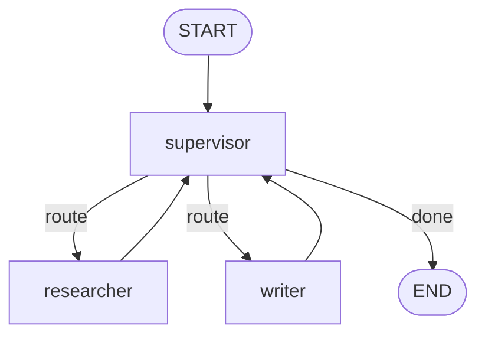

# 07-1 · Supervisor

> **Level:** Intermediate · **Prerequisites:** [04-2 · Command](../04_control_flow/02_command.md)
> **Time:** 30 min · **Verified:** 2026-07-21 (langgraph 1.2.9)

## Why this matters

The supervisor is the most common multi-agent shape: a **coordinator** decides which specialist should act next, the specialist does its bit and reports back, and the coordinator decides again — until the task is done. It's a hub-and-spoke loop, and it maps perfectly onto `Command(goto=...)`.



---

## Building it (offline, deterministic)

A production supervisor asks an LLM "who's next?". To keep this **verifiable**, our supervisor routes on state (`research_done`, `written`) rather than a model — the *topology* is identical; only the decision source changes.

```python
from typing import TypedDict, Annotated, Literal
import operator
from langgraph.graph import StateGraph, START, END
from langgraph.types import Command

class TeamState(TypedDict):
    task: str
    steps: Annotated[list, operator.add]
    research_done: bool
    written: bool

def supervisor(state: TeamState) -> Command[Literal["researcher", "writer", "__end__"]]:
    if not state["research_done"]:
        return Command(goto="researcher", update={"steps": ["supervisor->researcher"]})
    if not state["written"]:
        return Command(goto="writer", update={"steps": ["supervisor->writer"]})
    return Command(goto=END, update={"steps": ["supervisor->END"]})

def researcher(state): return {"research_done": True, "steps": ["researched"]}
def writer(state):     return {"written": True, "steps": ["wrote"]}

g = StateGraph(TeamState)
g.add_node("supervisor", supervisor)
g.add_node("researcher", researcher)
g.add_node("writer", writer)
g.add_edge(START, "supervisor")
g.add_edge("researcher", "supervisor")     # workers always report back
g.add_edge("writer", "supervisor")

out = g.compile().invoke(
    {"task": "write report", "steps": [], "research_done": False, "written": False})
print(out["steps"])
```

**Output (real run):**
```
['supervisor->researcher', 'researched', 'supervisor->writer', 'wrote', 'supervisor->END']
```

The trace *is* the coordination: supervisor → researcher → back to supervisor → writer → back to supervisor → END. Each worker edges back to `supervisor`, so the hub stays in control.

---

## Making the supervisor LLM-driven

Swap the `if` ladder for a model that returns the next agent's name:

```python
# def supervisor(state):
#     choice = router_llm.invoke(f"Workers: researcher, writer. "
#                                f"State: {state}. Reply with one name or FINISH.")
#     nxt = choice.content.strip().lower()
#     goto = "researcher" if "research" in nxt else "writer" if "writ" in nxt else END
#     return Command(goto=goto)
```

Everything else — the edges, the report-back loop — is unchanged. That's the value of building on `Command`: the decision mechanism is swappable without touching the topology.

> **Tip:** Keep a bound on supervisor loops (a step counter in state or `recursion_limit`). An LLM supervisor that never says "FINISH" will otherwise spin. Give workers a clear "done" signal in state so the supervisor can detect completion.

---

## Recap & next

- ✅ Supervisor = a coordinator that `Command(goto=worker)`s and loops until `goto=END`.
- ✅ Workers edge back to the supervisor so it stays in control.
- ✅ Route on state (deterministic/testable) or an LLM (flexible) — same topology.
- ✅ Self-check: what stops the supervisor loop, and how would you bound a misbehaving LLM supervisor?

→ Next: **[07-2 · Swarm & handoffs](02_swarm_and_handoffs.md)**

## Exercises

1. Add a third worker `editor` that must run after `writer`; extend the supervisor's ladder and add its report-back edge.

<details>
<summary>Solution</summary>

Add an `edited: bool` flag, a `writer→` step that leaves `edited=False`, and a supervisor branch: `if state["written"] and not state["edited"]: return Command(goto="editor")`. Add `g.add_edge("editor", "supervisor")`.
</details>
