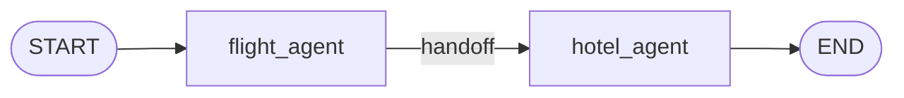

# 07-2 · Swarm & handoffs

> **Level:** Intermediate · **Prerequisites:** [07-1 · Supervisor](01_supervisor.md)
> **Time:** 30 min · **Verified:** 2026-07-21 (langgraph 1.2.9)

## Why this matters

A supervisor is a *hub*: control always returns to the center. A **swarm** is *peer-to-peer*: agents hand off directly to whichever specialist should take over next, and control stays wherever it landed. Think of a travel booking where the flight agent, done with flights, hands you straight to the hotel agent — no coordinator in the middle. The handoff is just `Command(goto=other_agent)`.



---

## A handoff

```python
from typing import TypedDict, Annotated, Literal
import operator
from langgraph.graph import StateGraph, START, END
from langgraph.types import Command

class SwarmState(TypedDict):
    messages: Annotated[list, operator.add]

def flight_agent(state: SwarmState) -> Command[Literal["hotel_agent"]]:
    # do flight work, then hand off to the hotel specialist
    return Command(goto="hotel_agent",
                   update={"messages": ["flight booked → handoff to hotel"]})

def hotel_agent(state: SwarmState) -> Command[Literal["__end__"]]:
    return Command(goto=END, update={"messages": ["hotel booked"]})

g = StateGraph(SwarmState)
g.add_node("flight_agent", flight_agent)
g.add_node("hotel_agent", hotel_agent)
g.add_edge(START, "flight_agent")

print(g.compile().invoke({"messages": []})["messages"])
```

**Output (real run):**
```
['flight booked → handoff to hotel', 'hotel booked']
```

No supervisor node, no report-back edges — `flight_agent` decided *itself* that hotel was next and jumped there. In a real swarm each agent's `Command[Literal[...]]` lists every peer it can hand off to, and the active agent chooses based on the conversation.

---

## Handoff as a tool

The common production idiom is a **handoff tool**: the agent's LLM "calls" `transfer_to_hotel_agent()`, and that tool returns a `Command(goto="hotel_agent")`. This lets the *model* trigger the handoff through normal tool-calling:

```python
from langchain_core.tools import tool
from langgraph.types import Command

@tool
def transfer_to_hotel_agent():
    """Hand the conversation to the hotel booking agent."""
    return Command(goto="hotel_agent", graph=Command.PARENT)
```

Because a tool can return a `Command`, "use a tool" and "hand off to a peer" become the same mechanism — the agent doesn't need special routing code, just another tool.

> **Tip:** `graph=Command.PARENT` (from [04-2](../04_control_flow/02_command.md)) is what lets a handoff tool *inside* one agent-subgraph jump to a sibling agent in the parent. That's how the `langgraph-swarm` package wires its handoffs under the hood.

---

## Supervisor vs swarm

| | Supervisor | Swarm |
|---|---|---|
| Control | returns to a hub each step | stays with the active agent |
| Routing | central coordinator decides | each agent decides its handoff |
| Best for | clear task decomposition, oversight | fluid, conversational role-switching |
| Risk | hub becomes a bottleneck | handoff logic scattered across agents |

Neither is "better" — supervisors give you a single place to reason about routing; swarms give agents autonomy. Many systems nest them (a supervisor of swarms).

---

## Recap & next

- ✅ A swarm handoff is `Command(goto=peer)` — no central hub.
- ✅ A tool can *return* a `Command`, so handoffs ride on ordinary tool-calling.
- ✅ `graph=Command.PARENT` lets a tool inside one agent hand off to a sibling agent.
- ✅ Self-check: in a swarm, where does the routing decision live compared to a supervisor?

→ Next: **[07-3 · Hierarchical](03_hierarchical.md)**

## Exercises

1. Add a `car_rental_agent` and have `hotel_agent` hand off to it (instead of ending) before the graph finishes.

<details>
<summary>Solution</summary>

Change `hotel_agent`'s return to `Command(goto="car_rental_agent", update=...)`, add the node, and have `car_rental_agent` return `Command(goto=END, ...)`. The chain becomes flight → hotel → car → END, each hop a peer handoff.
</details>
