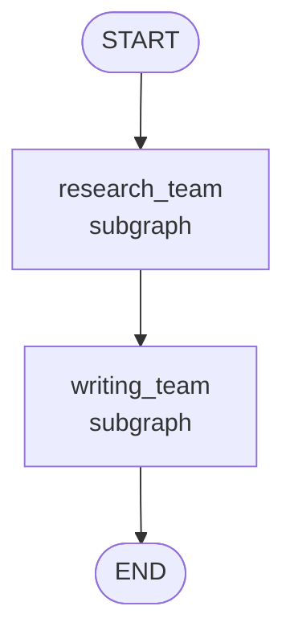

# 07-3 · Hierarchical teams

> **Level:** Intermediate · **Prerequisites:** [04-4 · Subgraphs](../04_control_flow/04_subgraphs.md) · [07-1 · Supervisor](01_supervisor.md)
> **Time:** 25 min · **Verified:** 2026-07-21 (langgraph 1.2.9)

## Why this matters

When a single supervisor has too many workers, you group them into **teams**, each team its own graph with its own internal coordination, and a **top-level** graph orchestrates the teams. This is the same subgraph composition from 04-4, applied to agents: teams are subgraphs, the org chart is the parent graph. It's how you scale past "a handful of agents" without one giant flat router.



---

## Teams as subgraphs

Each team is a compiled graph. Give teams **distinct output keys** so their results compose cleanly in the parent (a shared reduced key can double-apply when a subgraph merges back — keep team outputs separate and let the parent wire them):

```python
from typing import TypedDict
from langgraph.graph import StateGraph, START, END

def research_team():
    class TS(TypedDict):
        research: str
    def do(s): return {"research": "found 3 sources"}
    t = StateGraph(TS); t.add_node("do", do)
    t.add_edge(START, "do"); t.add_edge("do", END)
    return t.compile()

def writing_team():
    class TS(TypedDict):
        research: str          # reads the parent's research
        article: str           # writes its own key
    def do(s): return {"article": f"Article based on: {s['research']}"}
    t = StateGraph(TS); t.add_node("do", do)
    t.add_edge(START, "do"); t.add_edge("do", END)
    return t.compile()

class Top(TypedDict):
    research: str
    article: str

top = StateGraph(Top)
top.add_node("research_team", research_team())    # subgraph as node
top.add_node("writing_team", writing_team())
top.add_edge(START, "research_team")
top.add_edge("research_team", "writing_team")
top.add_edge("writing_team", END)

print(top.compile().invoke({"research": "", "article": ""}))
```

**Output (real run):**
```
{'research': 'found 3 sources', 'article': 'Article based on: found 3 sources'}
```

The research team produced `research`; the writing team *read* that shared key and produced `article`. Each team could itself contain a supervisor and several workers — arbitrary depth, because a subgraph is just a `Runnable`.

> **Tip:** Inside each team you'd typically put a **supervisor** (07-1). So a real hierarchy is "a supervisor of teams, each team a supervisor of workers" — turtles all the way down, but each level is the same pattern you already know.

---

## When to go hierarchical

- One flat supervisor is juggling more than ~5–6 workers.
- Groups of workers share context that others don't need (a research team, a writing team).
- You want to develop/test/deploy a team independently, then slot it into the org.

If none of those apply, a single supervisor is simpler — don't add layers for their own sake.

---

## Recap & next

- ✅ Teams are subgraphs; the top-level graph orchestrates them (subgraph composition from 04-4).
- ✅ Give teams **distinct output keys**; let the parent wire shared data between them.
- ✅ Each team can contain its own supervisor + workers — the pattern nests to any depth.
- ✅ Self-check: what problem does grouping workers into teams solve that a flat supervisor doesn't?

→ Next: **[07-4 · Map-reduce agents](04_map_reduce_agents.md)**

## Exercises

1. Add an `editing_team` after `writing_team` that reads `article` and writes a `final` key.

<details>
<summary>Solution</summary>

Mirror `writing_team`: a team whose state has `article` (read) and `final` (write), a node returning `{"final": polish(s["article"])}`, added as a third node edged `writing_team → editing_team → END`.
</details>
