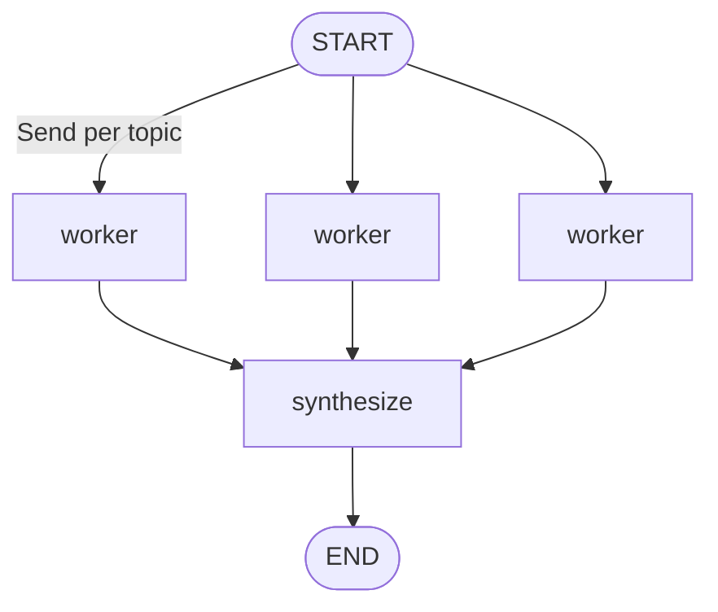

# 07-4 · Map-reduce agents

> **Level:** Intermediate · **Prerequisites:** [04-3 · Send & map-reduce](../04_control_flow/03_send_map_reduce.md)
> **Time:** 25 min · **Verified:** 2026-07-21 (langgraph 1.2.9, langchain-core 1.5.0)

## Why this matters

Some multi-agent work isn't a conversation between *different* specialists — it's the *same* agent run in parallel over many inputs. "Draft a section for each of these 8 topics", "grade each of these 20 answers", "summarize each retrieved document". That's map-reduce with agents: `Send` fans out one worker agent per item ([04-3](../04_control_flow/03_send_map_reduce.md)), then a synthesizer reduces the outputs into one result.



---

## Fan out an agent, then synthesize

```python
from typing import TypedDict, Annotated
import operator
from langgraph.graph import StateGraph, START, END
from langgraph.types import Send
from langchain_openai import ChatOpenAI

worker_llm = ChatOpenAI(model="gpt-4o-mini", temperature=0)

class S(TypedDict):
    topics: list[str]
    drafts: Annotated[list[str], operator.add]   # reduce side
    report: str

def assign(state: S):
    return [Send("worker", {"topic": t}) for t in state["topics"]]   # one agent per topic

def worker(state: dict) -> dict:
    draft = worker_llm.invoke(f"Write one sentence about {state['topic']}.").content
    return {"drafts": [f"[{state['topic']}] {draft}"]}

def synthesize(state: S) -> dict:
    return {"report": " | ".join(state["drafts"])}

g = StateGraph(S)
g.add_node("worker", worker)
g.add_node("synthesize", synthesize)
g.add_conditional_edges(START, assign, ["worker"])   # fan out
g.add_edge("worker", "synthesize")                    # gather
g.add_edge("synthesize", END)

out = g.compile().invoke({"topics": ["ai", "cloud", "security"], "drafts": [], "report": ""})
print(out["report"])
```

**Output (representative — your wording will differ):**
```
[ai] Artificial intelligence enables machines to learn from data and perform tasks that once required human judgement. | [security] Security protects systems and data from unauthorised access and misuse. | [cloud] Cloud computing delivers on-demand computing resources over the internet.
```

Three worker agents ran **concurrently**, each drafting its own topic; `synthesize` merged their drafts (gathered by the `operator.add` reducer) into one report. Scale `topics` to 50 and you get 50 parallel drafts, then one synthesis — no structural change.

> **Note:** The order of drafts in `report` can differ between runs — the workers finish concurrently and the `operator.add` reducer appends in completion order, a nice illustration that they really do run in parallel. Sort by topic in `synthesize` if you need a stable order.

---

## Map-reduce vs supervisor vs swarm

| Pattern | Shape | Use when |
|---------|-------|----------|
| Supervisor | hub delegates, workers differ | decompose a task into *different* roles |
| Swarm | peers hand off | fluid role-switching, no central hub |
| Map-reduce | one worker × N items, in parallel | the *same* job over many inputs |

They compose: a supervisor might route to a map-reduce sub-step that grades 100 items, then to a writer.

---

## Recap & next

- ✅ Map-reduce agents = `Send` one worker per item (map) → reducer gathers → synthesizer (reduce).
- ✅ Workers run in parallel and see only their own payload.
- ✅ Distinct from supervisor/swarm: same agent, many inputs, not many roles.
- ✅ Self-check: which reducer key gathers the parallel workers' outputs, and why must it have a reducer?

→ Next: **[08 · Real-world use cases](../08_real_world/README.md)**

## Exercises

1. Add a `score` worker that also runs per topic (rating each draft 1–5) and have `synthesize` report the average.

<details>
<summary>Solution</summary>

Have `worker` also emit a `scores: Annotated[list[int], operator.add]` entry (e.g. `len(draft) % 5 + 1`), then in `synthesize` compute `sum(state["scores"]) / len(state["scores"])`. Same fan-out, a second reduced channel.
</details>
