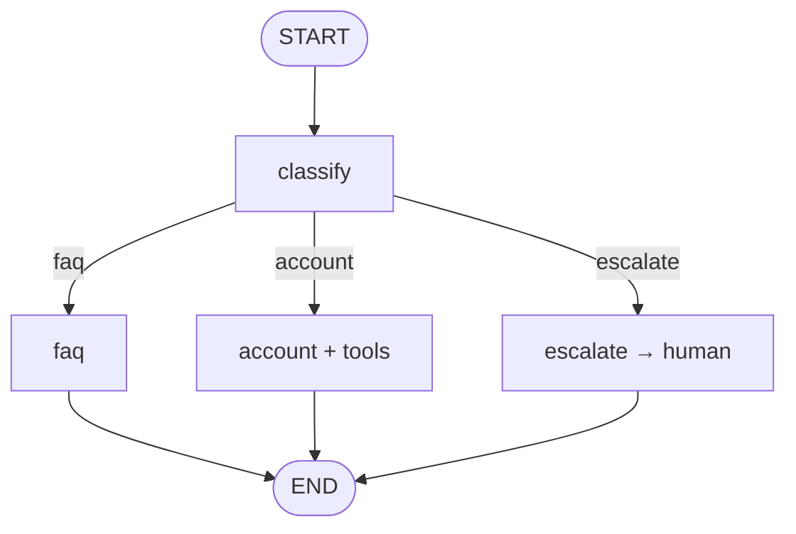

# 08-1 · Support routing with escalation

> **Level:** Intermediate · **Prerequisites:** [04-1 · Conditional edges](../04_control_flow/01_conditional_edges.md) · [06-1 · Interrupt & resume](../06_human_in_the_loop/01_interrupt_and_resume.md)
> **Time:** 30 min · **Verified:** 2026-07-21 (langgraph 1.2.9, langchain-core 1.5.0)

## Why this matters

A support bot's job is triage: answer what it can, and hand the rest to a human *gracefully*. That's a classifier node, a branch per intent, and an escalation path that pauses for a person. It's the "routing + HITL" combo you'll reuse for any assistant that must know its limits.



---

## The graph (offline, deterministic)

The classifier here routes on keywords so the run is reproducible; swap in an LLM classifier (as in [07-1](../07_multi_agent/01_supervisor.md)) for production.

```python
from typing import TypedDict, Literal
from langgraph.graph import StateGraph, START, END
from langgraph.checkpoint.memory import InMemorySaver
from langgraph.types import interrupt, Command

class SupportState(TypedDict):
    query: str
    intent: str
    answer: str

def classify(s: SupportState) -> dict:
    q = s["query"].lower()
    intent = "account" if "balance" in q else "escalate" if "refund" in q else "faq"
    return {"intent": intent}

def faq(s):     return {"answer": "Here's how that feature works..."}
def account(s): return {"answer": "Your balance is $1,250.00"}       # would call a tool
def escalate(s):
    human = interrupt({"reason": "needs human", "query": s["query"]})  # pause for an agent
    return {"answer": f"Human agent: {human}"}

def route(s) -> Literal["faq", "account", "escalate"]:
    return s["intent"]

b = StateGraph(SupportState)
for n, f in [("classify", classify), ("faq", faq), ("account", account), ("escalate", escalate)]:
    b.add_node(n, f)
b.add_edge(START, "classify")
b.add_conditional_edges("classify", route,
                        {"faq": "faq", "account": "account", "escalate": "escalate"})
for n in ["faq", "account", "escalate"]:
    b.add_edge(n, END)
app = b.compile(checkpointer=InMemorySaver())
```

Two simple intents resolve immediately:

```python
print(app.invoke({"query": "how do I export data", "intent": "", "answer": ""},
                 {"configurable": {"thread_id": "s1"}})["answer"])
print(app.invoke({"query": "what is my balance", "intent": "", "answer": ""},
                 {"configurable": {"thread_id": "s2"}})["answer"])
```

**Output (real run):**
```
Here's how that feature works...
Your balance is $1,250.00
```

The refund request escalates — the graph pauses until a human answers, then resumes:

```python
cfg = {"configurable": {"thread_id": "s3"}}
paused = app.invoke({"query": "I want a refund", "intent": "", "answer": ""}, cfg)
print("paused:", "__interrupt__" in paused)
print(app.invoke(Command(resume="Refund approved"), cfg)["answer"])
```

**Output (real run):**
```
paused: True
Human agent: Refund approved
```

The bot handled FAQ and account itself, but recognized "refund" as beyond its authority and looped a human in — the escalation is just the `interrupt`/`resume` pattern from Section 06 wired to one branch.

---

## Recap & next

- ✅ Classify → branch per intent → resolve or escalate; escalation is `interrupt`/`resume`.
- ✅ Keyword routing keeps the demo reproducible; an LLM classifier drops in unchanged.
- ✅ The checkpointer both remembers the conversation and enables the escalation pause.
- ✅ Self-check: what would you add so the bot escalates automatically when the FAQ answer is low-confidence?

→ Next: **[08-2 · Self-correcting RAG](02_self_correcting_rag.md)**

## Exercises

1. Add a `clarify` branch for vague queries that loops back to `classify` after asking one question.

<details>
<summary>Solution</summary>

Add an intent `"clarify"` when the query is too short; a `clarify` node that `interrupt`s for more detail and updates `query`; then edge `clarify → classify` to re-route with the enriched query.
</details>
