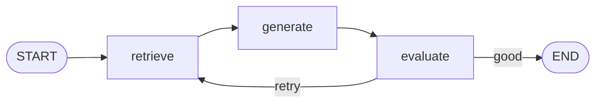

# 08-2 · Self-correcting RAG

> **Level:** Intermediate · **Prerequisites:** [04-1 · Conditional edges](../04_control_flow/01_conditional_edges.md)
> **Time:** 30 min · **Verified:** 2026-07-21 (langgraph 1.2.9, langchain-core 1.5.0)

## Why this matters

A plain RAG chain is "retrieve → generate → done" — fire and forget, no quality control. Wrapping it in a LangGraph loop adds a **self-evaluation** step: the graph judges its own answer and, if it's weak, retrieves more and tries again. That loop is the difference between a demo that sometimes hallucinates and an assistant that knows when it hasn't answered.

> This pairs with the [LangChain & RAG](../../langchain_rag/) guide — that course builds the retrieval/embeddings; this one adds the *control loop* around it.



---

## The loop

The generator answers **only** from the retrieved docs and says `INSUFFICIENT` when they don't cover the question; the evaluator turns that into `retry`, which loops back for another retrieval. The attempt cap bounds it. The first retrieval below deliberately returns an irrelevant doc so you can *see* the loop fire.

```python
from typing import TypedDict, Annotated, Literal
import operator
from langgraph.graph import StateGraph, START, END
from langchain_openai import ChatOpenAI

gen_llm = ChatOpenAI(model="gpt-4o-mini", temperature=0)

CORPUS = {1: "LangGraph nodes are plain Python functions.",           # attempt 1: irrelevant
          2: "Persistence: a checkpointer saves state after every step, keyed by thread_id.",
          3: "Checkpoints enable resume, time-travel, and human-in-the-loop."}

class RAGState(TypedDict):
    question: str
    docs: Annotated[list[str], operator.add]
    answer: str
    quality: str
    attempt: int

def retrieve(s):
    n = s.get("attempt", 0) + 1
    return {"docs": [CORPUS[n]], "attempt": n}
def generate(s):
    prompt = ("Answer ONLY from these docs. If they don't contain the answer, reply exactly "
              "'INSUFFICIENT'.\n\nDocs:\n" + "\n".join(s["docs"]) + f"\n\nQuestion: {s['question']}")
    return {"answer": gen_llm.invoke(prompt).content}
def evaluate(s): return {"quality": "retry" if "INSUFFICIENT" in s["answer"] else "good"}

def quality_router(s) -> Literal["retrieve", "end"]:
    if s["quality"] == "good" or s["attempt"] >= 3:   # cap attempts as a safety net
        return "end"
    return "retrieve"

b = StateGraph(RAGState)
for n, f in [("retrieve", retrieve), ("generate", generate), ("evaluate", evaluate)]:
    b.add_node(n, f)
b.add_edge(START, "retrieve"); b.add_edge("retrieve", "generate"); b.add_edge("generate", "evaluate")
b.add_conditional_edges("evaluate", quality_router, {"retrieve": "retrieve", "end": END})

out = b.compile().invoke({"question": "how does persistence work?",
                          "docs": [], "answer": "", "quality": "", "attempt": 0})
print("answer:", out["answer"], "| attempts:", out["attempt"])
```

**Output (representative — your wording will differ):**
```
answer: A checkpointer saves the graph's state after every step, keyed by thread_id, so a run can be resumed later. | attempts: 2
```

Two passes: the first retrieval had nothing about persistence, so the model replied `INSUFFICIENT` → `evaluate` said `retry` → back to `retrieve`; the second retrieval answered it → `end`. The `attempt >= 3` guard guarantees termination even if the docs never satisfy the evaluator.

> **Tip:** In production the "evaluator" is often a second LLM call (an *LLM-as-judge*) checking the answer against the retrieved docs — or a groundedness score. Whatever the check, the graph shape is the same; only the `evaluate` node changes. And always keep an attempt cap, or a stubborn evaluator loops forever.

---

## Why a graph beats a chain here

| | Plain RAG chain | Self-correcting graph |
|---|---|---|
| Quality control | none | self-evaluation loop |
| Bad retrieval | returned as-is | triggers re-retrieval |
| Termination | one pass | "good" *or* attempt cap |

---

## Recap & next

- ✅ retrieve → generate → **evaluate** → loop back or finish is the self-correction pattern.
- ✅ Always bound the loop (attempt counter and/or `recursion_limit`).
- ✅ The evaluator is a swappable node — heuristic, LLM-judge, or groundedness score.
- ✅ Self-check: what guarantees this graph terminates even if `evaluate` never returns "good"?

→ Next: **[08-3 · DevOps pipeline](03_devops_pipeline.md)**

## Exercises

1. Add query *refinement*: on each retry, `retrieve` should broaden the query (e.g. append "detailed") so later attempts differ from earlier ones.

<details>
<summary>Solution</summary>

Track a `query` in state; in `retrieve`, on `attempt > 1` set `query = base + " (broadened)"` and retrieve against that. This models the real benefit of the loop — *different* retrievals each pass, not identical ones.
</details>
