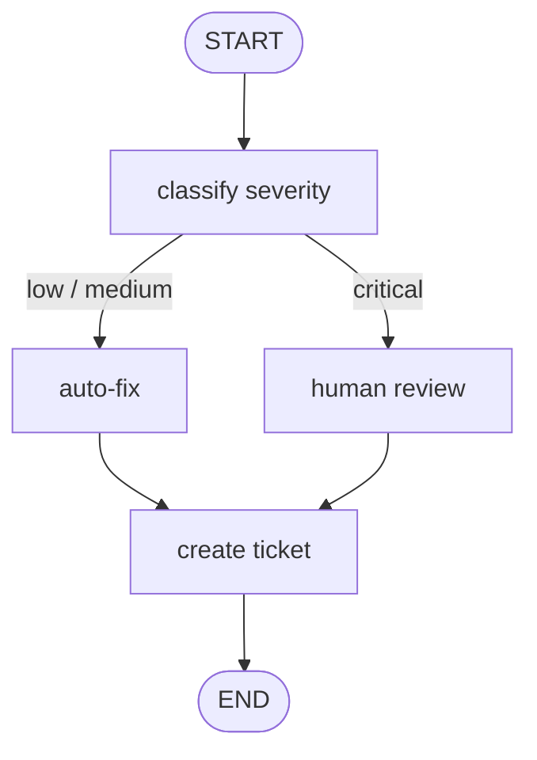

# 08-3 · DevOps automation pipeline

> **Level:** Intermediate · **Prerequisites:** [04-1 · Conditional edges](../04_control_flow/01_conditional_edges.md) · [06-1 · Interrupt & resume](../06_human_in_the_loop/01_interrupt_and_resume.md)
> **Time:** 30 min · **Verified:** 2026-07-21 (langgraph 1.2.9)

## Why this matters

An incident-response agent classifies a log entry, auto-fixes the routine stuff, and — crucially — **stops for a human before doing anything drastic**. It's the enterprise pattern in miniature: automation where it's safe, a human gate where it's not, and an audit trail either way. The shape is severity branch + conditional HITL + a final record step.



---

## The pipeline (offline, deterministic)

```python
import zlib
from typing import TypedDict, Literal
from langgraph.graph import StateGraph, START, END
from langgraph.checkpoint.memory import InMemorySaver
from langgraph.types import interrupt, Command

class Incident(TypedDict):
    log: str
    severity: str
    action: str
    ticket: str

def classify(s: Incident) -> dict:
    l = s["log"].lower()
    sev = "critical" if ("outage" in l or "breach" in l) else "medium" if "error" in l else "low"
    return {"severity": sev}

def auto_fix(s):        return {"action": f"auto-fixed {s['severity']} issue"}
def critical_review(s):
    ok = interrupt({"alert": "CRITICAL", "log": s["log"]})          # pause for on-call
    return {"action": "restart executed" if ok == "approve" else f"custom: {ok}"}
def ticket(s):
    tid = abs(zlib.crc32(s["log"].encode())) % 10000               # deterministic id
    return {"ticket": f"INC-{tid:04d}"}

def route(s) -> Literal["auto_fix", "critical_review"]:
    return "critical_review" if s["severity"] == "critical" else "auto_fix"

b = StateGraph(Incident)
for n, f in [("classify", classify), ("auto_fix", auto_fix),
             ("critical_review", critical_review), ("ticket", ticket)]:
    b.add_node(n, f)
b.add_edge(START, "classify")
b.add_conditional_edges("classify", route,
                        {"auto_fix": "auto_fix", "critical_review": "critical_review"})
b.add_edge("auto_fix", "ticket"); b.add_edge("critical_review", "ticket"); b.add_edge("ticket", END)
app = b.compile(checkpointer=InMemorySaver())
```

A low-severity incident runs end to end with no human:

```python
o = app.invoke({"log": "WARNING disk at 85%", "severity": "", "action": "", "ticket": ""},
               {"configurable": {"thread_id": "i1"}})
print(o["severity"], "|", o["action"], "|", o["ticket"])
```

**Output (real run):**
```
low | auto-fixed low issue | INC-2118
```

A critical incident pauses for approval, then completes:

```python
cfg = {"configurable": {"thread_id": "i2"}}
paused = app.invoke({"log": "CRITICAL outage in payment service",
                     "severity": "", "action": "", "ticket": ""}, cfg)
print("paused:", "__interrupt__" in paused)
print(app.invoke(Command(resume="approve"), cfg)["action"])
```

**Output (real run):**
```
paused: True
restart executed
```

Routine issues are handled autonomously; the critical one waited for a human's "approve" before the restart — and *both* paths produce a ticket, so nothing goes unrecorded.

> **Tip:** Attach a durable checkpointer (`SqliteSaver`/`PostgresSaver`) so a critical incident can stay paused across a process restart while on-call is paged — the whole point of checkpoint-based HITL for long waits.

---

## Recap & next

- ✅ Severity branch → auto-fix (safe) or human review (critical) → always record a ticket.
- ✅ Conditional HITL: the human gate is on the critical branch only.
- ✅ Use a deterministic id (`zlib.crc32`) so runs are reproducible; a durable saver for long pauses.
- ✅ Self-check: why route *every* branch through `ticket` instead of ticketing inside each handler?

→ Next: **[09 · Pitfalls & production](../09_pitfalls_and_production/README.md)**

## Exercises

1. Add a `medium` path that auto-fixes but *also* notifies a channel (a `notify` node) before ticketing.

<details>
<summary>Solution</summary>

Split the router into three (`low`/`medium`/`critical`); route `medium → auto_fix → notify → ticket`. `notify` is a simple node that records a message; the low path skips it.
</details>
