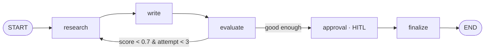

# 99 · Capstone — Research Assistant

> **Level:** Intermediate · **Prerequisites:** Sections 01–10
> **Time:** 2–3 h · **Verified:** 2026-07-21 (langgraph 1.2.9, langchain-core 1.5.0, Python 3.10)

A complete, **offline**, tested agent that ties the whole course together: it researches a topic, writes a report, evaluates its own quality in a **self-correction loop**, and pauses for **human approval** before finalizing.



## Concepts it combines

| Feature | Section |
|---------|---------|
| Typed state + reducers (`add_messages`, `operator.add`) | [01](../01_foundations/README.md) |
| Conditional edges + a self-correction **loop** | [04-1](../04_control_flow/01_conditional_edges.md), [08-2](../08_real_world/02_self_correcting_rag.md) |
| A tool (offline, deterministic corpus) | [03-2](../03_building_graphs/02_tools_and_react.md) |
| Checkpointer + `thread_id` | [05-1](../05_persistence_and_memory/01_checkpointers.md) |
| Human-in-the-loop approval (`interrupt`/`Command(resume=)`) | [06](../06_human_in_the_loop/README.md) |
| Streaming (`stream_mode="updates"`) | [02-2](../02_execution_model/02_streaming.md) |
| Swappable model (fake ↔ Ollama) | [01-3](../01_foundations/03_environment_setup.md) |

## Layout

```
99_project_research_assistant/
├── requirements.txt
├── research_assistant/
│   ├── state.py         # ResearchState (typed, with reducers)
│   ├── providers.py     # get_model(): fake (default) or Ollama
│   ├── tools.py         # offline deterministic "search"
│   ├── graph.py         # build_graph(): the whole agent
│   └── run.py           # CLI entry point
└── tests/
    └── test_graph.py    # 5 offline tests
```

## Run it (offline, no API key)

```bash
python -m venv .venv && source .venv/bin/activate
pip install -r requirements.txt
python -m research_assistant.run "LangGraph persistence"
```

**Output (real run):**
```
· research
· write
· evaluate
· research
· write
· evaluate

DRAFT (quality 1.00):
  Report on LangGraph persistence: LangGraph models agents as state + nodes + edges. Checkpointers give LangGraph memory, resume, and time-travel.

[auto-approving]

Status: approved
Sources gathered: 2 over 2 attempt(s)
```

Notice `research → write → evaluate` ran **twice**: the first pass scored below the `0.7` quality bar, so `quality_gate` looped back for another source; the second pass cleared the bar and the graph paused for approval. The CLI auto-approves; in a real app a human answers the `interrupt`.

## Test it

```bash
pytest -q
```

**Output (real run):**
```
.....                                                                    [100%]
5 passed in 0.27s
```

The tests assert the self-correction loop runs the right number of times, the graph pauses at the HITL gate, and approve/reject are recorded — all with **no network**.

## Go live

Set `LANGGRAPH_LLM=ollama` (after `ollama pull qwen2.5:0.5b` and `pip install langchain-ollama`) to generate the report text with a real local model — the graph, tools, loop, and approval gate are unchanged.

## Extend it

- Replace `tools.search_sources` with a real retriever (a vector store from [LangChain & RAG](../../langchain_rag/)).
- Make the evaluator an **LLM-as-judge** instead of the source-count proxy.
- Swap the CLI auto-approve for a real UI reading the `interrupt` payload.
- Deploy it with `langgraph dev` / the Platform ([Section 10](../10_platform_and_deployment/README.md)).

## Where next

- **[Google ADK](../../google_adk/)** — build the *same* research assistant in Google's framework and compare.
- **[LangGraph Proposal Agent](../../langgraph_proposal_agent/)** · **[Faceless YouTube Studio](../../faceless_youtube_agent/)** — larger LangGraph projects.
