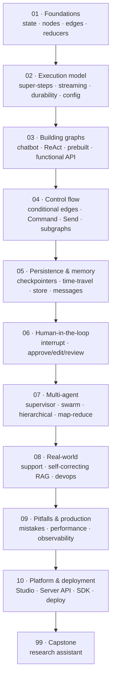

# 🕸️ LangGraph — stateful LLM agents with graphs

> **What you build:** stateful, tool-using, human-supervised LLM agents — from a 20-line "hello graph" to a full offline **research-assistant** capstone with tools, self-correction, time-travel and a human approval gate.

> **Verified:** 2026-07-21 against **Python 3.10**, **langgraph 1.2.9**, **langchain-core 1.5.0**, **langgraph-checkpoint 4.1.1**, **langgraph-checkpoint-sqlite 3.1.0**, **langgraph-prebuilt 1.1.0**, **langgraph-sdk 0.4.2**. Every code sample was actually run. Everything runs **offline** — no API key — using a deterministic fake chat model (and optionally a local **Ollama** model). Real output is shown under each sample.

> ⚠️ **Built for LangGraph 1.x.** The 1.x line renamed/moved a few things (e.g. `langgraph.prebuilt`, `langgraph.checkpoint.*` in separate packages). If an import differs from what you have, check your installed version first: `pip show langgraph`.

LangGraph lets you build LLM applications as **graphs** — nodes that do work, edges that decide what happens next, and a shared **state** that flows through it all. That graph model is what turns a one-shot LLM call into a *reliable* agent: it can loop, branch, call tools, pause for a human, remember across sessions, and be rewound and replayed when something goes wrong.

## Who this is for

You're comfortable with basic Python (functions, dicts, type hints) and have seen an LLM API before. You do **not** need any prior LangGraph, LangChain, or ML background — every concept is built from scratch with an analogy, a diagram, and runnable code.

## What you'll be able to do

- Model any workflow as **state → nodes → edges** and reason about how it executes.
- Build tool-calling **ReAct** agents, **supervisor**/**swarm**/**hierarchical** multi-agent systems, and **map-reduce** fan-out with the `Send` API.
- Add **persistence** (checkpointers), **long-term memory** (the store), **human-in-the-loop** pauses, and **time-travel** debugging.
- Use `Command` for combined routing + state updates + agent handoffs.
- Choose between the **graph API** and the **functional API** (`@entrypoint`/`@task`).
- Make graphs production-ready: retries, `recursion_limit`, durability, streaming, observability.
- Run and deploy on the **LangGraph Platform** (`langgraph dev`, Studio, the Server REST API and SDK).

## The stack we use (and why)

| Piece | We use | Why | Swap to (production) |
|---|---|---|---|
| Orchestration | **LangGraph 1.2.x** | The subject of the course | — |
| Chat model (default) | **`FakeListChatModel`** | Deterministic, offline, zero-cost — lets every sample be *verified* | any real chat model |
| Chat model (optional) | **Ollama** (`qwen2.5:0.5b`) via `langchain-ollama` | Local, free, no key — real generation on your laptop | OpenAI / Anthropic / Google |
| Checkpointer | **`InMemorySaver`** / **`SqliteSaver`** | No external service to run | `PostgresSaver` |
| Store (long-term memory) | **`InMemoryStore`** | Same | `PostgresStore` |

> **Why a fake model?** Learning orchestration should not depend on a paid API or a GPU. A fake model returns canned answers *deterministically*, so the graph's wiring — not the LLM's mood — is what you observe. Every lesson notes exactly where you'd drop in a real model.

## Prerequisites

```bash
python -m venv .venv && source .venv/bin/activate     # Windows: .venv\Scripts\activate
pip install "langgraph==1.2.9" "langchain-core==1.5.0" \
            "langgraph-checkpoint-sqlite==3.1.0"
# optional, for real local generation:
pip install langchain-ollama   # then: ollama pull qwen2.5:0.5b
```

## Learning path



## Course map

| # | Section | Modules | You'll be able to… | Time |
|---|---------|---------|--------------------|------|
| 01 | [Foundations](01_foundations/) | 3 | Define typed state, write nodes/edges, use reducers & `MessagesState` | 90 min |
| 02 | [Execution model](02_execution_model/) | 4 | Explain super-steps; stream; add retries/recursion limits/durability; pass runtime config | 90 min |
| 03 | [Building graphs](03_building_graphs/) | 4 | Build a chatbot, a ReAct tool agent, use `create_react_agent`, and the functional API | 2 h |
| 04 | [Control flow](04_control_flow/) | 4 | Route with conditional edges & `Command`, fan out with `Send`, compose subgraphs | 2 h |
| 05 | [Persistence & memory](05_persistence_and_memory/) | 4 | Use checkpointers, time-travel, the long-term store, and manage message history | 2 h |
| 06 | [Human-in-the-loop](06_human_in_the_loop/) | 2 | Pause with `interrupt`, resume with `Command`, build approve/edit/review gates | 60 min |
| 07 | [Multi-agent](07_multi_agent/) | 4 | Build supervisor, swarm/handoff, hierarchical, and map-reduce agent systems | 2 h |
| 08 | [Real-world](08_real_world/) | 3 | Ship support-routing, self-correcting RAG, and devops-automation graphs | 90 min |
| 09 | [Pitfalls & production](09_pitfalls_and_production/) | 3 | Avoid the common mistakes; harden and observe graphs | 90 min |
| 10 | [Platform & deployment](10_platform_and_deployment/) | 3 | Run `langgraph dev`/Studio, call the Server API & SDK, deploy | 90 min |
| 99 | [Capstone: Research Assistant](99_project_research_assistant/) | project | Combine everything into one offline agent | 2–3 h |

**Total:** ~15–18 hours. Prerequisites: basic Python; the [LangChain & RAG](../langchain_rag/) guide is a helpful companion but not required.

## Related guides

- **[LangChain & RAG](../langchain_rag/)** — the LLM building blocks (models, prompts, retrievers) LangGraph orchestrates.
- **[Google ADK](../google_adk/)** — Google's agent framework; a peer to LangGraph. Section 04 there is a direct LangGraph↔ADK bridge.
- **[Faceless YouTube Studio](../faceless_youtube_agent/)** — a full LangGraph pipeline project (and a LangGraph-vs-ADK comparison).
- **[LangGraph Proposal Agent](../langgraph_proposal_agent/)** — a multi-agent state machine with three frontends.

→ Start here: **[00 · Introduction to LangGraph](00_introduction.md)**
