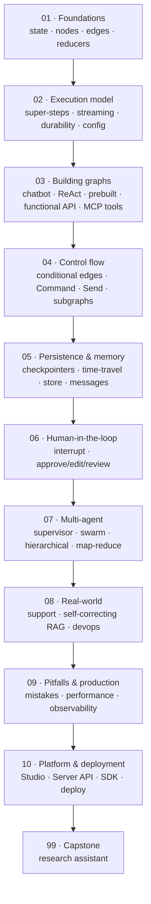

# 🕸️ LangGraph — stateful LLM agents with graphs

> **What you build:** stateful, tool-using, human-supervised LLM agents — from a 20-line "hello graph" to a full **research-assistant** capstone with tools, self-correction, time-travel and a human approval gate.

> **Verified:** 2026-07-21 against **Python 3.10**, **langgraph 1.2.9**, **langchain-core 1.5.0**, **langgraph-checkpoint 4.1.1**, **langgraph-checkpoint-sqlite 3.1.0**, **langgraph-prebuilt 1.1.0**, **langgraph-sdk 0.4.2**. Every graph was actually run. Samples that call an LLM use **OpenAI `gpt-4o-mini`** (set `OPENAI_API_KEY`; a local **Ollama** model is a one-line swap). Graph-only samples show real output; LLM answers are shown as *representative* — the wording varies, the graph behaviour doesn't.

> ⚠️ **Built for LangGraph 1.x.** The 1.x line renamed/moved a few things (e.g. `langgraph.prebuilt`, `langgraph.checkpoint.*` in separate packages). If an import differs from what you have, check your installed version first: `uv pip show langgraph`.

LangGraph lets you build LLM applications as **graphs** — nodes that do work, edges that decide what happens next, and a shared **state** that flows through it all. That graph model is what turns a one-shot LLM call into a *reliable* agent: it can loop, branch, call tools, pause for a human, remember across sessions, and be rewound and replayed when something goes wrong.

## Who this is for

You're comfortable with basic Python (functions, dicts, type hints) and have seen an LLM API before. You do **not** need any prior LangGraph, LangChain, or ML background — every concept is built from scratch with an analogy, a diagram, and runnable code.

## What you'll be able to do

- Model any workflow as **state → nodes → edges** and reason about how it executes.
- Build tool-calling **ReAct** agents, **supervisor**/**swarm**/**hierarchical** multi-agent systems, and **map-reduce** fan-out with the `Send` API.
- Add **persistence** (checkpointers), **long-term memory** (the store), **human-in-the-loop** pauses, and **time-travel** debugging.
- Use `Command` for combined routing + state updates + agent handoffs.
- Choose between the **graph API** and the **functional API** (`@entrypoint`/`@task`).
- Make graphs production-ready: retries, `recursion_limit`, durability, streaming, observability.
- Run and deploy on the **LangGraph Platform** (`langgraph dev`, Studio, the Server REST API and SDK).

## The stack we use (and why)

| Piece | We use | Why | Swap to (production) |
|---|---|---|---|
| Orchestration | **LangGraph 1.2.x** | The subject of the course | — |
| Chat model (default) | **`ChatOpenAI`** (`gpt-4o-mini`) via `langchain-openai` | Cheap, fast, reliable **tool calling** | any other chat model — same interface |
| Chat model (optional) | **Ollama** (`qwen2.5:0.5b`) via `langchain-ollama` | Local, free, no key — generation on your laptop | Anthropic / Google / … |
| Checkpointer | **`InMemorySaver`** / **`SqliteSaver`** | No external service to run | `PostgresSaver` |
| Store (long-term memory) | **`InMemoryStore`** | Same | `PostgresStore` |

> **Why `gpt-4o-mini`?** Cheap enough that the whole course costs cents, fast, and reliable at **tool calling** — the thing agents live on. With `temperature=0` its answers are as stable as an LLM gets, so the graph's wiring — not the model's mood — is what you observe. Every lesson's model is one `ChatOpenAI(...)` line; swap in `ChatOllama` (free, local) and the graph is unchanged.

## Prerequisites

```bash
uv venv && source .venv/bin/activate     # Windows: .venv\Scripts\activate
uv pip install "langgraph==1.2.9" "langchain-core==1.5.0" \
            "langgraph-checkpoint-sqlite==3.1.0" langchain-openai
export OPENAI_API_KEY=sk-...   # from platform.openai.com
# optional, free local model instead:
uv pip install langchain-ollama   # then: ollama pull qwen2.5:0.5b
```

## Learning path



## Course map

| # | Section | Modules | You'll be able to… | Time |
|---|---------|---------|--------------------|------|
| 01 | [Foundations](01_foundations/) | 3 | Define typed state, write nodes/edges, use reducers & `MessagesState` | 90 min |
| 02 | [Execution model](02_execution_model/) | 4 | Explain super-steps; stream; add retries/recursion limits/durability; pass runtime config | 90 min  ·  ⚪ *depth* |
| 03 | [Building graphs](03_building_graphs/) | 5 | Build a chatbot, a ReAct tool agent, use `create_react_agent`, the functional API, and **MCP tools** | 2.5 h |
| 04 | [Control flow](04_control_flow/) | 4 | Route with conditional edges & `Command`, fan out with `Send`, compose subgraphs | 2 h |
| 05 | [Persistence & memory](05_persistence_and_memory/) | 4 | Use checkpointers, time-travel, the long-term store, and manage message history | 2 h |
| 06 | [Human-in-the-loop](06_human_in_the_loop/) | 2 | Pause with `interrupt`, resume with `Command`, build approve/edit/review gates | 60 min |
| 07 | [Multi-agent](07_multi_agent/) | 4 | Build supervisor, swarm/handoff, hierarchical, and map-reduce agent systems | 2 h |
| 08 | [Real-world](08_real_world/) | 3 | Ship support-routing, self-correcting RAG, and devops-automation graphs | 90 min  ·  ⚪ *depth* |
| 09 | [Pitfalls & production](09_pitfalls_and_production/) | 3 | Avoid the common mistakes; harden and observe graphs | 90 min |
| 10 | [Platform & deployment](10_platform_and_deployment/) | 3 | Run `langgraph dev`/Studio, call the Server API & SDK, deploy | 90 min  ·  ⚪ *depth* |
| 99 | [Capstone: Research Assistant](99_project_research_assistant/) | project | Combine everything into one agent | 2–3 h |

**Total:** ~15–18 hours. Prerequisites: basic Python; the [LangChain & RAG](../langchain_rag/) guide is a helpful companion but not required.

### ⭐ Job-ready core track (start here if the course feels big)

LangGraph is **the production agent framework employers name** — but a job doesn't need all 10 sections. These **8 lessons in order** are the interview surface: state, the tool-calling loop, routing, persistence, HITL, and one multi-agent pattern.

1. [01-1 · Core concepts](01_foundations/01_core_concepts.md) — nodes, edges, state
2. [01-2 · State & messages](01_foundations/02_state_and_messages.md) — reducers, `MessagesState`
3. [03-1 · Your first chatbot](03_building_graphs/01_first_chatbot.md)
4. [03-2 · Tools & the ReAct loop](03_building_graphs/02_tools_and_react.md) — **the agent loop itself**
5. [03-3 · Prebuilt agents](03_building_graphs/03_create_react_agent.md) — `create_react_agent`
6. [04-1 · Conditional edges](04_control_flow/01_conditional_edges.md) — routing
7. [05-1 · Checkpointers](05_persistence_and_memory/01_checkpointers.md) — **the reason LangGraph exists**; stateful, resumable agents
8. [06-1 · Interrupt & resume](06_human_in_the_loop/01_interrupt_and_resume.md) — HITL, a real production requirement

Then [07-1 · Supervisor](07_multi_agent/01_supervisor.md) (the most common multi-agent shape) and [09 · Pitfalls & production](09_pitfalls_and_production/) for the judgment questions → then the [capstone](99_project_research_assistant/).

**Add these to go deeper / stand out** (rough priority): [03-5 MCP tools](03_building_graphs/05_mcp_tools.md) *(high market value — pairs with the [MCP course](../mcp_servers/))* · [10 Platform & deployment](10_platform_and_deployment/) · [05-3 Long-term memory store](05_persistence_and_memory/03_long_term_memory_store.md) · [04-3 `Send` map-reduce](04_control_flow/03_send_map_reduce.md) · [04-4 Subgraphs](04_control_flow/04_subgraphs.md) · [08 Real-world case studies](08_real_world/) · [02 Execution model internals](02_execution_model/) · [07-2/3/4 other multi-agent shapes](07_multi_agent/).

## Related guides

- **[LangChain & RAG](../langchain_rag/)** — the LLM building blocks (models, prompts, retrievers) LangGraph orchestrates.
- **[Google ADK](../google_adk/)** — Google's agent framework; a peer to LangGraph. Section 04 there is a direct LangGraph↔ADK bridge.
- **[Faceless YouTube Studio](../faceless_youtube_agent/)** — a full LangGraph pipeline project (and a LangGraph-vs-ADK comparison).
- **[LangGraph Proposal Agent](../langgraph_proposal_agent/)** — a multi-agent state machine with three frontends.
- **[Build MCP Servers](../mcp_servers/)** — author the tool servers your agents consume (`03-5` here is the consume side; that course is the build side).
- **[LLM Evals & Observability](../llm_evals_observability/)** — prove the agent works: eval sets, LLM-as-judge, tracing, and a CI regression gate.
- **[FastAPI — from first route to production](../fastapi_complete/)** — the production service an agent actually ships inside (auth, Redis, Docker, CI).

→ Start here: **[00 · Introduction to LangGraph](00_introduction.md)**
