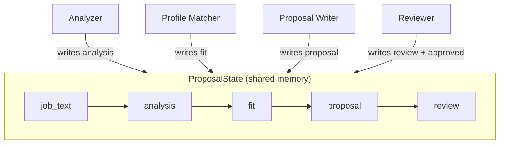
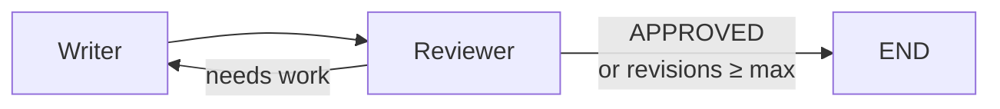

# 01-1 · Problem & Architecture

> **Level:** Beginner · **Prerequisites:** [Introduction](../00_introduction.md)
> **Time:** 15 min · **Verified:** concept module, no code to run

---

## Why one big prompt fails

The naive approach: write one giant prompt with the job text, your CV, and instructions
for how to write the proposal, and ask an LLM to do everything at once.

Problems:

| Problem | Why it matters |
|---|---|
| **Context overload** | The LLM must analyse the job, recall your portfolio, pick the right story, and write prose — all at once. Quality degrades. |
| **No feedback loop** | You get one shot. If the output is generic, you have to re-run everything. |
| **Hard to improve** | When the proposal is bad, which part failed — the analysis? the story? the writing? You can't tell. |
| **Not testable** | You can't unit-test "write a great proposal". You can test "extract the tech stack from this job text". |

The multi-agent solution fixes all four by **dividing the work into focused steps**.

---

## The 4-agent design

Each agent has one job and one prompt. Each can be tested, improved, and swapped
independently.



### Agent 1 · Analyzer

**Input:** raw job text  
**Output:** structured breakdown — tech stack, budget, timeline, pain points, red flags

Separating *understanding the job* from *writing the proposal* is the most important
architectural decision. The writer gets clean data, not a wall of text.

### Agent 2 · Profile Matcher

**Input:** analysis + your `profile.yaml`  
**Output:** fit assessment — HIGH/MEDIUM/LOW, which portfolio project to reference, why

This is what makes the proposal personalised. Without this agent, every proposal reads
the same. With it, the writer always leads with the most relevant story.

### Agent 3 · Proposal Writer

**Input:** job text + analysis + fit assessment (+ any revision notes)  
**Output:** the proposal draft

Dedicated to prose. It has one job: write a compelling proposal using the prepared
inputs. When the reviewer sends it back for revision, it receives the feedback and
rewrites — without re-running analysis or matching.

### Agent 4 · Reviewer

**Input:** job text + proposal draft  
**Output:** APPROVED or numbered revision notes

The quality gate. It checks for generic language, missing specifics, wrong tone.
If the draft is good enough, it outputs `APPROVED` and the graph ends. Otherwise
it sends the writer back for another pass.

---

## The revision loop

The graph has a **conditional edge** after the reviewer:



Two termination conditions prevent infinite loops:

1. `approved = True` — reviewer accepted the proposal
2. `revisions >= max_revisions` — hard cap (default: 2), output best draft so far

This pattern — a **bounded revision loop** — is one of the most useful multi-agent
patterns you'll encounter. LangGraph makes it a single `add_conditional_edges` call.

---

## The shared state

All four agents communicate through a single `ProposalState` dictionary that flows
through the graph. Each agent **reads** what it needs and **writes** only its own keys:

```
job_text   → read by: Analyzer, Writer, Reviewer
analysis   → written by: Analyzer  · read by: Matcher, Writer
fit        → written by: Matcher   · read by: Writer
proposal   → written by: Writer    · read by: Reviewer
review     → written by: Reviewer  · read by: Writer (on revision)
approved   → written by: Reviewer  · read by: router
revisions  → incremented by Writer · read by: router
```

This is a **unidirectional data flow** — each stage enriches the state for the next.
The writer is the only node that runs more than once (when revising).

---

## Self-check

1. Why does separating the Analyzer from the Writer improve output quality?
2. What two conditions stop the revision loop?
3. Which agent is the only one that can run multiple times?

<details>
<summary>Answers</summary>

1. The writer receives clean structured data (stack, budget, timeline) instead of raw
   job text. It can focus entirely on prose quality.
2. `approved = True` from the reviewer, or `revisions >= max_revisions`.
3. The Proposal Writer — it rewrites on each revision cycle.

</details>

---

**Next → [02 Environment & providers](02_environment_and_providers.md)**
