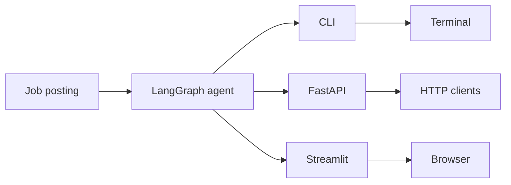

# 05-3 · Ship & Monetise

> **Level:** Intermediate · **Prerequisites:** Section 04 (all frontends)
> **Time:** 15 min · **Verified:** concept module

---

## Deploy the API for free

The FastAPI app can be deployed on any platform that runs Python. The simplest
free-tier options:

### Railway (recommended for quick deploys)

```bash
# install Railway CLI
npm i -g @railway/cli

# from 99_project_proposal_agent/
railway login
railway init
railway up
```

Set env vars in the Railway dashboard: `PROPOSAL_LLM=anthropic`, `ANTHROPIC_API_KEY=...`

Railway gives you a public HTTPS URL in ~2 minutes.

### Fly.io

```dockerfile
# Dockerfile
FROM python:3.11-slim
WORKDIR /app
COPY requirements.txt .
RUN pip install -r requirements.txt
COPY . .
CMD ["uvicorn", "proposal_agent.api:app", "--host", "0.0.0.0", "--port", "8080"]
```

```bash
fly launch
fly secrets set PROPOSAL_LLM=anthropic ANTHROPIC_API_KEY=sk-ant-...
fly deploy
```

### Cost note

With Claude Sonnet 4.6 at ~$3 per million input tokens, a typical proposal run
(4 agents, ~2000 tokens total input) costs under $0.01. At 100 proposals/day, that's
< $1/day.

---

## Portfolio framing

This project demonstrates:

- **Multi-agent orchestration** — a pattern used in production AI systems at scale
- **Provider abstraction** — LLM-agnostic design (a valued engineering practice)
- **Testable AI** — 12 deterministic offline tests, no API key required
- **Full-stack delivery** — CLI + REST API + web UI from one codebase

Write it up as: *"Built a LangGraph multi-agent system that generates personalised
freelance proposals. 4 specialised agents with a conditional review loop. FastAPI
endpoint + Streamlit UI. 12 offline tests, Ollama/Claude/OpenAI swappable."*

That's a concrete portfolio piece, not a tutorial project.

---

## Fiverr / SaaS framing

The gap between this prototype and a productised service is small:

| What to add | Effort |
|---|---|
| Auth (API key per user) | FastAPI `Depends` + a simple key store |
| Rate limiting | `slowapi` middleware, 5 min |
| Profile upload endpoint | FastAPI file upload → YAML parse |
| Usage tracking | Log requests to a SQLite or Postgres table |
| Stripe payment | Stripe SDK + webhook, ~1 day |

A realistic Fiverr gig: *"I'll turn your job posting into a custom freelance proposal
using AI"* — manual delivery, with your agent doing the heavy lifting. Once you've
done it manually enough to trust the output, automate the delivery.

A realistic SaaS: charge per proposal ($1-3), unlimited plan ($15-20/month). The
LLM cost per proposal is < $0.01, so margins are high.

---

## What not to do

- **Don't claim AI-written proposals win more jobs** — you don't have data for that.
  The honest framing is: "saves 20 minutes per proposal; quality depends on your profile
  and prompts".
- **Don't automate sending proposals** — most platforms (Upwork, Fiverr) ban bots.
  Always review before sending.
- **Don't skip the profile** — a generic `profile.yaml` produces generic proposals.
  The agent is only as good as the profile you give it.

---

## Recap: what you built



- 4 specialised agents in a state machine with a bounded revision loop
- Provider-agnostic LLM layer: Ollama / Claude / OpenAI / fake
- 12 deterministic offline tests
- Three frontends from one `generate_proposal()` function
- A personalised profile system

**You're done. Go ship something with it.**
