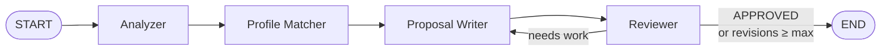

# Capstone: Proposal Agent — Complete App

The full, runnable reference implementation. Every module in the course is derived
from code in this folder. Read it as a reference, run it to verify your understanding,
or copy it as a starting point.

---

## File layout

```
99_project_proposal_agent/
├── requirements.txt
├── profile/
│   └── profile.yaml          ← edit this with YOUR skills and projects
├── data/sample_jobs/
│   ├── fastapi_backend.txt
│   └── rag_chatbot.txt
├── proposal_agent/
│   ├── __init__.py            ← exports: build_graph, generate_proposal, ProposalState
│   ├── state.py               ← ProposalState TypedDict
│   ├── providers.py           ← get_chat_model() — ollama | anthropic | openai | fake
│   ├── profile.py             ← load_profile() + profile_to_text()
│   ├── agents.py              ← analyzer / matcher / writer / reviewer functions
│   ├── graph.py               ← build_graph() + route_after_review() + generate_proposal()
│   ├── cli.py                 ← python -m proposal_agent.cli <job-file>
│   └── api.py                 ← FastAPI app
├── app_streamlit.py           ← Streamlit web UI
└── tests/
    ├── test_agents.py         ← 4 unit tests (per-agent, offline)
    ├── test_api.py            ← 4 API tests (TestClient, offline)
    └── test_graph.py          ← 4 integration tests (full graph, offline)
```

---

## Install

```bash
pip install -r requirements.txt
```

---

## Run (offline, zero API key)

### CLI

```bash
PROPOSAL_LLM=fake python -m proposal_agent.cli data/sample_jobs/fastapi_backend.txt
```

Output:

```
============================================================
PATH     : analyzer -> matcher -> writer -> reviewer
REVISIONS: 1
APPROVED : True
============================================================
Hi — I build exactly this. I recently shipped a typed Python/FastAPI API...
[draft]. Happy to start this week.
```

### API server

```bash
PROPOSAL_LLM=fake uvicorn proposal_agent.api:app --reload
# open http://localhost:8000/docs
```

### Streamlit UI

```bash
PROPOSAL_LLM=fake streamlit run app_streamlit.py
# open http://localhost:8501
```

---

## Run with a real LLM

```bash
# Local Ollama (install from https://ollama.com, then: ollama pull llama3.2)
PROPOSAL_LLM=ollama OLLAMA_MODEL=llama3.2 python -m proposal_agent.cli data/sample_jobs/fastapi_backend.txt

# Claude (needs ANTHROPIC_API_KEY)
PROPOSAL_LLM=anthropic python -m proposal_agent.cli data/sample_jobs/rag_chatbot.txt

# OpenAI (needs OPENAI_API_KEY)
PROPOSAL_LLM=openai OPENAI_MODEL=gpt-4o-mini python -m proposal_agent.cli data/sample_jobs/fastapi_backend.txt
```

---

## Tests (12 passing, all offline)

```bash
PROPOSAL_LLM=fake pytest -v
```

```
tests/test_agents.py::test_analyzer_returns_analysis_and_logs   PASSED
tests/test_agents.py::test_matcher_uses_profile                 PASSED
tests/test_agents.py::test_writer_increments_revisions          PASSED
tests/test_agents.py::test_reviewer_detects_approval            PASSED
tests/test_api.py::test_health                                  PASSED
tests/test_api.py::test_generate_returns_proposal               PASSED
tests/test_api.py::test_generate_rejects_empty_job              PASSED
tests/test_api.py::test_generate_max_revisions_param            PASSED
tests/test_graph.py::test_happy_path_no_revision                PASSED
tests/test_graph.py::test_revision_loop_then_approve            PASSED
tests/test_graph.py::test_max_revisions_caps_the_loop           PASSED
tests/test_graph.py::test_router_logic                          PASSED

12 passed, 1 warning in 2.35s
```

---

## Personalise it

1. Open `profile/profile.yaml`
2. Replace the sample name, skills, and projects with your own
3. Add a `tone:` field (optional): `tone: warm and consultative`
4. Run `PROPOSAL_LLM=fake python -m proposal_agent.cli data/sample_jobs/fastapi_backend.txt`
   and check that the Profile Matcher references your real projects

The more specific your project descriptions (with numbers, outcomes, technologies),
the better the proposals.

---

## Architecture recap



| Agent | Reads | Writes |
|---|---|---|
| Analyzer | `job_text` | `analysis` |
| Profile Matcher | `analysis` | `fit` |
| Proposal Writer | `job_text`, `analysis`, `fit`, `review` | `proposal`, `revisions` |
| Reviewer | `job_text`, `proposal` | `review`, `approved` |
