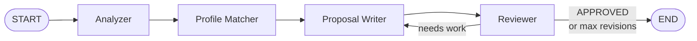

# Multi-Agent Freelance Proposal Generator with LangGraph

> **What you build:** Paste any freelance job posting → 4 AI agents analyse it,
> match it to your profile, draft a personalised proposal, and review it —
> all in seconds. The finished app is a real portfolio piece and a tool you
> can use every day.

---

## The architecture at a glance



| Agent | What it does |
|---|---|
| **Analyzer** | Extracts tech stack, budget, timeline, red flags |
| **Profile Matcher** | Scores job vs your `profile.yaml`, picks best portfolio project |
| **Proposal Writer** | Drafts a personalised proposal using the analysis + match |
| **Reviewer** | Quality-gates the draft; returns revision notes or APPROVED |

---

## Stack we use (and why)

| Tool | Why |
|---|---|
| **LangGraph 1.1.10** | First-class multi-agent state machines with conditional edges and memory checkpointing |
| **Ollama (local)** | Zero cost, zero API key; runs offline on your laptop |
| **GenericFakeChatModel** | Deterministic offline testing — every test in this course runs without any LLM |
| **Claude / OpenAI** | One env-var swap away when you want hosted quality |
| **FastAPI** | Thin HTTP wrapper so the agent becomes a service |
| **Streamlit** | Web UI in ~60 lines of Python |

> **Why LangGraph and not a single prompt?**
> A single large prompt gives you one shot. A graph gives you four specialists,
> each with a focused prompt, plus a feedback loop that iterates until the
> output is good enough — or a hard cap stops it.

---

## Course map

| # | Module | Time |
|---|---|---|
| 00 | [Introduction](00_introduction.md) | 10 min |
| **01** | **Foundations** | |
| 01-1 | [Problem & architecture](01_foundations/01_problem_and_architecture.md) | 15 min |
| 01-2 | [Environment & providers](01_foundations/02_environment_and_providers.md) | 20 min |
| 01-3 | [LangGraph refresher](01_foundations/03_langgraph_refresher.md) | 25 min |
| **02** | **Building the agents** | |
| 02-1 | [Shared state](02_building_the_agents/01_shared_state.md) | 15 min |
| 02-2 | [Analyzer](02_building_the_agents/02_analyzer.md) | 20 min |
| 02-3 | [Profile Matcher](02_building_the_agents/03_profile_matcher.md) | 20 min |
| 02-4 | [Proposal Writer](02_building_the_agents/04_proposal_writer.md) | 20 min |
| 02-5 | [Reviewer](02_building_the_agents/05_reviewer.md) | 20 min |
| **03** | **Assembling the graph** | |
| 03-1 | [Wiring & the revision loop](03_assembling_the_graph/01_wiring_and_revision_loop.md) | 25 min |
| 03-2 | [Memory & streaming](03_assembling_the_graph/02_memory_and_streaming.md) | 20 min |
| **04** | **Serving & frontends** | |
| 04-1 | [CLI](04_serving_and_frontends/01_cli.md) | 10 min |
| 04-2 | [FastAPI endpoint](04_serving_and_frontends/02_fastapi_endpoint.md) | 20 min |
| 04-3 | [Streamlit UI](04_serving_and_frontends/03_streamlit_ui.md) | 20 min |
| **05** | **Quality & shipping** | |
| 05-1 | [Prompts & template](05_quality_and_shipping/01_prompts_and_template.md) | 20 min |
| 05-2 | [Evaluating & guardrails](05_quality_and_shipping/02_evaluating_and_guardrails.md) | 20 min |
| 05-3 | [Ship & monetise](05_quality_and_shipping/03_ship_and_monetize.md) | 15 min |
| **99** | [Capstone walkthrough](99_project_proposal_agent/README.md) | — |

**Total: ~5 hours** | Prerequisites: Python basics, some LangChain familiarity

---

## Quick start (offline, zero API key)

```bash
cd 99_project_proposal_agent
pip install -r requirements.txt

# offline demo with the built-in fake model
PROPOSAL_LLM=fake python -m proposal_agent.cli data/sample_jobs/fastapi_backend.txt

# run all 12 tests
PROPOSAL_LLM=fake pytest -v

# real LLM (needs Ollama running)
PROPOSAL_LLM=ollama python -m proposal_agent.cli data/sample_jobs/fastapi_backend.txt
```

---

## Related guides in this collection

- [LangGraph core](../langgraph/) — state, nodes, edges, tools, memory
- [LangChain RAG](../langchain_rag/) — embeddings, retrieval, LCEL chains
- [LangGraph Trading Bot](../langgraph_fo_trading_bot/) — another multi-agent project
