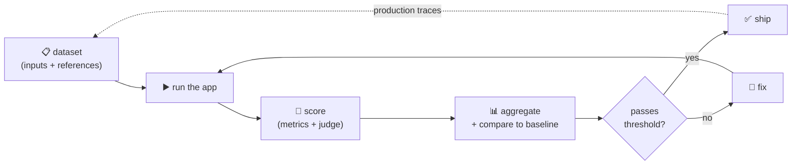

# 00 · Introduction

> **Level:** Intermediate · **Prerequisites:** you've built something with an LLM (an agent, a RAG app, a chatbot).
> **Time:** 20 min · **Verified:** 2026-08-05 (concepts; the harness is verified throughout)

You've built an LLM app. It works when you try it. Now answer two questions:

1. **How good is it?** — not "it felt right", a number you'd defend in a review.
2. **How would you know if it broke?** — after a prompt tweak, a model upgrade, a new retriever.

Most teams can't answer either. That's the gap this course closes, and it's the single most valuable skill in the current AI-engineering market.

---

## Why this matters

The postings are explicit: employers want **prompt evaluation**, **retrieval workflows**, and **guardrails** — the *reliability* layer, not the demo layer. Anyone can wire up an API call. Far fewer can build the harness that proves the thing works and catches it when it stops. It's also what separates a paid production system from a prototype that never ships.

---

## Why LLM testing is different

Normal software is deterministic: `add(2, 2)` returns `4` or your test fails. LLM output is:

| Property | Consequence |
|----------|-------------|
| **Non-deterministic** | the same input can produce different text — `assertEqual` is useless |
| **Open-ended** | many different answers are equally correct |
| **Silently degrading** | it doesn't crash; it just gets subtly worse |
| **Sensitive to everything** | a prompt word, a model version, a retrieval change can shift quality |

So you can't *test* an LLM app the way you test a function. You **evaluate** it: run a dataset, score the outputs on several axes, aggregate, and compare against a baseline.

> **Analogy — grading essays, not marking multiple-choice.** You can't answer-key an essay. You use a **rubric** (multiple criteria), grade a **representative sample**, accept that scores are approximate, and watch the **trend**. If this year's average dropped 15%, something changed — even without a "wrong" answer anywhere.

---

## The eval loop



The loop closes: production traces become tomorrow's test cases. That's how the dataset gets good — real failures, not imagined ones.

---

## What we build: EvalKit

A harness for a small offline RAG app, with everything the real thing has:

- **`metrics.py`** — exact match, F1, faithfulness, retrieval precision/recall
- **`judge.py`** — LLM-as-judge with rubric, pairwise, position-bias control, human-agreement check
- **`tracing.py`** — spans, tokens, **cost**, latency, JSON export
- **`runner.py`** — run a dataset, aggregate, **compare two versions**
- **`guardrails.py`** — PII redaction, injection screening, groundedness
- **`tests/`** — 22 tests, including a **CI gate** that fails on regression

Here's the harness detecting a real regression — the whole course in one output:

**Output (real run):**
```
=== v2 (baseline) -> v1 (candidate) ===
  f1                0.7513 -> 0.5847  delta  -0.1666  REGRESSED
  contains          0.6667 -> 0.5     delta  -0.1667  REGRESSED
  faithfulness      0.8333 -> 1.0     delta   0.1667  ok
  context_recall       1.0 -> 1.0     delta      0.0  ok
  judge               0.75 -> 0.5833  delta  -0.1667  REGRESSED
```

Look at **faithfulness going *up* while everything else went down**. The worse version copied text from the wrong document — perfectly "faithful" to its context, and completely wrong. That's the most important lesson in this course: **a single metric can improve while your system gets worse.** You need several, and you need to understand what each one actually measures.

(The regressed version was also **15× cheaper**. Quality, cost, and correctness pull in different directions — you measure all of them or you optimize blind.)

---

## Offline vs online evaluation

| | **Offline** (this course's focus) | **Online** (production) |
|---|---|---|
| When | before you ship — CI, local | on live traffic |
| Against | a golden dataset | real user inputs |
| Gives | a pass/fail gate | drift detection, real cost, user feedback |
| Tools | DeepEval, Ragas, promptfoo | Langfuse, OTel, dashboards |

You need both, and they feed each other: offline evals gate the release, online traces reveal what to add to the offline dataset.

---

## Recap & next

- ✅ Two questions define the job: **how good is it** and **how would I know if it broke**.
- ✅ LLM output is non-deterministic and open-ended, so you **evaluate** with rubrics and samples rather than assert equality.
- ✅ The **eval loop**: dataset → run → score → aggregate → gate; production traces feed the dataset.
- ✅ **One metric is never enough** — faithfulness rose while quality fell.
- ✅ Offline evals gate releases; online traces catch drift.
- ✅ Self-check: why can't you write `assert answer == "Paris"` as an LLM test?

→ Next: **[01 · Foundations](01_foundations/README.md)**
