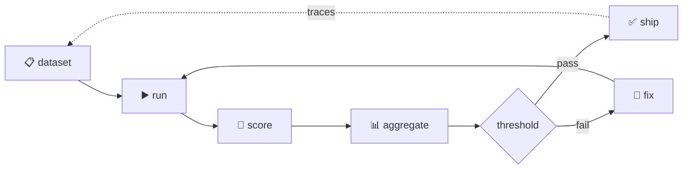

# 01-2 · The eval loop & types of eval

> **Level:** Intermediate · **Prerequisites:** [01-1 · Why evals](01_why_evals.md)
> **Time:** 40 min · **Verified:** 2026-08-05 (concepts)

## Why this matters

"Evals" is used for several different activities. Knowing which one you need — and which tool does it — saves you from building a judge when a string match would do, or from trusting an offline score to catch a production drift it can't see.

---

## The loop

| Stage | What it is | Section |
|-------|-----------|---------|
| **Dataset** | inputs + references + tags | [02](../02_datasets/README.md) |
| **Run** | execute the app, capture output *and* trace | [06](../06_tracing_observability/README.md) |
| **Score** | metrics + judge → numbers in [0,1] | [03](../03_metrics/README.md), [04](../04_llm_as_judge/README.md) |
| **Aggregate** | mean, per-tag slices, cost | [03](../03_metrics/README.md) |
| **Gate** | thresholds, regression vs baseline | [07](../07_ci_regression/README.md) |

The dotted line is what makes the loop compound: production traces become new dataset cases.

---

## Four kinds of evaluation

**1. Reference-based** — you have a known-good answer. Score with string/semantic metrics. *Best when there's a right answer* (facts, extraction, classification).

**2. Reference-free** — no gold answer exists (summaries, creative text). Score with a **judge** against a rubric, or with properties (is it grounded? on-topic? the right length?).

**3. Pairwise** — "is A better than B?" More reliable than absolute scoring, and the natural fit for comparing two prompts or models ([04-2](../04_llm_as_judge/02_rubrics_and_bias.md)).

**4. Property/assertion** — cheap deterministic checks that must always hold: valid JSON, contains a citation, never mentions a competitor, under N tokens. **Start here** — these catch a surprising share of real bugs for almost no cost.

> **Tip — climb the ladder in that order.** Assertions are free and catch format breakage. Reference metrics are cheap and catch factual drift. Judges are expensive, slow, and noisy — use them only for what the cheaper layers genuinely can't measure. Teams that start with a judge end up with slow suites they don't trust.

---

## Offline vs online

| | **Offline** | **Online** |
|---|---|---|
| Runs | in CI / locally, pre-merge | on production traffic |
| Input | fixed golden dataset | real users |
| Answers | "did this change break anything?" | "is it working right now?" |
| Blocks a merge | ✅ | ❌ |
| Catches drift | ❌ | ✅ |
| Tools | DeepEval, Ragas, promptfoo | Langfuse, OTel, dashboards |

Neither replaces the other. Offline is your **regression gate**; online is your **smoke detector**. Online signals (thumbs-down, low judge scores on sampled traffic) tell you what to add to the offline set.

---

## Where each tool fits

| Tool | Layer | Use it for |
|------|-------|-----------|
| **DeepEval** | offline | pytest-style LLM unit tests; CI gates |
| **Ragas** | offline/online | RAG metrics (faithfulness, context precision/recall) |
| **promptfoo** | offline | prompt regression across variants/models |
| **Langfuse** | online | tracing, scores attached to traces, dashboards |
| **OpenTelemetry** | online | vendor-neutral trace standard (GenAI conventions) |

The pattern the industry is converging on: **DeepEval pre-deploy, Langfuse in production, Ragas computing RAG scores over sampled traces**, all keyed by trace id so a score links back to the exact prompt, model, and dataset version that produced it. That linkage — **traceability** — is the thing to design for.

---

## Recap & next

- ✅ The loop: dataset → run → score → aggregate → gate, with traces feeding back into the dataset.
- ✅ Four eval kinds: reference-based, reference-free, pairwise, property/assertion.
- ✅ **Climb the ladder**: assertions → reference metrics → judge. Don't start with the expensive one.
- ✅ **Offline** gates merges; **online** catches drift. You need both.
- ✅ Design for **traceability**: every score should link to the prompt/model/dataset that produced it.
- ✅ Self-check: for "summarize this ticket", which eval kind(s) apply, and why not exact match?

→ Next: **[01-3 · Environment setup](03_environment_setup.md)**

## Exercises

1. For each, name the eval kind: (a) extract an invoice total, (b) write a product description, (c) choose between two system prompts, (d) always return valid JSON.

Solution

(a) reference-based — there's one right number. (b) reference-free — judge/properties; no single correct text. (c) pairwise. (d) property/assertion — cheap, deterministic, and should run on *every* case regardless of what else you measure.

