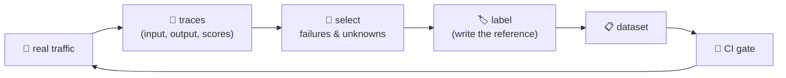

# 02-2 · Growing the dataset from traces

> **Level:** Intermediate · **Prerequisites:** [02-1 · Building eval sets](01_building_eval_sets.md)
> **Time:** 40 min · **Verified:** 2026-08-05 (concepts; trace format from EvalKit)

## Why this matters

Your hand-written dataset reflects what you *imagined* users would ask. Production reflects what they actually ask — which is always stranger. The teams with good evals aren't better at inventing test cases; they have a **pipeline that turns real failures into permanent regression tests**. That's what makes the eval loop compound.

---

## The flywheel



Every bug becomes a test; every test prevents that bug returning. After a few months your dataset is a precise map of the ways *your* system fails.

---

## What to harvest

You can't label everything, so sample deliberately:

| Signal | Why it's worth a case |
|--------|----------------------|
| **👎 user feedback** | the strongest signal you'll get — a human said it was wrong |
| **Low online judge score** | sampled traffic the judge flagged ([04](../04_llm_as_judge/README.md)) |
| **Low faithfulness** | possible hallucination ([05-2](../05_rag_evaluation/02_generation_faithfulness.md)) |
| **Retrieval returned nothing** | a coverage gap in your knowledge base |
| **Anomalies** | very long, very slow, or very expensive requests |
| **Novel inputs** | questions unlike anything in your dataset (drift) |

> **Tip — sample the boring middle too.** If you only harvest failures, your dataset drifts toward pathological inputs and stops representing normal traffic — so your average score becomes meaningless. A healthy mix is roughly *most cases typical, a meaningful minority hard*.

---

## From a trace to a case

A trace ([06](../06_tracing_observability/README.md)) already contains nearly everything:

```json
{
  "trace_id": "8f399268d560",
  "spans": [
    { "name": "retrieve",
      "attributes": { "query": "What is Flask?", "retrieved": ["d1", "d3"] } }
  ]
}
```

Convert it:

```python
def trace_to_case(trace: dict, reference: str, tags: list[str]) -> dict:
    """A production trace becomes a dataset case. The reference is the human bit."""
    retrieve = next(s for s in trace["spans"] if s["name"] == "retrieve")
    return {
        "id": f"prod-{trace['trace_id'][:8]}",       # traceable back to the incident
        "question": retrieve["attributes"]["query"],
        "reference": reference,                       # ← a human writes this
        "relevant_docs": [],                          # ← and this
        "tags": tags + ["from-production"],
    }
```

The **reference is the only part a machine can't supply** — that's the labelling cost, and it's why you sample rather than harvest everything.

Tagging cases `from-production` lets you slice: *"how do we do on real traffic vs our synthetic set?"* Usually worse, which is informative.

---

## Privacy: scrub before you store

> ⚠️ **Production inputs contain real user data.** Names, emails, order numbers, sometimes worse. A dataset file is copied to laptops, CI runners, and git history — so it must not carry PII. Run every harvested case through redaction ([08](../08_guardrails/README.md)) *before* it lands in the repo:
>
> ```python
> from evalkit.guardrails import redact_pii
> case["question"] = redact_pii(case["question"])     # ada@example.com -> [EMAIL]
> ```
>
> Check your jurisdiction's rules too — in some, using customer data for testing needs a lawful basis regardless of redaction.

---

## Keeping it honest over time

- **Freeze a holdout.** Keep ~20% of cases out of your day-to-day loop. If you tune against every case you'll overfit the dataset — scores rise, users don't notice.
- **Re-review references periodically.** Your product changes; yesterday's correct answer becomes wrong.
- **Record why each case exists.** A one-line note ("added after the 2026-03 hallucination incident") stops a future teammate deleting it for being "weird".

---

## Recap & next

- ✅ Real traffic beats imagined test cases — build a **pipeline** from traces to dataset.
- ✅ Harvest 👎 feedback, low judge/faithfulness scores, empty retrievals, anomalies, novel inputs — plus some typical traffic.
- ✅ A trace supplies the input; **a human supplies the reference** (that's the cost).
- ✅ **Redact PII before storing**; datasets travel further than you think.
- ✅ Keep a **holdout** to avoid overfitting your own eval set.
- ✅ Self-check: if you only ever add failures to the dataset, what happens to your average score's meaning?

→ Next: **[03 · Metrics](../03_metrics/README.md)**

## Exercises

1. Write `trace_to_case()` against EvalKit's exported `trace.json` (`python -m evalkit.report --trace`), redact the question, and append the case to a copy of the dataset.

<details>
<summary>Solution</summary>

Load the JSON, pull `spans[0].attributes.query`, run it through `redact_pii`, add your own `reference`, tag it `from-production`, and append as a JSONL line. You've just built the flywheel's key step — in production this runs on a schedule over sampled traces.
</details>
