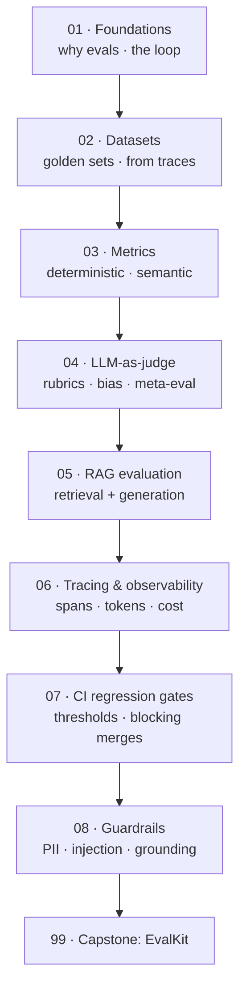

# 📊 LLM Evals & Observability — proving your AI actually works

> **What you build:** **EvalKit**, a complete evaluation and observability harness for an LLM app — golden datasets, deterministic + semantic metrics, an **LLM-as-judge** (with bias controls and meta-evaluation), **RAG retrieval metrics**, a **tracer** with token/cost/latency accounting, **guardrails** for live traffic, and a **CI quality gate** that blocks a merge when quality regresses.

> **Verified:** 2026-08-05 · Python 3.10 · stdlib-only core · pytest 9.1.1. Everything was actually run: **22 tests pass**, the harness scores a 6-case dataset, **detects a real regression** between two app versions (f1 0.751 → 0.585), exports a trace with token/cost rollups, and the CI gate fails on cue. Runs **fully offline** — no API key, no network, no LLM bill.

This is the course for the gap the market is loudest about. Job postings ask for **LLM (2,656 roles)**, **agents (2,597)**, and — specifically — *prompt evaluation, retrieval workflows, and guardrails*. Almost everyone can call an LLM API. Very few can answer **"how do you know it works, and how would you notice if it broke?"** That question is what this course teaches you to answer.

## Who this is for

You can already build with LLMs — you've written an agent or a RAG app (e.g. via the [LangGraph](../langgraph/), [Google ADK](../google_adk/), or [LangChain & RAG](../langchain_rag/) courses). What you're missing is the discipline layer that turns a demo into something you'd put in front of users.

## What you'll be able to do

- Explain **why** LLM testing is different, and choose offline vs online evaluation.
- Build **golden datasets** — from scratch and from production traces.
- Pick the right **metrics**: exact match, F1, semantic similarity, task-specific.
- Run **LLM-as-judge** properly: rubrics, pairwise comparison, position-bias control, and **validating the judge against humans**.
- Evaluate **RAG** on both axes: retrieval (precision/recall/hit-rate) and generation (faithfulness).
- **Trace** an app: spans, token counts, **cost**, latency — and know the OTel/Langfuse landscape.
- Add **guardrails**: PII redaction, injection screening, groundedness checks.
- Ship a **CI gate** that fails the build on regression, with thresholds you can defend.

## The stack (and why)

| Concern | Course uses | Real-world tool |
|---|---|---|
| Harness | **stdlib Python** (EvalKit) | [DeepEval](https://deepeval.com/) — pytest-style LLM unit tests |
| RAG metrics | our own implementations | [Ragas](https://docs.ragas.io/) — faithfulness, context precision/recall |
| Tracing | our own `Trace`/`Span` | [Langfuse](https://langfuse.com/), OpenTelemetry GenAI conventions |
| Prompt regression | version-diff reports | [promptfoo](https://promptfoo.dev/) |

> **Why build it instead of just installing a tool?** Because every one of these tools computes numbers you'll be asked to defend. Implementing faithfulness or a judge *once* means you understand what the score means, where it lies, and when to distrust it. Then the real tools are a swap, not a mystery — the course shows the integration code for each.

> **Why offline?** So the whole suite is deterministic and reproducible. Evaluating an LLM *with* an LLM is inherently noisy; this course removes that noise while teaching the mechanics, then shows exactly where a real model plugs in.

## Prerequisites

```bash
python -m venv .venv && source .venv/bin/activate
cd 99_project_evalkit && pip install -r requirements.txt
pytest -q                       # 22 passed
python -m evalkit.report --compare v1
```

## Learning path



## Course map

| # | Section | Modules | You'll be able to… | Time |
|---|---------|---------|--------------------|------|
| 01 | [Foundations](01_foundations/) | 3 | Explain why LLM testing differs; run the eval loop | ~2 h |
| 02 | [Datasets](02_datasets/) | 2 | Build and grow golden datasets, incl. from traces | ~1.5 h |
| 03 | [Metrics](03_metrics/) | 2 | Choose and implement the right scores | ~2 h |
| 04 | [LLM-as-judge](04_llm_as_judge/) | 2 | Judge with rubrics; control bias; validate the judge | ~2 h |
| 05 | [RAG evaluation](05_rag_evaluation/) | 2 | Measure retrieval and faithfulness separately | ~2 h |
| 06 | [Tracing & observability](06_tracing_observability/) | 3 | Instrument spans, tokens, cost, latency | ~2.5 h |
| 07 | [CI regression gates](07_ci_regression/) | 2 | Block merges on quality regression | ~2 h |
| 08 | [Guardrails](08_guardrails/) | 1 | Protect live traffic | ~1 h |
| 99 | [Capstone: EvalKit](99_project_evalkit/) | project | The complete harness | — |

**Total:** ~15 hours.

## Related guides

- **[LangGraph](../langgraph/)** · **[Google ADK](../google_adk/)** — build the agents you'll evaluate here.
- **[LangChain & RAG](../langchain_rag/)** — the retrieval system Section 05 measures.
- **[CI/CD with GitHub Actions](../cicd_github_actions/)** — where Section 07's gate runs.
- **[Production FastAPI Backend](../fastapi_production_backend/)** — serve the agent you've measured.

→ Start here: **[00 · Introduction](00_introduction.md)**
