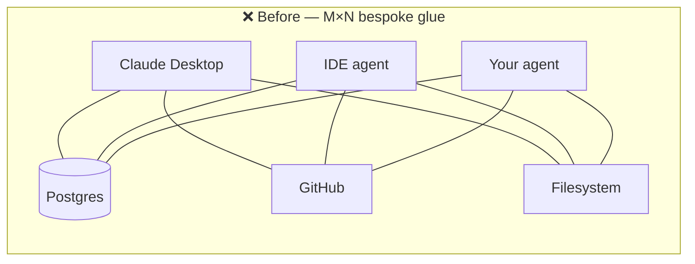
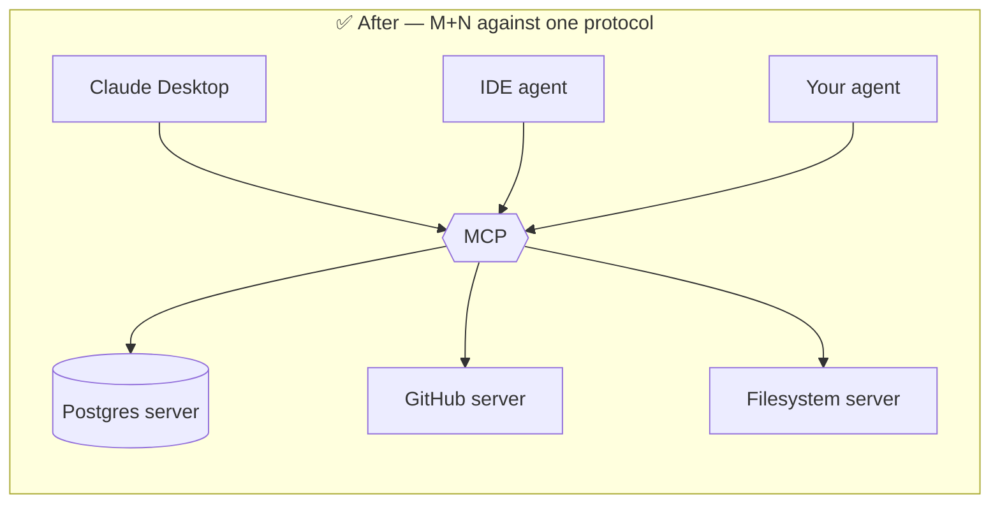
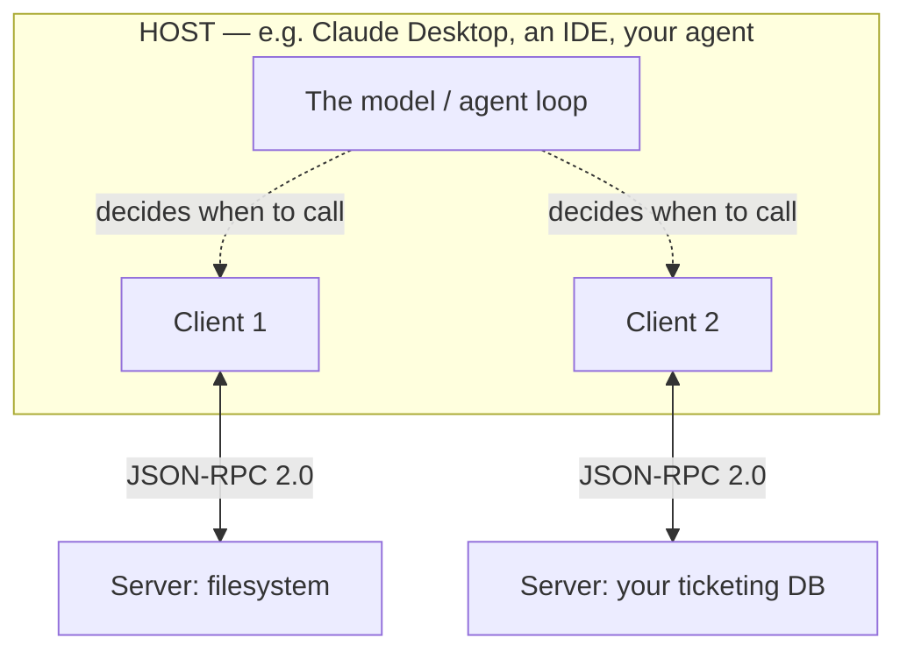

# 01-1 · What MCP is & why it won

> **Level:** Beginner · **Prerequisites:** [00 · Introduction](../00_introduction.md)
> **Time:** ~30–40 min · **Verified:** 2026-08-08 (MCP spec 2026-07-28 · FastMCP · Python 3.12)

## Why this matters

Every AI product hits the same wall: the model is smart but blind — it can't read your database, call your API, or open your files without you wiring each one up by hand. Before MCP, every host wired every tool its own way, so a connector built for one app was useless in the next. **MCP is the standard that ended that** — write a server once, and *any* MCP-compatible host can use it. Understanding *why* the standard won tells you what to optimize for when you build one.

---

## The N×M problem

Say you have **M** AI hosts (Claude Desktop, an IDE assistant, your own agent) and **N** systems to connect (Postgres, GitHub, a filesystem, an internal API). Without a standard, each host needs bespoke glue for each system. That's **M × N** integrations — and every new host or system multiplies the work.

Each host learns **one** protocol; each system is exposed **once** as a server. The problem collapses from **M × N** to **M + N**. That's the whole economic argument for a standard — and why it spread fast.

> **USB-C for AI.** Before USB-C you kept a drawer of proprietary chargers — one per device. USB-C made the *port* universal, so any cable fits any device. MCP does the same for AI: one connector shape between models and the tools/data they need.

---

## Where MCP came from

MCP was created by **Anthropic** and open-sourced in late 2024. It's now stewarded under the **Linux Foundation's Agentic AI Foundation** — vendor-neutral governance, which is exactly why competing hosts and model providers were willing to adopt it. An open, foundation-governed standard is a safer thing to build a business on than one company's proprietary API. That neutrality is a big part of "why it won."

---

## The architecture: host, client, server

Three roles, and it's worth being precise about them because the words get misused.

- **Host** — the application the user runs (Claude Desktop, an IDE, an agent framework). It contains the model and manages the whole session.
- **Client** — a connector *inside* the host. Each client holds exactly **one** connection to **one** server (1:1). A host with three servers runs three clients.
- **Server** — the thing **you** build. It exposes capabilities (resources, tools, prompts — next lesson) and knows nothing about the model. It just answers protocol messages.

The wire format between client and server is **JSON-RPC 2.0** (covered in 01-2). Servers expose; the host decides.

---

## "The model decides when to call"

This is the part that trips people coming from plain function calling. **You don't call the server — the model does.** Your server *advertises* what it can do (a `delete_ticket` tool, a `ticket://open` resource). During a conversation the host shows those capabilities to the model, and the **model chooses** when a tool is relevant, fills in the arguments, and the host's client sends the call.

That's the power *and* the danger. Power: you expose a capability once and it composes into any task the user asks for. Danger: a capability with side effects (delete, shell out, pay money) can be invoked by a model reacting to text it read — including text an attacker planted. Keep that in the back of your mind; we return to it below and in depth in **Section 06**.

---

## MCP vs. function calling vs. A2A

These three get conflated constantly. They solve different problems:

| | What it standardizes | Portable across hosts? | Who talks to whom |
|---|---|---|---|
| **Plain function/tool calling** | Nothing — it's a per-app feature of one model's API | ❌ No. Rewrite it for every app/model | Your app ↔ your model |
| **MCP** | Model ↔ **tools & data** | ✅ Yes — any MCP host can use any MCP server | Host's model ↔ external servers |
| **A2A** (Agent-to-Agent, Google; also Linux Foundation) | **Agent ↔ agent** delegation | ✅ Yes, for agents | One agent ↔ another agent |

The distinction that matters: raw function calling is real and useful, but it's **non-portable** — a tool schema you hand to one model's API doesn't move to another app. MCP takes that same idea and makes the tool a **standalone server** any host can connect to. **A2A is orthogonal** — it's about agents delegating to other agents, not a model reaching for a tool. A system can use both: MCP to reach tools, A2A to reach peer agents.

---

## The ecosystem: who speaks MCP

Because the protocol is open, the list of hosts grew quickly. As of 2026 you'll find MCP support in:

- **Claude Desktop** and the Claude apps — the reference host.
- **IDEs and coding agents** — editor assistants that connect to MCP servers for filesystem, git, and project context.
- **Agent frameworks** — SDKs that let you build custom hosts/agents which load MCP servers as their toolset.

The practical upshot for you as a *server author*: you target **the protocol**, not a specific host. One well-built server shows up everywhere MCP is spoken. That reach is why building servers (not just consuming them) is the 2026 job-ready skill.

---

## Security flag (planted now, unpacked in Section 06)

Two things to internalize early:

1. **A server is code the host trusts.** When a host launches a local (stdio) server it runs your process on the user's machine. That's arbitrary code execution *by design* — great when it's your server, a real supply-chain risk when it's someone else's. 2026 saw a class of MCP **command-injection** issues (e.g. **CVE-2026-30623**, where a stdio server executed its `command` field unsanitized). Trust in a server is not free.
2. **Tool outputs and resource contents are untrusted data.** What a server returns can contain **indirect prompt injection** — instructions hidden in a fetched web page or a database row that try to hijack the model. Never treat tool output as trusted commands.

We're only planting these flags here. Build securely from lesson one; the full treatment is **Section 06**.

---

## Recap & next

- ✅ MCP collapses the **N×M** integration problem to **N+M** — one protocol, servers exposed once. The "**USB-C for AI**."
- ✅ Created by **Anthropic** (open-sourced late 2024), now under the **Linux Foundation's Agentic AI Foundation**.
- ✅ **Host** runs one or more **clients**, each 1:1 with a **server**; servers expose, the **model decides** when to call.
- ✅ MCP standardizes model↔tools (**portable**); function calling is per-app (**not portable**); **A2A** is agent↔agent (orthogonal).
- ✅ Two standing flags: servers are **trusted code**; their **output is untrusted data**.
- ✅ Self-check: your teammate says "MCP is just OpenAI-style function calling with extra steps." In one sentence, what's the key thing they're missing?

→ Next: **[01-2 · The protocol & the three primitives](02_protocol_and_primitives.md)**

## Exercises

1. Your company has 4 AI hosts in use and 5 internal systems to connect. Compute the integration count with bespoke glue vs. with MCP. What happens to each number when you add a 6th system?

Solution

Bespoke glue = **M × N = 4 × 5 = 20** integrations. With MCP = **M + N = 4 + 5 = 9** (4 hosts each learn the protocol; 5 systems each get one server). Adding a 6th system: bespoke jumps to **4 × 6 = 24** (+4, one new glue per host); MCP goes to **4 + 6 = 10** (+1, a single new server that all hosts reach). The gap widens with every addition — that's the compounding value of the standard.

2. A colleague built a great tool by hand-writing a JSON schema and passing it to one model provider's function-calling API. Their new IDE assistant can't use it. Why not — and what would wrapping it as an MCP server change?

Solution

Function-calling schemas are **per-app / per-provider** — the tool is glued to the one API it was written for, so a different host has no way to discover or invoke it. Wrapping it as an **MCP server** exposes it over the standard protocol, so *any* MCP-compatible host (the IDE assistant, Claude Desktop, a custom agent) can connect and use it with no rewrite. Same logic inside; portable on the outside.

3. You're evaluating an open-source MCP server from a stranger's GitHub to run locally via stdio. Name the single biggest risk and one concrete precaution.

Solution

Biggest risk: a stdio server is **arbitrary code executing on your machine** with your privileges (the CVE-2026-30623 class of issues). Precautions (any one): read the source before running; run it sandboxed / in a container with least privilege; pin a reviewed version; prefer signed or reputable publishers. Trusting a server = trusting its code. Full treatment in Section 06.

